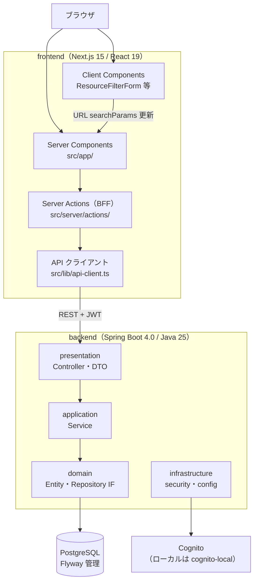
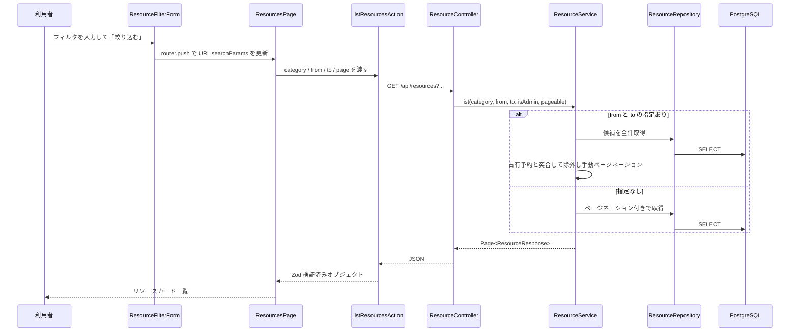

# System Architecture

> スコープ注記：全体像の真実の源は `docs-next/docs/reference/architecture.md`（アーキテクチャ全体）である。本ファイルは AI-DLC が本課題を進めるうえで必要な範囲の要約であり、再導出ではない。

## System Overview

BookFlow は Next.js（App Router）のフロントエンドと Spring Boot のバックエンドを分離したモノレポ構成である。ブラウザはフロントエンドのみと通信し、フロントエンドの Server Actions 層が BFF としてバックエンド REST API を呼ぶ。バックエンドは OAuth2 Resource Server として JWT を検証する。

## Architecture Diagram

```mermaid
flowchart TD
    Browser["ブラウザ"]

    subgraph Frontend["frontend（Next.js 15 / React 19）"]
        Pages["Server Components<br/>src/app/"]
        ClientComp["Client Components<br/>ResourceFilterForm 等"]
        Actions["Server Actions（BFF）<br/>src/server/actions/"]
        ApiClient["API クライアント<br/>src/lib/api-client.ts"]
    end

    subgraph Backend["backend（Spring Boot 4.0 / Java 25）"]
        Presentation["presentation<br/>Controller・DTO"]
        Application["application<br/>Service"]
        Domain["domain<br/>Entity・Repository IF"]
        Infrastructure["infrastructure<br/>security・config"]
    end

    DB[("PostgreSQL<br/>Flyway 管理")]
    Cognito["Cognito<br/>（ローカルは cognito-local）"]

    Browser --> Pages
    Browser --> ClientComp
    ClientComp -->|"URL searchParams 更新"| Pages
    Pages --> Actions
    Actions --> ApiClient
    ApiClient -->|"REST + JWT"| Presentation
    Presentation --> Application
    Application --> Domain
    Domain --> DB
    Infrastructure --> Cognito
```

## Component Descriptions

### frontend

- **Purpose**: 画面表示と BFF。
- **Responsibilities**: Server Components でのデータ取得、Server Actions によるバックエンド呼び出しと Zod での応答検証、クライアント側のフォーム操作。
- **Dependencies**: backend の REST API、Better Auth / Cognito。
- **Type**: Application。

### backend

- **Purpose**: 業務ロジックと永続化。
- **Responsibilities**: 4レイヤー（domain / application / presentation / infrastructure）の厳守。認可は Spring Security の `@PreAuthorize` とロール判定で二重化する。
- **Dependencies**: PostgreSQL、Cognito（JWT 検証）。
- **Type**: Application。

### docs-next

- **Purpose**: ドキュメントサイト（Docusaurus）。`docs-next/docs/spec/` が仕様の真実の源。
- **Type**: Documentation。

## Data Flow

本課題が対象とするリソース一覧照会の流れ。

```mermaid
sequenceDiagram
    participant U as 利用者
    participant F as ResourceFilterForm
    participant P as ResourcesPage
    participant A as listResourcesAction
    participant C as ResourceController
    participant S as ResourceService
    participant R as ResourceRepository
    participant D as PostgreSQL

    U->>F: フィルタを入力して「絞り込む」
    F->>P: router.push で URL searchParams を更新
    P->>A: category / from / to / page を渡す
    A->>C: GET /api/resources?...
    C->>S: list(category, from, to, isAdmin, pageable)
    alt from と to の指定あり
        S->>R: 候補を全件取得
        R->>D: SELECT
        S->>S: 占有予約と突合して除外し手動ページネーション
    else 指定なし
        S->>R: ページネーション付きで取得
        R->>D: SELECT
    end
    S-->>C: Page<ResourceResponse>
    C-->>A: JSON
    A-->>P: Zod 検証済みオブジェクト
    P-->>U: リソースカード一覧
```

## Integration Points

- **External APIs**: Cognito（認証）。ローカルは cognito-local。
- **Databases**: PostgreSQL（本番・開発）、H2（テスト・PostgreSQL 互換モード）。
- **Third-party Services**: なし。

## Infrastructure Components

- **CDK Stacks**: なし（IaC は本リポジトリに含まれない）。
- **Deployment Model**: DevContainer + Docker Compose によるローカル開発。GitHub Actions が CI を担う。
- **Networking**: ローカル完結（frontend `:3000`、backend `:8080`、docs `:8000`）。
