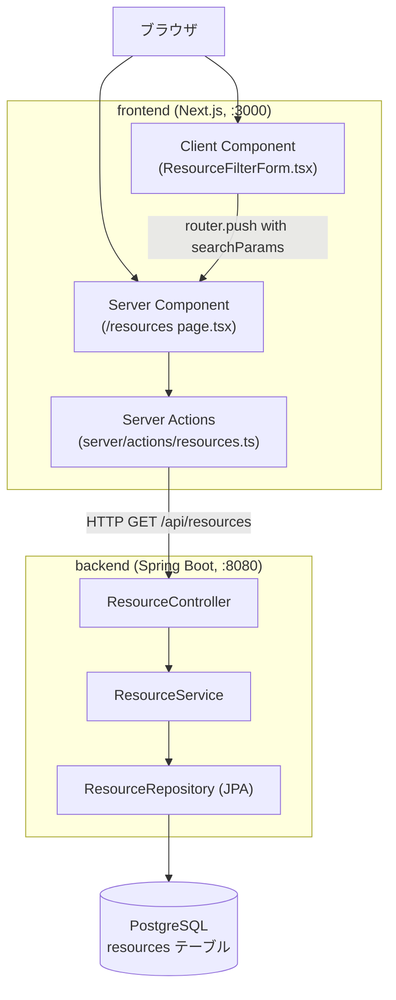
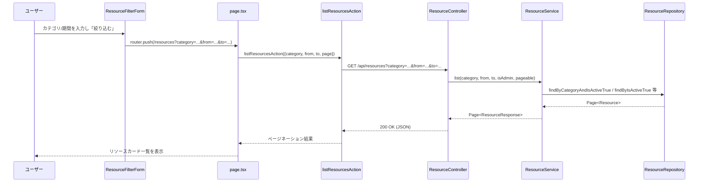

# System Architecture

## System Overview

BookFlow はモノレポ構成。`frontend/`（Next.js 15 App Router、BFF 兼 UI）と `backend/`（Spring Boot 4.0 REST API）の 2 パッケージからなる。詳細な AWS 標準構成・技術スタック一覧は [`docs-next/docs/reference/architecture.md`](../../../../docs-next/docs/reference/architecture.md) に既存のものがあり、本ファイルは重複を避けそちらを正とする。ローカル開発では ECS/ECR/API Gateway/Cognito 等の AWS マネージドサービス部分を `docker compose`（PostgreSQL）+ cognito-local + `pnpm dev` / `./gradlew bootRun` の直接起動で代替する。

## Architecture Diagram

```mermaid
flowchart TB
    Browser["ブラウザ"]
    subgraph FE["frontend (Next.js, :3000)"]
        Page["Server Component<br/>(/resources page.tsx)"]
        Action["Server Actions<br/>(server/actions/resources.ts)"]
        Client["Client Component<br/>(ResourceFilterForm.tsx)"]
    end
    subgraph BE["backend (Spring Boot, :8080)"]
        Controller["ResourceController"]
        Service["ResourceService"]
        Repo["ResourceRepository (JPA)"]
    end
    DB[("PostgreSQL<br/>resources テーブル")]

    Browser --> Page
    Browser --> Client
    Client -->|router.push with searchParams| Page
    Page --> Action
    Action -->|HTTP GET /api/resources| Controller
    Controller --> Service
    Service --> Repo
    Repo --> DB
```

## Component Descriptions

### frontend
- **Purpose**: リソース一覧画面の表示とフィルタ入力の受付
- **Responsibilities**: `page.tsx`（Server Component、`searchParams` を読み取り一覧取得）／ `ResourceFilterForm.tsx`（Client Component、URL クエリパラメータ組み立て）／ `server/actions/resources.ts`（BFF 層、バックエンド API 呼び出し）
- **Dependencies**: backend の `/api/resources`
- **Type**: Application（Next.js）

### backend
- **Purpose**: リソース一覧取得の業務ロジックと永続化
- **Responsibilities**: `ResourceController`（クエリパラメータ受付・認可）／ `ResourceService`（ロール別フィルタ・空き判定）／ `ResourceRepository`（JPA データアクセス）
- **Dependencies**: PostgreSQL（本番）/ H2（テスト、`MODE=PostgreSQL` 互換モード）
- **Type**: Application（Spring Boot）

## Data Flow

```mermaid
sequenceDiagram
    participant U as ユーザー
    participant Form as ResourceFilterForm
    participant Page as page.tsx
    participant Action as listResourcesAction
    participant Ctrl as ResourceController
    participant Svc as ResourceService
    participant Repo as ResourceRepository

    U->>Form: カテゴリ/期間を入力し「絞り込む」
    Form->>Page: router.push(/resources?category=...&from=...&to=...)
    Page->>Action: listResourcesAction({category, from, to, page})
    Action->>Ctrl: GET /api/resources?category=...&from=...&to=...
    Ctrl->>Svc: list(category, from, to, isAdmin, pageable)
    Svc->>Repo: findByCategoryAndIsActiveTrue / findByIsActiveTrue 等
    Repo-->>Svc: Page<Resource>
    Svc-->>Ctrl: Page<ResourceResponse>
    Ctrl-->>Action: 200 OK (JSON)
    Action-->>Page: ページネーション結果
    Page-->>U: リソースカード一覧を表示
```

## Integration Points

- **External APIs**: なし（frontend → backend のみ、外部連携は認証基盤の Cognito のみ）
- **Databases**: PostgreSQL（`resources` テーブル。詳細は [`docs-next/docs/spec/er-diagram.md`](../../../../docs-next/docs/spec/er-diagram.md)）
- **Third-party Services**: Amazon Cognito（JWT 発行・検証）

## Infrastructure Components

repo 全体の AWS 標準構成・ローカル代替は [`docs-next/docs/reference/architecture.md`](../../../../docs-next/docs/reference/architecture.md) を参照。本課題（Issue #23）はアプリケーション層（frontend / backend）のみの変更であり、インフラ構成に変更はない。
