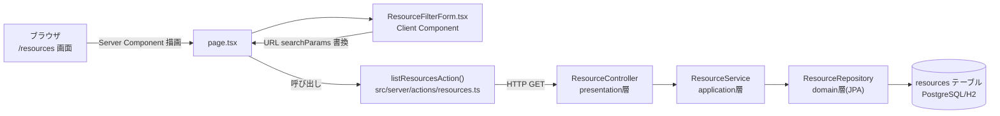
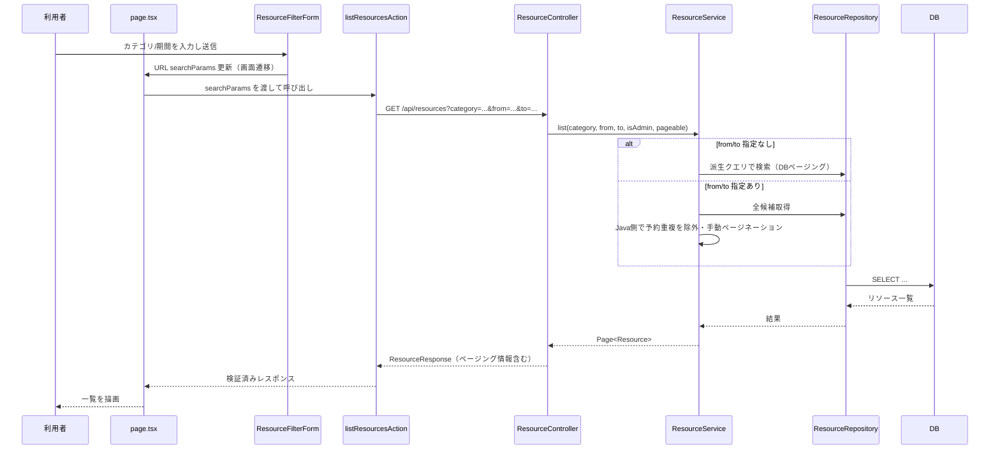

# System Architecture

> リポジトリ全体のアーキテクチャは `docs-next/docs/reference/architecture.md` を参照。ここではリソース一覧機能に関わる経路のみを扱う。

## System Overview

BookFlow は Next.js 15（App Router）で実装されたフロントエンド兼 BFF と、Spring Boot 4.0 / Java 25 のバックエンド API から成るモノレポ。フロントエンドはブラウザから直接バックエンドを呼ばず、Server Actions（BFF 層）を経由してバックエンド API を呼ぶ。バックエンドは domain / application / presentation / infrastructure の4層アーキテクチャで、PostgreSQL（本番）/ H2（テスト）を利用する。

## Architecture Diagram

```mermaid
flowchart LR
    Browser["ブラウザ<br/>/resources 画面"] -->|Server Component 描画| Page["page.tsx"]
    Page --> FilterForm["ResourceFilterForm.tsx<br/>Client Component"]
    FilterForm -->|URL searchParams 書換| Page
    Page -->|呼び出し| Action["listResourcesAction()<br/>src/server/actions/resources.ts"]
    Action -->|HTTP GET| Controller["ResourceController<br/>presentation層"]
    Controller --> Service["ResourceService<br/>application層"]
    Service --> Repo["ResourceRepository<br/>domain層(JPA)"]
    Repo --> DB[("resources テーブル<br/>PostgreSQL/H2")]
```

## Component Descriptions

### `frontend/src/app/(authenticated)/resources/page.tsx`
- **Purpose**: リソース一覧画面（Server Component）
- **Responsibilities**: `searchParams` を受け取り `listResourcesAction()` を呼んで一覧を描画
- **Dependencies**: `ResourceFilterForm.tsx`、`listResourcesAction`
- **Type**: Application（Frontend Page）

### `frontend/src/app/(authenticated)/resources/ResourceFilterForm.tsx`
- **Purpose**: カテゴリ・期間（・今回追加するキーワード）のフィルタ入力フォーム
- **Responsibilities**: フォーム入力から URL クエリパラメータを組み立てて画面遷移させる
- **Dependencies**: なし（Client Component、`react-hook-form`）
- **Type**: Application（Frontend Component）

### `frontend/src/server/actions/resources.ts`
- **Purpose**: BFF 層。バックエンド API を呼び出し Zod でレスポンスを検証する
- **Responsibilities**: `listResourcesAction()` がクエリパラメータをバックエンドの `GET /api/resources` に伝播
- **Dependencies**: `src/lib/api-client.ts`、`src/lib/types/api.ts`
- **Type**: Application（BFF）

### `backend/.../presentation/ResourceController.java`
- **Purpose**: `GET /api/resources` エンドポイント
- **Responsibilities**: リクエストパラメータの受け付け、認証ユーザーのロール判定、`ResourceService` への委譲
- **Dependencies**: `ResourceService`
- **Type**: Application（Presentation層）

### `backend/.../application/ResourceService.java`
- **Purpose**: リソース検索のユースケース実装
- **Responsibilities**: `category`/`from`/`to` の有無で `listPaginated`（DBページング）と `listWithAvailabilityFilter`（全件取得＋Java側フィルタ・手動ページネーション）を使い分ける
- **Dependencies**: `ResourceRepository`
- **Type**: Application（Application層）

### `backend/.../domain/ResourceRepository.java`
- **Purpose**: リソースの永続化・検索
- **Responsibilities**: 派生クエリメソッド6種（`isActive`×`category`の組み合わせ）を提供
- **Dependencies**: Spring Data JPA
- **Type**: Application（Domain層）

## Data Flow

```mermaid
sequenceDiagram
    participant U as 利用者
    participant P as page.tsx
    participant F as ResourceFilterForm
    participant A as listResourcesAction
    participant C as ResourceController
    participant S as ResourceService
    participant R as ResourceRepository
    participant D as DB

    U->>F: カテゴリ/期間を入力し送信
    F->>P: URL searchParams 更新（画面遷移）
    P->>A: searchParams を渡して呼び出し
    A->>C: GET /api/resources?category=...&from=...&to=...
    C->>S: list(category, from, to, isAdmin, pageable)
    alt from/to 指定なし
        S->>R: 派生クエリで検索（DBページング）
    else from/to 指定あり
        S->>R: 全候補取得
        S->>S: Java側で予約重複を除外・手動ページネーション
    end
    R->>D: SELECT ...
    D-->>R: リソース一覧
    R-->>S: 結果
    S-->>C: Page<Resource>
    C-->>A: ResourceResponse（ページング情報含む）
    A-->>P: 検証済みレスポンス
    P-->>U: 一覧を描画
```

## Integration Points

- **External APIs**: なし（今回のスコープ内）
- **Databases**: PostgreSQL（本番）/ H2 PostgreSQL互換モード（テスト）。H2 は PostgreSQL 固有演算子（`ILIKE` 等）を使えない制約がある
- **Third-party Services**: なし（認証は Better Auth + Cognito だが本課題のスコープ外）

## Infrastructure Components

- 本課題はアプリケーション層の変更のみで、インフラ構成（CDK/Terraform 等）への変更は不要
