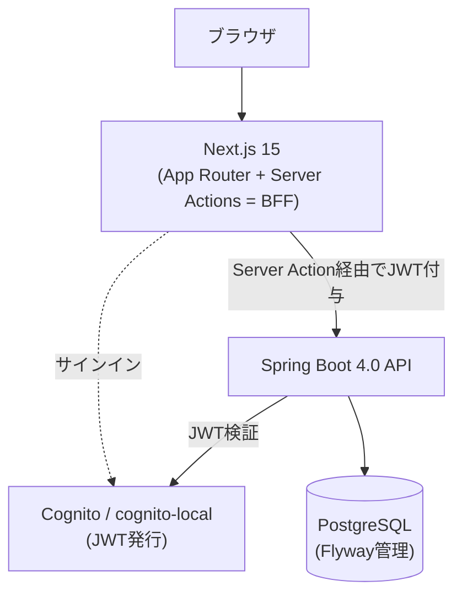
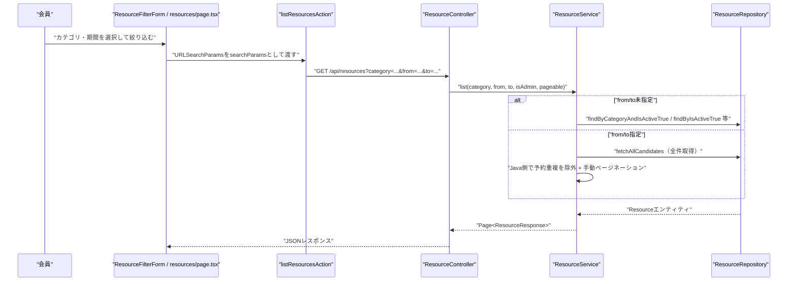

# System Architecture

> **一次情報源**: `docs-next/docs/reference/architecture.md`（AWS 標準アーキテクチャ）。本ファイルはそれをローカル開発・本タスクの文脈で要約し、インフラ詳細（VPC・IAM 等）は対象外として引用元に委ねる。

## System Overview

BookFlow は Next.js（フロントエンド + BFF）と Spring Boot（バックエンド API）からなる 2 層構成のモノレポである。認証は Cognito（本番）/ cognito-local（ローカル）経由の JWT。データストアは PostgreSQL 単独（DynamoDB・S3 は本タスクでは未使用）。バックエンドは `domain / application / presentation / infrastructure` の 4 層アーキテクチャを厳守する。

## Architecture Diagram

```mermaid
flowchart TD
    Browser["ブラウザ"]
    FE["Next.js 15\n(App Router + Server Actions = BFF)"]
    BE["Spring Boot 4.0 API"]
    DB[("PostgreSQL\n(Flyway管理)")]
    Cognito["Cognito / cognito-local\n(JWT発行)"]

    Browser --> FE
    FE -->|"Server Action経由でJWT付与"| BE
    FE -.->|"サインイン"| Cognito
    BE -->|"JWT検証"| Cognito
    BE --> DB
```

## Component Descriptions

### frontend（Next.js, BFF 統合）

- **Purpose**: 画面描画と、バックエンド API 呼び出しの集約（BFF）
- **Responsibilities**: Server Actions（`frontend/src/server/actions/`）経由でのみバックエンドを呼び出す。クライアントコンポーネントに認証トークンを露出しない。
- **Dependencies**: Spring Boot バックエンド API、Cognito（Better Auth 経由）
- **Type**: Application

### backend（Spring Boot, 4層アーキテクチャ）

- **Purpose**: 業務ロジックとデータ永続化
- **Responsibilities**:
  - `presentation`: `@RestController`・DTO・入力バリデーション（例：`ResourceController`）
  - `application`: ユースケースサービス（例：`ResourceService`）
  - `domain`: エンティティ・Repository インターフェース（例：`Resource`, `ResourceRepository`）
  - `infrastructure`: Spring Security 設定・JWT 変換・横断的関心事（`SecurityConfig`, `RoleJwtAuthenticationConverter` 等）
- **Dependencies**: PostgreSQL、Cognito が発行する JWT
- **Type**: Application

### PostgreSQL（Flyway 管理）

- **Purpose**: 永続化層
- **Responsibilities**: `resources` / `reservations` / `approval_steps` / `users` / `departments` 等のテーブルを保持。スキーマは単一マイグレーション `V001__create_initial_schema.sql` で定義済み。
- **Type**: Data Store

## Data Flow（`GET /api/resources` の現状）

```mermaid
sequenceDiagram
    participant U as "会員"
    participant FE as "ResourceFilterForm / resources/page.tsx"
    participant SA as "listResourcesAction"
    participant C as "ResourceController"
    participant S as "ResourceService"
    participant R as "ResourceRepository"

    U->>FE: "カテゴリ・期間を選択して絞り込む"
    FE->>SA: "URLSearchParamsをsearchParamsとして渡す"
    SA->>C: "GET /api/resources?category=...&from=...&to=..."
    C->>S: "list(category, from, to, isAdmin, pageable)"
    alt "from/to未指定"
        S->>R: "findByCategoryAndIsActiveTrue / findByIsActiveTrue 等"
    else "from/to指定"
        S->>R: "fetchAllCandidates（全件取得）"
        S->>S: "Java側で予約重複を除外 + 手動ページネーション"
    end
    R-->>S: "Resourceエンティティ"
    S-->>C: "Page<ResourceResponse>"
    C-->>FE: "JSONレスポンス"
```

> 本タスクでキーワード検索を追加する場合、このシーケンスの `R`（Repository）呼び出しに `keyword` 条件を組み込む設計判断が必要（`code-structure.md` のメモ参照）。

## Integration Points

- **External APIs**: なし（本タスクの対象範囲では外部 API 連携なし）
- **Databases**: Amazon RDS for PostgreSQL（本番） / Docker PostgreSQL（ローカル）
- **Third-party Services**: Amazon Cognito（JWT 発行） / cognito-local（ローカル代替）

## Infrastructure Components

- **CDK Stacks**: N/A（本リポジトリは Terraform 前提・IaC コードは対象外）
- **Deployment Model**: ローカルは Docker Compose（`.devcontainer/docker-compose.yml`）。本番は ECS Fargate（詳細は引用元ドキュメント）
- **Networking**: 対象外（引用元ドキュメントのスコープ外事項と同様）
