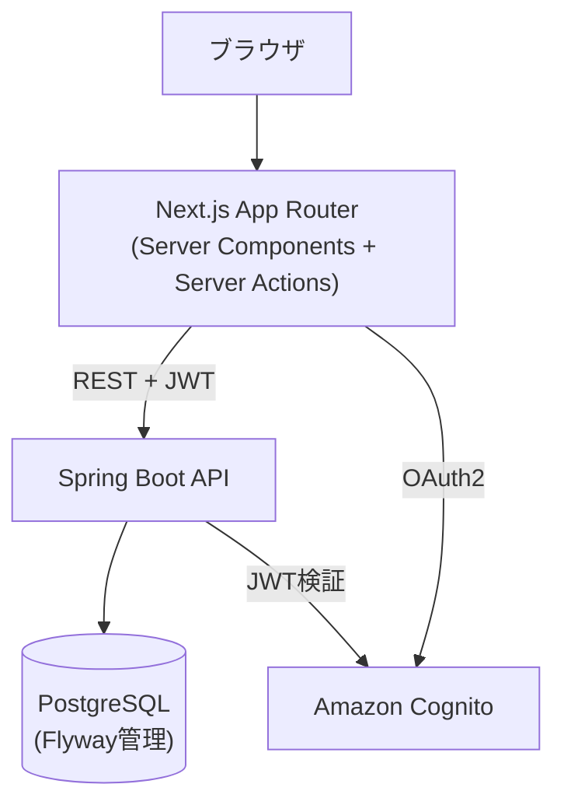
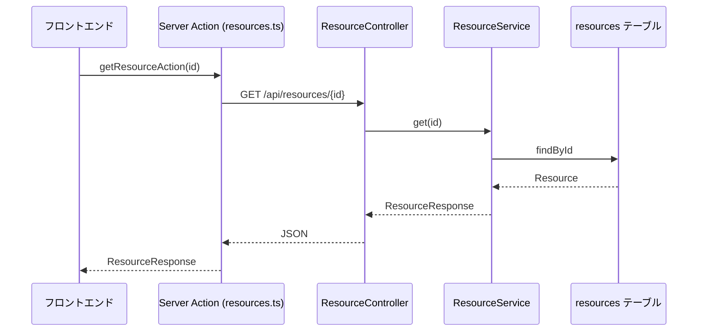

# System Architecture

## System Overview

BookFlow はモノレポ構成。Next.js（App Router）フロントエンドが BFF（Server Actions）経由で Spring Boot バックエンドの REST API を呼び出す。認証は Better Auth（フロントエンド）+ Cognito、バックエンドは Spring Security の OAuth2 Resource Server で JWT を検証する。

## Architecture Diagram

```mermaid
flowchart TD
    Browser["ブラウザ"] --> NextApp["Next.js App Router\n(Server Components + Server Actions)"]
    NextApp -->|REST + JWT| Spring["Spring Boot API"]
    Spring --> Postgres[("PostgreSQL\n(Flyway管理)")]
    NextApp -->|OAuth2| Cognito["Amazon Cognito"]
    Spring -->|JWT検証| Cognito
```

## Component Descriptions

### `frontend`（Next.js）

- **Purpose**: UI 描画・BFF 層（Server Actions）。
- **Responsibilities**: 画面表示（Server Components）、フォーム送信・API 中継（Server Actions、`src/server/actions/`）、クライアント側バリデーション（Zod、`src/lib/schemas/`）。
- **Dependencies**: `backend` の REST API、Cognito（Better Auth 経由）。
- **Type**: Application

### `backend`（Spring Boot）

- **Purpose**: ドメインロジック・永続化・認可。
- **Responsibilities**: 4 レイヤーアーキテクチャ（`domain`/`application`/`presentation`/`infrastructure`）を厳守。
- **Dependencies**: PostgreSQL（Flyway でスキーマ管理）、Cognito（JWT 検証）。
- **Type**: Application

## Resource ドメインのデータフロー（Issue #25 関連）

```mermaid
sequenceDiagram
    participant FE as フロントエンド
    participant BFF as Server Action (resources.ts)
    participant API as ResourceController
    participant SVC as ResourceService
    participant DB as resources テーブル

    FE->>BFF: getResourceAction(id)
    BFF->>API: GET /api/resources/{id}
    API->>SVC: get(id)
    SVC->>DB: findById
    DB-->>SVC: Resource
    SVC-->>API: ResourceResponse
    API-->>BFF: JSON
    BFF-->>FE: ResourceResponse
```

## Integration Points

- **External APIs**: なし（Resource ドメインは自己完結）。
- **Databases**: PostgreSQL（本番・開発）／H2（テスト、PostgreSQL 互換モード）。
- **Third-party Services**: Amazon Cognito（認証のみ、Resource ドメインには直接関与しない）。

## Infrastructure Components

本課題（Issue #25）はアプリケーション層・DB スキーマの変更のみで、インフラ構成（CDK 等）への影響はない。
