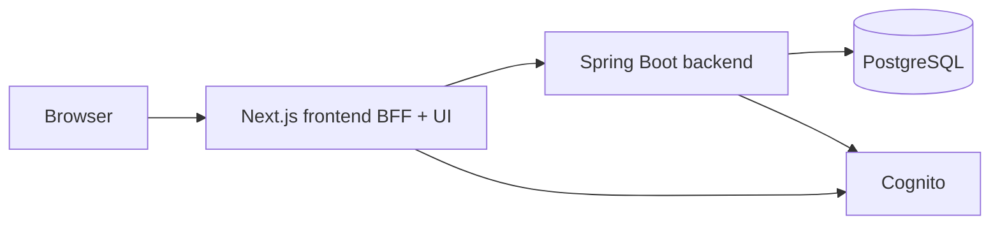
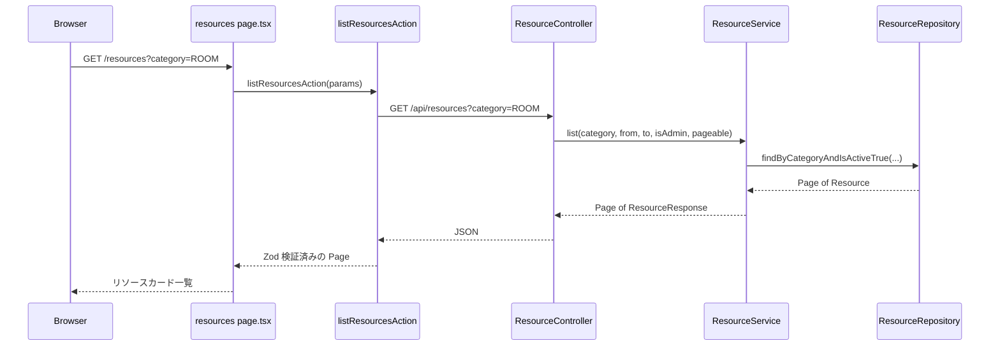

# System Architecture

## System Overview

Next.js（App Router）の BFF 兼 UI と、Spring Boot の REST API からなるモノレポ。ブラウザは Next.js の Server Component / Server Action を呼び、Server Action が JWT 付きで backend の `/api/*` を呼ぶ。backend は domain / application / presentation / infrastructure の 4 層で構成する。

## Architecture Diagram

```mermaid
flowchart LR
    Browser["Browser"]
    Next["Next.js frontend BFF + UI"]
    Api["Spring Boot backend"]
    Db[("PostgreSQL")]
    Cognito["Cognito"]

    Browser --> Next
    Next --> Api
    Api --> Db
    Next --> Cognito
    Api --> Cognito
```

## Component Descriptions

### frontend
- **Purpose**: UI と BFF
- **Responsibilities**: ページ描画、Server Actions による API 呼び出し、Zod による型検証
- **Dependencies**: backend、Cognito（Better Auth）
- **Type**: Application

### backend
- **Purpose**: 業務 API
- **Responsibilities**: 認証・認可、業務ルール、永続化
- **Dependencies**: PostgreSQL、Cognito（JWT 検証）
- **Type**: Application

## Data Flow

リソース一覧の取得フロー（現行）。

```mermaid
sequenceDiagram
    participant U as Browser
    participant P as resources page.tsx
    participant A as listResourcesAction
    participant C as ResourceController
    participant S as ResourceService
    participant R as ResourceRepository

    U->>P: GET /resources?category=ROOM
    P->>A: listResourcesAction(params)
    A->>C: GET /api/resources?category=ROOM
    C->>S: list(category, from, to, isAdmin, pageable)
    S->>R: findByCategoryAndIsActiveTrue(...)
    R-->>S: Page of Resource
    S-->>C: Page of ResourceResponse
    C-->>A: JSON
    A-->>P: Zod 検証済みの Page
    P-->>U: リソースカード一覧
```

## Integration Points

- **External APIs**: Amazon Cognito（本番）/ cognito-local（ローカル）
- **Databases**: PostgreSQL（本番・ローカル）、H2（バックエンドテスト）
- **Third-party Services**: なし

## Infrastructure Components

- **Deployment Model**: ローカルは DevContainer + Docker Compose。CI は GitHub Actions（`ci-backend.yml` / `ci-frontend.yml`）。
- **Networking**: 本課題の対象外
