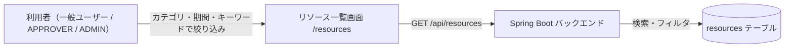

# Business Overview

> スコープ：本ドキュメントは今回のタスク（リソース一覧の検索・フィルタ追加）のために作成した RE artifacts であり、全体のビジネス概要は既存の [`docs-next/docs/spec/overview.md`](../../../../../docs-next/docs/spec/overview.md) を出典とする。ここではタスクに関わる範囲（リソース一覧・UC-02）のみ記載する。

## Business Context Diagram

## Business Description

- **Business Description**: BookFlow は施設・備品予約システム。リソース一覧画面（`/resources`）は UC-02（リソース一覧・空き確認）を実装しており、利用者がカテゴリ・空き確認期間で予約可能なリソースを絞り込める。
- **Business Transactions**: リソース一覧取得（カテゴリ・期間フィルタ、ページネーション）。今回追加するのはキーワード検索（リソース名・説明文への部分一致）。
- **Business Dictionary**:
  - **リソース**：施設・備品予約の対象（`ROOM` / `EQUIPMENT` / `VEHICLE`）。
  - **空き確認**：`from`/`to` を指定し、当該期間に `PENDING`/`APPROVED` の予約がないリソースのみ表示する機能。

## Component Level Business Descriptions

### frontend（`/resources` 画面）

- **Purpose**: リソース一覧の表示とフィルタ UI の提供。
- **Responsibilities**: `ResourceFilterForm` によるフィルタ入力の URL パラメータ化、`ResourcesPage`（Server Component）によるサーバーアクション呼び出しと一覧描画。

### backend（`ResourceController` / `ResourceService` / `ResourceRepository`）

- **Purpose**: リソース一覧・検索ロジックの提供。
- **Responsibilities**: カテゴリ・期間フィルタの適用、ロール別可視性制御（ADMIN のみ inactive を含む）、ページネーション。
