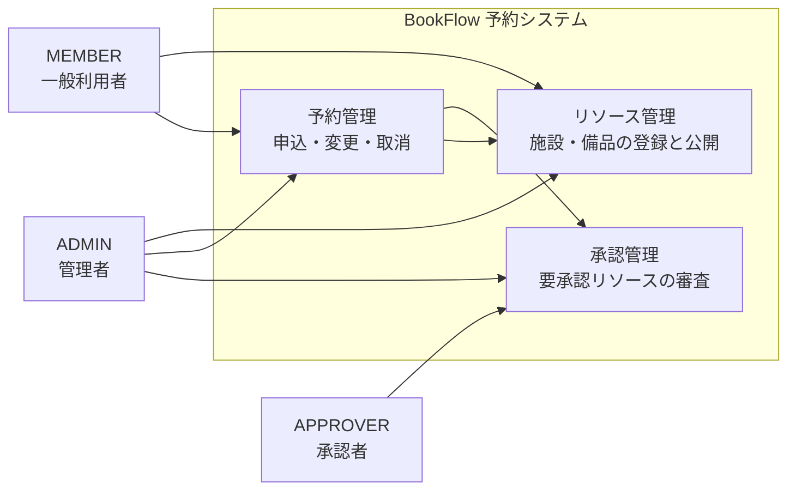

# Business Overview

> スコープ注記：本課題（リソース一覧の検索・フィルタ追加）に関係する範囲を中心に記述する。
> システム全体の網羅的な記述は `docs-next/docs/spec/overview.md`（リポジトリ概要）と `docs-next/docs/spec/requirements.md`（要件定義）が真実の源であり、本ファイルはその要約である。

## Business Context Diagram

## Business Description

- **Business Description**: 社内の施設（会議室）・備品・車両を対象とする予約システム。利用者はリソースを探し、空き時間帯を確認して予約を申し込む。要承認リソースの予約は承認者の審査を経て確定する。
- **Business Transactions**:
  - リソース一覧照会（カテゴリ・空き時間帯での絞り込みを含む）
  - リソース詳細照会・空き状況照会
  - 予約の申込・変更・取消
  - 予約の承認・却下
  - リソースの登録・更新・有効無効切替（ADMIN）
  - ユーザー・部署の管理（ADMIN）
- **Business Dictionary**:
  - **リソース**：予約の対象となる施設・備品・車両。`ROOM` / `EQUIPMENT` / `VEHICLE` の3カテゴリを持つ。
  - **要承認リソース**：`requiresApproval = true` のリソース。予約が `PENDING` で作成され、承認を経て `APPROVED` になる。
  - **占有**：`PENDING` または `APPROVED` の予約が存在する時間帯。空き確認ではこの時間帯を持つリソースが除外される。
  - **無効リソース**：`isActive = false` のリソース。ADMIN のみ一覧に表示される。

## Component Level Business Descriptions

### リソース管理（`ResourceController` / `ResourceService` / `ResourceRepository`）

- **Purpose**: リソースの照会と維持管理を担う。本課題で変更する中心コンポーネント。
- **Responsibilities**:
  - ロールに応じた一覧の可視範囲制御（ADMIN は無効リソースを含む、それ以外は有効のみ）
  - カテゴリによる絞り込み
  - 指定時間帯（`from` / `to`）に占有予約が無いリソースへの絞り込み
  - リソースの登録・更新・ステータス切替（ADMIN のみ）

### 予約管理（`ReservationController` / `ReservationService`）

- **Purpose**: 予約の申込と状態遷移を担う。
- **Responsibilities**: 予約の CRUD、重複予約チェック、要承認リソースの承認フロー起動。
- **本課題との関係**: リソース一覧の空き確認は予約データを参照するため読み取り側の依存がある。本課題では変更しない。

### 承認管理（`ApprovalController` / `ApprovalService`）

- **Purpose**: 要承認予約の審査を担う。
- **本課題との関係**: 依存なし。
