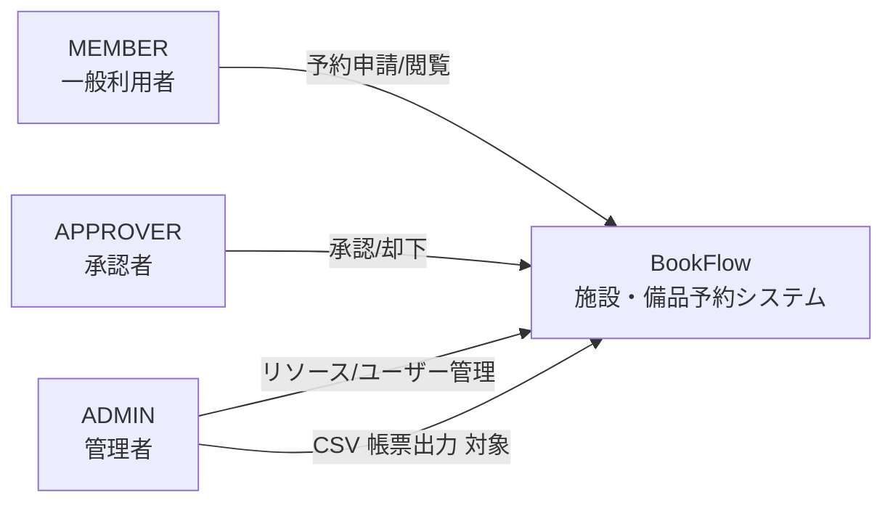

# Business Overview

> 深さ：浅め（既存の `docs-next/docs/spec/requirements.md` が真実の源のため要約に留める）。CSV 帳票出力に関わる予約ドメインのみ詳しめに記述する。

## Business Context Diagram

## Business Description

- **Business Description**: 社内の会議室・設備・車両などのリソースを予約・承認するための施設予約システム。ロールは `MEMBER` / `APPROVER` / `ADMIN` の3種。
- **Business Transactions**:
  - リソース閲覧・空き確認（全ロール）
  - 予約申請・更新・キャンセル（全ロール、本人分のみ）
  - 承認・却下（APPROVER / ADMIN）
  - リソース管理・ユーザー管理（ADMIN）
  - **CSV 帳票出力（本タスクで追加、ADMIN）**：予約一覧・利用実績を CSV でダウンロードする機能
- **Business Dictionary**:
  - **予約（Reservation）**：リソースに対する利用申請。ステータスは `DRAFT` / `PENDING` / `APPROVED` / `REJECTED` / `CANCELLED`
  - **リソース（Resource）**：会議室・設備・車両などの予約対象
  - **承認ステップ（ApprovalStep）**：`requires_approval = true` のリソースに対する予約に紐づく承認記録

## Component Level Business Descriptions

### バックエンド（Spring Boot）

- **Purpose**: 予約・リソース・承認・ユーザーのユースケースを実装する REST API
- **Responsibilities**: ドメインルール（重複予約防止・所有権チェック・ステータスガード）の集約、JWT 認可

### フロントエンド（Next.js）

- **Purpose**: BFF を兼ねた UI 層。Server Actions からバックエンド API を呼び出す
- **Responsibilities**: 画面描画・フォームバリデーション（Zod）・認証トークンのサーバー側保持

詳細は既存仕様を参照：[requirements.md](../../../../../docs-next/docs/spec/requirements.md)、[overview.md](../../../../../docs-next/docs/spec/overview.md)。
