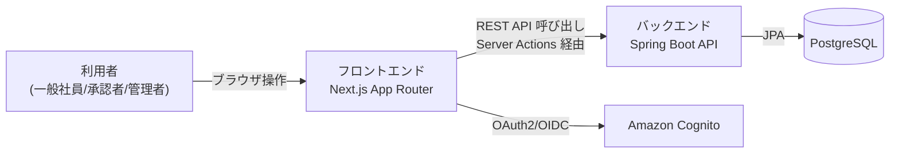

# Business Overview

## Business Context Diagram

## Business Description

- **Business Description**: BookFlow は社内の施設（会議室等）・備品（機器・社用車等）を予約するためのシステムである。利用者は一覧から空き状況を確認し予約を申請し、必要に応じて承認者の承認を経て予約が確定する。
- **Business Transactions**: リソース一覧参照・空き確認（UC-02）、予約申請・承認・却下、リソース登録・編集（管理者）。今回のスコープ（issue #22）はこのうち UC-02 の拡張（並び替え）に限定される。
- **Business Dictionary**:
  - **リソース**：予約対象となる会議室・備品・社用車の総称（`ResourceCategory`: `ROOM`/`EQUIPMENT`/`VEHICLE`）
  - **空き確認フィルタ**：`from`/`to` 日時範囲を指定し、その期間に予約が入っていないリソースのみへ絞り込む機能

## Component Level Business Descriptions

### リソース一覧（`/resources`）

- **Purpose**: 利用者が予約対象リソースを検索・閲覧する画面
- **Responsibilities**: カテゴリ・期間による絞り込み表示、リソース詳細への導線提供。issue #22 により並び替え基準の選択も担う

### リソースAPI（`GET /api/resources`）

- **Purpose**: リソース一覧のページング取得
- **Responsibilities**: カテゴリ・アクティブ状態・期間フィルタの適用、ページネーション。issue #22 によりソート順の適用も担う
