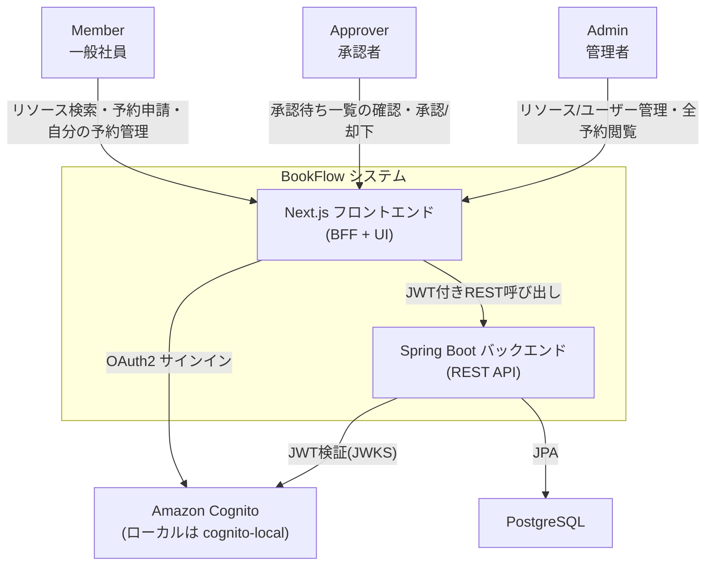

# Business Overview

> AI-DLC Reverse Engineering 成果物。対象: BookFlow モノレポ全体（frontend + backend）。

## Business Context Diagram

## Business Description

- **Business Description**: BookFlow は社内向けの施設・備品予約システムである。会議室・備品・社用車といったリソースを一覧・検索し、空き時間帯を確認したうえで予約を申請できる。リソースによっては承認者の承認を要する予約フローが組み込まれている。
- **Business Transactions**:
  - **認証・自己情報取得**：JWT で認証したユーザーの自己プロフィール取得、サインアウト。
  - **リソース管理**：会議室・備品・社用車の登録・一覧・詳細・更新・有効/無効切替、空き状況照会。
  - **予約申請ワークフロー**：予約の申請・一覧・詳細・更新・キャンセル。リソース間の重複予約チェック、`requiresApproval` による自動承認/要承認の分岐を含む。
  - **承認ワークフロー**：承認者（Approver/Admin）による承認待ち一覧の確認、承認、却下（却下時はコメント必須）。
  - **ユーザー・部署管理**：管理者によるユーザー一覧閲覧、部署一覧閲覧。
- **Business Dictionary**:
  - **リソース（Resource）**：予約対象となる会議室（ROOM）・備品（EQUIPMENT）・社用車（VEHICLE）の総称。
  - **予約（Reservation）**：あるリソースの特定時間帯（`from`/`to`）を確保する申請。ステータスは `DRAFT` / `PENDING` / `APPROVED` / `REJECTED` / `CANCELLED` を遷移する。
  - **承認ステップ（ApprovalStep）**：`requiresApproval=true` のリソースへの予約申請に対して生成される、単一段階の承認レコード。ステータスは `PENDING` / `APPROVED` / `REJECTED`。
  - **ロール（Role）**：`MEMBER`（一般社員）・`APPROVER`（承認者）・`ADMIN`（管理者）の3種。

## Component Level Business Descriptions

### frontend（Next.js 15 App Router）

- **Purpose**: BookFlow の利用者向け画面（BFF層込み）を提供する。
- **Responsibilities**:
  - 認証（Better Auth + Cognito、本番は Hosted UI 経由の OAuth2、開発時のみロール別ログインボタンによるバイパス）。
  - ロールに応じた画面出し分け（ダッシュボード、リソース一覧・詳細、予約申請・一覧・詳細・編集、承認待ち一覧、管理画面）。
  - Server Actions を BFF 層として、バックエンド REST API 呼び出しと Zod によるレスポンス検証を担う。

### backend（Spring Boot 4.0）

- **Purpose**: BookFlow の業務ロジックとデータ永続化を担う REST API サーバー。
- **Responsibilities**:
  - JWT（Cognito 発行）の検証・認可（`@PreAuthorize` によるロールベース制御）。
  - リソース・予約・承認・ユーザー・部署の各ユースケースの実装。
  - PostgreSQL への永続化（JPA、Flyway によるスキーマ管理）。

### docs-next（Docusaurus）

- **Purpose**: 学習者・運営者向けドキュメントサイト。`docs-next/docs/spec/` が仕様の「真実の源」。
- **Responsibilities**: カリキュラム・開発フロー・仕様書・ADR・運用ガイドの一元管理。BookFlow アプリケーション自体の業務機能には関与しない。
