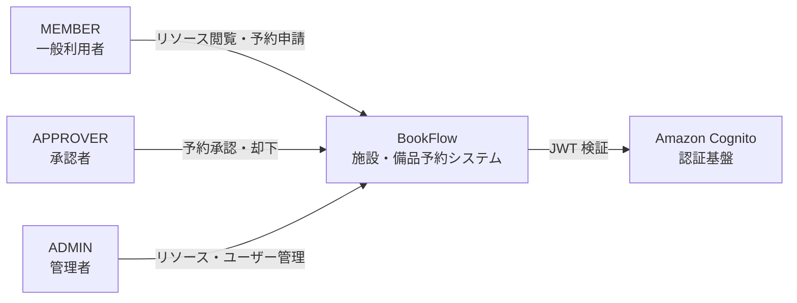

# Business Overview

## Business Context Diagram

```mermaid
flowchart LR
    Member["MEMBER<br/>一般利用者"]
    Approver["APPROVER<br/>承認者"]
    Admin["ADMIN<br/>管理者"]
    BookFlow["BookFlow<br/>施設・備品予約システム"]
    Cognito["Amazon Cognito<br/>認証基盤"]

    Member -->|リソース閲覧・予約申請| BookFlow
    Approver -->|予約承認・却下| BookFlow
    Admin -->|リソース・ユーザー管理| BookFlow
    BookFlow -->|JWT 検証| Cognito
```

## Business Description

- **Business Description**: BookFlow は社内の施設（会議室等）・備品（プロジェクター等）・車両を予約管理するシステム。リソース閲覧、予約申請、承認フロー、リソース管理の 4 つの業務領域を持つ。
- **Business Transactions**:
  - リソース一覧・空き確認（対象ユースケース UC-02）
  - 予約申請・キャンセル
  - 予約承認・却下
  - リソース登録・更新・有効/無効切替（ADMIN）
- **Business Dictionary**:
  - **リソース（Resource）**: 予約対象となる会議室・備品・車両（`category`: `ROOM` / `EQUIPMENT` / `VEHICLE`）
  - **予約（Reservation）**: リソースに対する利用申請。`requires_approval = true` の場合は承認フローを経る
  - **承認ステップ（Approval Step）**: 予約に対する承認者の決裁単位（ベース実装は 1 段階）

## Component Level Business Descriptions

### frontend（Next.js App Router）
- **Purpose**: UI 表示と BFF（Backend for Frontend）を兼ねる。Server Actions が Spring Boot API を呼び出す
- **Responsibilities**: 画面レンダリング、認証トークン管理、フォームバリデーション（Zod）、バックエンド API のプロキシ

### backend（Spring Boot）
- **Purpose**: 業務ロジックと永続化を担う REST API サーバー
- **Responsibilities**: 4 レイヤーアーキテクチャ（domain / application / presentation / infrastructure）に基づく業務ルール実装、JWT 検証、DB アクセス
