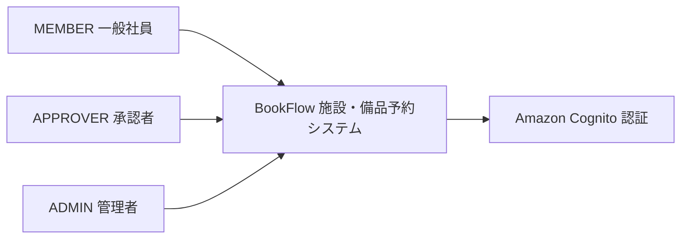

# Business Overview

## Business Context Diagram

```mermaid
flowchart LR
    Member["MEMBER 一般社員"]
    Approver["APPROVER 承認者"]
    Admin["ADMIN 管理者"]
    BookFlow["BookFlow 施設・備品予約システム"]
    Cognito["Amazon Cognito 認証"]

    Member --> BookFlow
    Approver --> BookFlow
    Admin --> BookFlow
    BookFlow --> Cognito
```

## Business Description

- **Business Description**: BookFlow は施設（会議室）・備品・社用車の予約と承認を扱う社内システム。リソースの空き確認、予約申請、承認者による承認・却下、管理者によるリソース管理を提供する。
- **Business Transactions**:
  - リソース一覧・空き確認（UC-02。本課題の対象）
  - リソース詳細・空き状況照会
  - 予約申請・編集・キャンセル
  - 承認・却下
  - リソース登録・更新・有効無効切替（ADMIN）
  - ユーザー・部署の参照（ADMIN）
- **Business Dictionary**:
  - **リソース**：予約対象の施設・備品・社用車（カテゴリ `ROOM` / `EQUIPMENT` / `VEHICLE`）
  - **占有**：ステータスが `PENDING` または `APPROVED` の予約が時間帯を埋めている状態
  - **空き確認**：`from` / `to` で指定した時間帯に占有がないリソースだけを返す絞り込み

## Component Level Business Descriptions

### backend
- **Purpose**: 業務ルールと永続化を担う REST API
- **Responsibilities**: 認可、リソース・予約・承認の業務ルール、重複予約の排他制御

### frontend
- **Purpose**: 画面表示と BFF（Server Actions 経由で backend API を呼ぶ）
- **Responsibilities**: リソース一覧のフィルタ UI、URL パラメータによる状態保持、API レスポンスの Zod 検証
