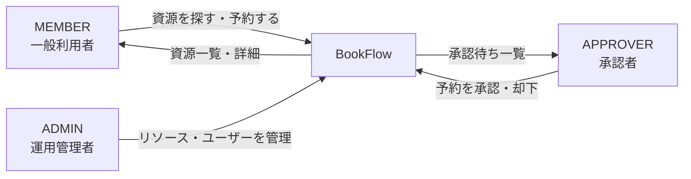

# Business Overview

## Business Context Diagram

```mermaid
flowchart LR
    Member["MEMBER\n一般利用者"] -->|資源を探す・予約する| BookFlow["BookFlow"]
    Approver["APPROVER\n承認者"] -->|予約を承認・却下| BookFlow
    Admin["ADMIN\n運用管理者"] -->|リソース・ユーザーを管理| BookFlow
    BookFlow -->|資源一覧・詳細| Member
    BookFlow -->|承認待ち一覧| Approver
```

## Business Description

- **Business Description**: BookFlow は社内の施設（会議室等）・備品（プロジェクター等）・車両を一元管理し、予約・承認フローをオンライン化する社内システム。
- **Business Transactions**:
  - リソース（施設・備品・車両）の登録・編集・有効/無効切替（ADMIN）
  - リソース一覧の検索・絞り込み・空き確認（全ロール）
  - 予約の申請・承認・却下・キャンセル（ロール別）
- **Business Dictionary**:
  - **リソース（Resource）**: 予約対象となる施設・備品・車両の総称。`category`（`ROOM`/`EQUIPMENT`/`VEHICLE`）で区分する。
  - **要承認（requiresApproval）**: リソースごとに設定するフラグ。`true` の場合、予約は `PENDING` から始まり承認者の承認を経て `APPROVED` になる。
  - **有効/無効（isActive）**: リソースの貸出可否フラグ。`false` のリソースは MEMBER/APPROVER の一覧に表示されない（ADMIN は表示される）。

## Component Level Business Descriptions

### Resource ドメイン（本 RE のスコープ）

- **Purpose**: 施設・備品・車両のマスタ管理と、予約画面から参照される基本情報・空き状況の提供。
- **Responsibilities**:
  - リソースの CRUD（ADMIN）・一覧検索・空き照会（全ロール）
  - Issue #25 のスコープ: リソース詳細画面で表示する付随情報（設備一覧・利用上の注意）の管理を追加する

### Reservation ドメイン（参考・本 RE のスコープ外）

- **Purpose**: 予約の申請・状態遷移・一覧フィルタ。
- **Responsibilities**: Resource ドメインが提供する「重複判定ロジック（`overlaps`）」を再利用する。Issue #25 では変更しない。
