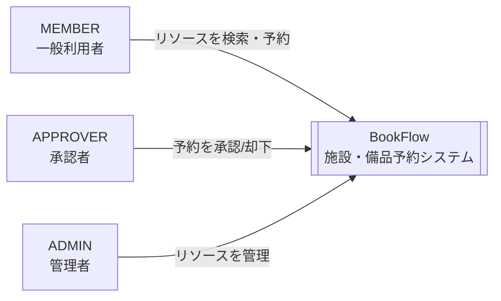

# Business Overview

> 本リポジトリ全体の詳しいアーキテクチャは `docs-next/docs/reference/architecture.md` と `docs-next/docs/spec/overview.md` に既にドキュメント化されている。ここでは今回のエンハンス課題（リソース一覧のキーワード検索）に関わる範囲に絞って記述する。

## Business Context Diagram

```mermaid
flowchart LR
    Member[MEMBER<br/>一般利用者] -->|リソースを検索・予約| BookFlow
    Approver[APPROVER<br/>承認者] -->|予約を承認/却下| BookFlow
    Admin[ADMIN<br/>管理者] -->|リソースを管理| BookFlow
    BookFlow[["BookFlow<br/>施設・備品予約システム"]]
```

## Business Description

- **Business Description**: BookFlow は社内の会議室・備品・社用車といったリソースの予約を一元管理する業務システム。ロール（`MEMBER`/`APPROVER`/`ADMIN`）に応じてリソース閲覧・予約申請・承認・管理の各業務を提供する。
- **Business Transactions**:
  - リソース一覧の閲覧・カテゴリ/期間による空き確認（対象 UC: UC-02）
  - 予約申請・承認・却下・取消
  - リソースの登録・編集（ADMIN）
- **Business Dictionary**:
  - **リソース**（`resources`）: 予約対象の物理資源。カテゴリは `ROOM`（会議室）/ `EQUIPMENT`（備品）/ `VEHICLE`（社用車）
  - **予約**（`reservations`）: リソースの利用申請。状態は `PENDING`/`APPROVED`/`REJECTED`/`CANCELLED`
  - **承認要否**（`requires_approval`）: リソースごとに設定され、`true` の場合は予約に承認ステップが必要

## Component Level Business Descriptions

### リソース一覧・検索（今回のスコープ）
- **Purpose**: 利用者がカテゴリ・空き期間・（今回追加する）キーワードでリソースを絞り込んで一覧できるようにする
- **Responsibilities**: フィルタ条件の受け付け（フロントエンド）、条件に応じたリソース検索（バックエンド）、権限に応じた表示制御（ADMIN のみ無効化リソースも閲覧可）
