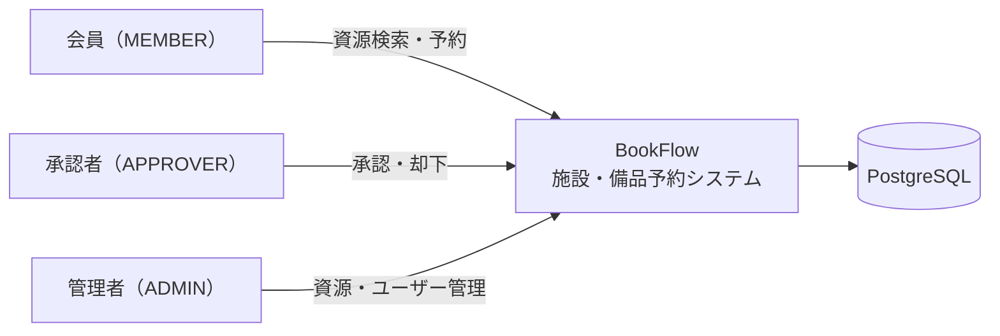

# Business Overview

> **スコープ注記**: このファイルはリポジトリ全体の概要を扱う。詳細な業務知識は既存の `docs-next/docs/spec/overview.md`・`docs-next/docs/spec/requirements.md` を一次情報源とし、本ファイルはそれらの要約と本タスク（リソース一覧の検索・フィルタ追加）に関わる範囲の補足に留める。

## Business Context Diagram

```mermaid
flowchart LR
    Member["会員（MEMBER）"]
    Approver["承認者（APPROVER）"]
    Admin["管理者（ADMIN）"]
    System["BookFlow\n施設・備品予約システム"]
    DB[("PostgreSQL")]

    Member -->|"資源検索・予約"| System
    Approver -->|"承認・却下"| System
    Admin -->|"資源・ユーザー管理"| System
    System --> DB
```

## Business Description

- **Business Description**: BookFlow は社内の会議室・備品・車両などの「リソース」を検索し、期間を指定して予約する社内システムである。カテゴリ（`ROOM` / `EQUIPMENT` / `VEHICLE`）ごとにリソースを管理し、承認要否（`requiresApproval`）に応じて承認フローを経て予約が確定する。
- **Business Transactions**:
  - リソース一覧の検索・空き確認（UC-02） — 本タスクの対象
  - 予約の作成・承認・却下（UC-03〜UC-05）
  - リソース・ユーザー・部署の管理（ADMIN 向け CRUD）
  - サインイン（Cognito 経由の JWT 発行）
- **Business Dictionary**:
  - **リソース（Resource）**: 予約対象となる会議室・備品・車両。`category` で種別を区別する。
  - **予約（Reservation）**: リソースと利用期間の紐付け。`status` が `PENDING` / `APPROVED` の間は当該リソースが占有中とみなされる。
  - **承認ステップ（ApprovalStep）**: `requiresApproval = true` のリソースに対する予約が経由する承認記録。

## Component Level Business Descriptions

### リソース管理（Resource）

- **Purpose**: 会員がリソースを検索・閲覧し、予約可能かどうかを確認できるようにする。管理者はリソースの登録・更新・有効化状態の変更を行う。
- **Responsibilities**:
  - カテゴリ・空き確認期間によるリソース一覧の絞り込み（既存）
  - リソース名・説明文によるキーワード検索（本タスクで追加）
  - 無効化（`is_active = false`）されたリソースを一般会員には非表示にする

### 予約（Reservation）・承認（Approval）

- **Purpose**: リソースの利用申請から承認・確定までを管理する。
- **Responsibilities**: 予約の重複判定、承認フローの進行管理（本タスクの変更範囲外）。

### 認証・ユーザー管理（Auth / User / Department）

- **Purpose**: Cognito が発行する JWT を検証し、ロール（MEMBER / APPROVER / ADMIN）・所属部署に基づくアクセス制御を行う。
- **Responsibilities**: JWT 検証、ロールベースアクセス制御（本タスクの変更範囲外）。
