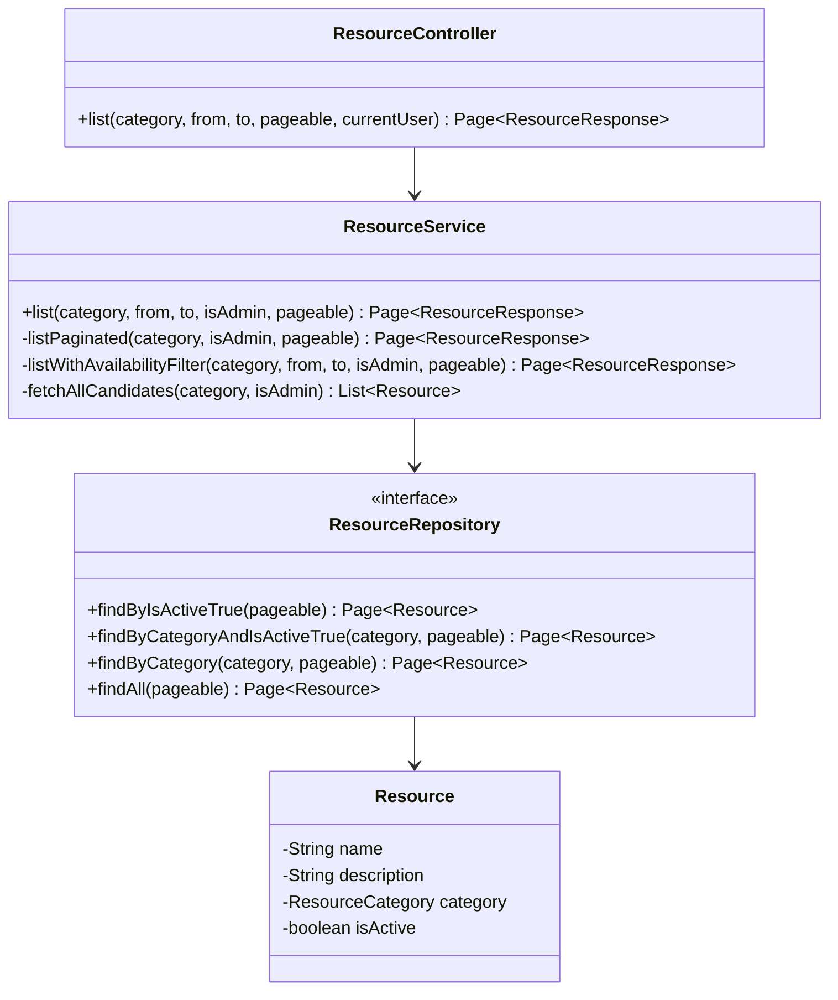

# Code Structure

## Build System

- **Frontend**: pnpm（`packageManager: pnpm@11.5.0`）+ Next.js 15 標準ビルド（`next build`）。
- **Backend**: Gradle（Kotlin DSL）+ Spring Boot Gradle Plugin。`backend/build.gradle.kts` 参照。

## Key Classes/Modules（リソース検索に関わる範囲）

### Existing Files Inventory（今回の変更候補）

- `backend/src/main/java/com/example/bookflow/presentation/ResourceController.java` — `GET /api/resources` のクエリパラメータ受け取り。`keyword` パラメータ追加の対象。
- `backend/src/main/java/com/example/bookflow/application/ResourceService.java` — フィルタ分岐ロジック（`listPaginated` / `listWithAvailabilityFilter` / `fetchAllCandidates`）。キーワード条件を各分岐に組み込む対象。
- `backend/src/main/java/com/example/bookflow/domain/ResourceRepository.java` — `findByCategory` 系メソッド群。キーワード検索クエリ（`Specification` または `@Query`）を追加する対象。
- `backend/src/main/java/com/example/bookflow/domain/Resource.java` — `name`（VARCHAR(100)）・`description`（TEXT）を保持するエンティティ。変更不要（既存フィールドで検索対象が揃っている）。
- `backend/src/test/java/com/example/bookflow/application/ResourceServiceTest.java`（372行）・`backend/src/test/java/com/example/bookflow/presentation/ResourceControllerTest.java`（451行） — 既存テスト。keyword 追加後も pass する必要があり、新規テストもここに追加する。
- `frontend/src/app/(authenticated)/resources/ResourceFilterForm.tsx` — フィルタフォーム。キーワード入力欄を追加する対象。
- `frontend/src/app/(authenticated)/resources/page.tsx` — `SearchParams` 型・`listResourcesAction` 呼び出し。`keyword` を追加する対象。
- `frontend/src/server/actions/resources.ts` — `ListResourcesParams` 型・`listResourcesAction`。`keyword` クエリパラメータを追加する対象。

## Design Patterns

### BFF（Backend for Frontend）
- **Location**: `frontend/src/server/actions/`
- **Purpose**: バックエンド API 呼び出しの集約・認証トークン管理。
- **Implementation**: `"use server"` の Server Actions が `createApiClient` 経由でバックエンドを呼ぶ。

### 4 レイヤーアーキテクチャ（バックエンド）
- **Location**: `backend/src/main/java/com/example/bookflow/{presentation,application,domain,infrastructure}`
- **Purpose**: Controller → Service → Repository の責務分離。
- **Implementation**: `ResourceController`（presentation）→ `ResourceService`（application）→ `ResourceRepository`（domain）。

### 手動ページネーション（in-memory フィルタ後）
- **Location**: `ResourceService#listWithAvailabilityFilter`
- **Purpose**: `from`/`to` 指定時は DB クエリだけでは重複予約を除外できないため、候補を全件取得し Java 側で重複判定してから手動でページ分割する。
- **Implementation**: `fetchAllCandidates` → 占有 ID 除外 → `candidates.subList(start, end)` → `PageImpl`。keyword フィルタもこの分岐に影響する（後述 Requirements Analysis で検討）。

## Critical Dependencies

### Spring Data JPA
- **Version**: Spring Boot 4.0.6 BOM 管理。
- **Usage**: `ResourceRepository` のクエリメソッド（`findByCategory` 等）。
- **Purpose**: `keyword` 検索の実装方式（`Specification` vs. `@Query` カスタム JPQL）を選ぶ際の基盤。

### PostgreSQL（`ILIKE`）
- **Version**: N/A（DB エンジン機能）。
- **Usage**: RES-02（大文字小文字を区別しない検索）の実装候補。
- **Purpose**: `ILIKE` 演算子または `LOWER()` 比較で大文字小文字を無視した部分一致を実現する。
