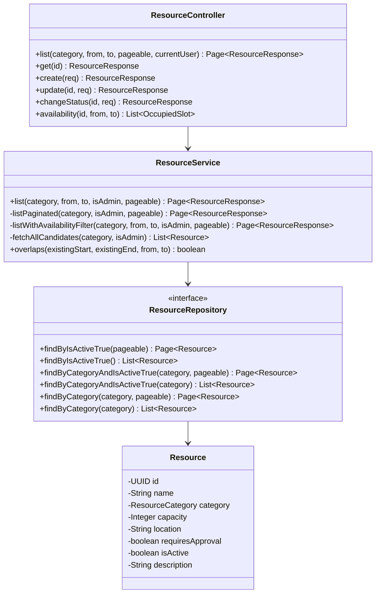

# Code Structure

> スコープ注記：全ソースファイルの網羅的な棚卸しではなく、本課題（リソース一覧の検索・フィルタ追加）で変更候補となるファイルを中心に列挙する。

## Build System

- **Type**: Gradle（Kotlin DSL、backend）/ pnpm（frontend）/ npm（docs-next）
- **Configuration**:
  - `backend/build.gradle.kts`：Spring Boot 4.0.6 プラグイン、Spotless 8.5.1、Checkstyle
  - `frontend/package.json`：Next.js 15、Vitest、Playwright、oxlint / oxfmt
  - `docs-next/package.json`：Docusaurus（`npm run build` がリンク・アンカー破損を検出する）

## Key Classes/Modules

リソース照会に関わるクラスの関係。

### Existing Files Inventory

本課題のスコープ内で参照または変更しうるファイル。

**バックエンド**

- `backend/src/main/java/com/example/bookflow/presentation/ResourceController.java` — リソース API のエンドポイント定義。一覧のクエリパラメータを受け取る。
- `backend/src/main/java/com/example/bookflow/application/ResourceService.java` — 一覧のロール判定・空き判定・ページネーション。
- `backend/src/main/java/com/example/bookflow/domain/ResourceRepository.java` — 派生クエリメソッド群（ページ有無 × カテゴリ有無 × ロール別で6メソッド）。
- `backend/src/main/java/com/example/bookflow/domain/Resource.java` — エンティティ。`name`（100文字）・`description`（TEXT）が検索対象。
- `backend/src/main/java/com/example/bookflow/domain/ResourceCategory.java` — カテゴリ列挙型。
- `backend/src/main/java/com/example/bookflow/presentation/dto/ResourceResponse.java` — 応答 DTO。
- `backend/src/test/java/com/example/bookflow/application/ResourceServiceTest.java` — Mockito 単体テスト。一覧系のスタブを持つ。
- `backend/src/test/java/com/example/bookflow/presentation/ResourceControllerTest.java` — MockMvc テスト。
- `backend/src/main/resources/db/migration/V001__create_initial_schema.sql` — 唯一のマイグレーション。本課題ではスキーマ変更が無いため追加不要。

**フロントエンド**

- `frontend/src/app/(authenticated)/resources/page.tsx` — 一覧画面。`searchParams` を読み取り Server Action に渡す。
- `frontend/src/app/(authenticated)/resources/ResourceFilterForm.tsx` — フィルタフォーム（クライアントコンポーネント）。
- `frontend/src/server/actions/resources.ts` — リソース系 Server Actions。`ListResourcesParams` を持つ。
- `frontend/src/lib/types/api.ts` — Zod スキーマ（`ResourceResponseSchema`）。
- `frontend/src/components/ui/pagination-nav.tsx` — ページネーション。クエリを引き継ぐ。
- `frontend/tests/unit/server/actions/resources.test.ts` — Server Action の単体テスト。

**ドキュメント**

- `docs-next/docs/spec/api-spec.md` — `GET /api/resources` のクエリパラメータ表。
- `docs-next/docs/spec/screen-spec.md` — `/resources` 画面のフィルタ UI 記述。

## Design Patterns

### 4レイヤーアーキテクチャ

- **Location**: `backend/src/main/java/com/example/bookflow/` 配下の4パッケージ。
- **Purpose**: 業務ロジックを application に集約し、presentation を薄く保つ。
- **Implementation**: Controller は入力検証と認可判定のみを行い、Service に委譲する。Repository インターフェースは domain に置き、Spring Data JPA が実装を生成する。

### BFF としての Server Actions

- **Location**: `frontend/src/server/actions/`。
- **Purpose**: ブラウザにバックエンドの URL やトークンを露出させない。
- **Implementation**: `createApiClient` 経由で REST を呼び、Zod スキーマで応答を検証してから Server Component に返す。

### URL searchParams によるフィルタ状態管理

- **Location**: `ResourceFilterForm.tsx` と `resources/page.tsx`。
- **Purpose**: フィルタ状態をクライアント状態ではなく URL に持たせ、共有・再読込に耐えるようにする。
- **Implementation**: フォーム送信時に `URLSearchParams` を組み立てて `router.push` し、Server Component 側が `searchParams` から読み直す。

### 派生クエリメソッドの組み合わせ爆発（技術的負債）

- **Location**: `ResourceRepository.java`。
- **状況**: 「ページネーション有無」×「カテゴリ有無」×「ADMIN 判定」の組み合わせを、すべて個別の派生クエリメソッドで表現している（現在6メソッド）。絞り込み条件が1つ増えるたびにメソッド数が倍増する構造になっている。
- **本課題との関係**: キーワード条件を素朴に派生クエリで追加すると12メソッドになる。設計判断を要する箇所として Functional Design で扱う。

## Critical Dependencies

### Spring Data JPA

- **Version**: Spring Boot 4.0.6 の BOM 管理。
- **Usage**: `ResourceRepository` を含む全リポジトリ。
- **Purpose**: 永続化と派生クエリ。`JpaSpecificationExecutor` を使えば動的条件を組み立てられるが、現状は未使用。

### H2（テスト）

- **Version**: Spring Boot BOM 管理。
- **Usage**: `backend/src/test/resources/application-test.yml` で `MODE=PostgreSQL`、`ddl-auto: create-drop`、Flyway 無効。
- **Purpose**: テスト用のインメモリ DB。PostgreSQL 固有構文（`ILIKE` 等）への依存を避ける必要がある。

### Zod

- **Version**: `^3.25.76`。
- **Usage**: `frontend/src/lib/types/api.ts` の応答スキーマ、`src/lib/schemas/` の入力スキーマ。
- **Purpose**: バックエンド応答の実行時検証と型導出。
