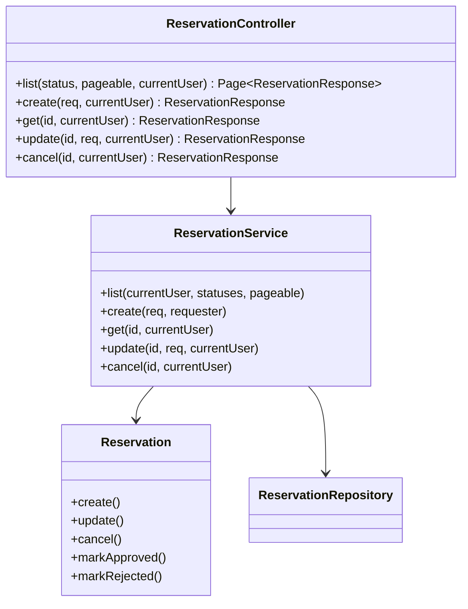

# Code Structure

> 深さ：CSV 帳票出力（`GET /api/reports/reservations/csv`）が触れる領域（予約ドメイン・管理者向けフロントエンド・Spring Security 認可）を詳しく記述し、それ以外は一覧のみに留める。

## Build System

- **バックエンド**: Gradle（Kotlin DSL）。`backend/build.gradle.kts`
- **フロントエンド**: pnpm。`frontend/package.json`

## Key Classes/Modules（4層アーキテクチャ）

### Existing Files Inventory（予約ドメイン・CSV 帳票出力タスクの直接の変更/参照対象）

- `backend/src/main/java/com/example/bookflow/presentation/ReservationController.java` - 予約 REST コントローラ。CSV エンドポイント用に新規コントローラ（例：`ReportController`）を並列追加するのが自然（既存コントローラへの追記ではなく、責務分離のため新設が妥当）
- `backend/src/main/java/com/example/bookflow/application/ReservationService.java` - 予約ユースケース。`list()` の絞り込みロジック（ADMIN 全件 / 本人分、status フィルタ）が CSV 出力のクエリ条件（`from`/`to`/`status`）設計の参考になる
- `backend/src/main/java/com/example/bookflow/domain/Reservation.java` - 予約エンティティ。CSV の出力列（予約ID・リソース名・申請者名・開始/終了日時・目的・承認状態）はこのエンティティ + JOIN 先（`Resource.name`、`User.name`）から構成される
- `backend/src/main/java/com/example/bookflow/domain/ReservationRepository.java` - 予約リポジトリ。既存の `findByStatusInFetch` 等を参考に、期間 (`from`/`to`) 条件のクエリメソッドを追加する必要がある
- `backend/src/main/java/com/example/bookflow/domain/ReservationStatus.java` - ステータス enum（`DRAFT`/`PENDING`/`APPROVED`/`REJECTED`/`CANCELLED`）
- `backend/src/main/java/com/example/bookflow/presentation/dto/ReservationResponse.java` - 予約レスポンス DTO。CSV の行データ構造の参考
- `backend/src/main/java/com/example/bookflow/infrastructure/security/SecurityConfig.java` - Spring Security 設定。`@EnableMethodSecurity` 有効化済みのため、新規エンドポイントは `@PreAuthorize("hasRole('ADMIN')")` で保護する（既存の `ResourceController`・`UserController` と同じパターン）
- `backend/src/main/java/com/example/bookflow/presentation/ResourceController.java` - ADMIN 限定エンドポイントの実装パターンの参考（`@PreAuthorize("hasRole('ADMIN')")` の付け方）
- `backend/src/main/java/com/example/bookflow/presentation/exception/GlobalExceptionHandler.java` - 共通エラーハンドリング（`@PreAuthorize` 違反時の 403 等）
- `frontend/src/app/(authenticated)/admin/resources/page.tsx` / `ResourceManagementClient.tsx` - 管理者ページの実装パターン（CSV ダウンロードボタンの追加先候補）
- `frontend/src/server/actions/reservations.ts` - 予約関連の Server Actions。CSV ダウンロード用アクション追加の参考
- `frontend/src/lib/api-client.ts` - バックエンド呼び出しの共通クライアント。CSV（`text/csv`）レスポンスの扱いは JSON 前提の既存実装と異なる可能性があり要確認

### その他のディレクトリ（一覧のみ）

- `backend/src/main/java/com/example/bookflow/{domain,application,presentation,infrastructure}/` - 4層アーキテクチャ。上記以外に `Resource` / `User` / `ApprovalStep` 関連のクラス群が同様の構造で存在
- `backend/src/main/resources/db/migration/` - Flyway マイグレーション（`V001__create_initial_schema.sql` 等）
- `frontend/src/app/` - App Router のページ・レイアウト一式
- `frontend/src/components/` - UI コンポーネント（shadcn/ui ベース）
- `frontend/src/lib/schemas/` - Zod スキーマ
- `docs-next/` - ドキュメントサイト（Docusaurus）。`docs/spec/` が仕様の真実の源
- `ops-note/`、`site/` - チュートリアル運営ノート・静的サイト（本タスクと無関係）

## Design Patterns

### 4層アーキテクチャ（domain / application / presentation / infrastructure）

- **Location**: `backend/src/main/java/com/example/bookflow/`
- **Purpose**: 責務分離。domain はエンティティ・リポジトリ IF、application はユースケース Service、presentation は Controller・DTO、infrastructure は横断的関心事（Security 等）
- **Implementation**: `ReservationController` → `ReservationService` → `Reservation`（ドメインロジックはエンティティのメソッドに寄せる）

### メソッドセキュリティ（`@PreAuthorize`）

- **Location**: `ResourceController`・`UserController`・`ApprovalController`
- **Purpose**: ロールベースのエンドポイント保護。`SecurityConfig` は `anyRequest().authenticated()` のみで、ロール別の制御はコントローラメソッドの `@PreAuthorize` に委ねる設計
- **Implementation**: `@PreAuthorize("hasRole('ADMIN')")` / `@PreAuthorize("hasAnyRole('APPROVER','ADMIN')")`

## Critical Dependencies

### spring-boot-starter-oauth2-resource-server

- **Usage**: JWT 検証（`jwk-set-uri` 方式、`custom:role` クレームを `ROLE_*` にマッピング）
- **Purpose**: Cognito 発行 JWT の検証・認可

### Spring Data JPA / PostgreSQL

- **Usage**: `reservations` テーブルへのアクセス。CSV 出力はこの層のクエリ結果を変換する

CSV 生成に使う具体的なライブラリ（`opencsv` 等）は `build.gradle.kts` に現時点で存在しない（未導入）。要件分析・NFR 設計で選定する。
