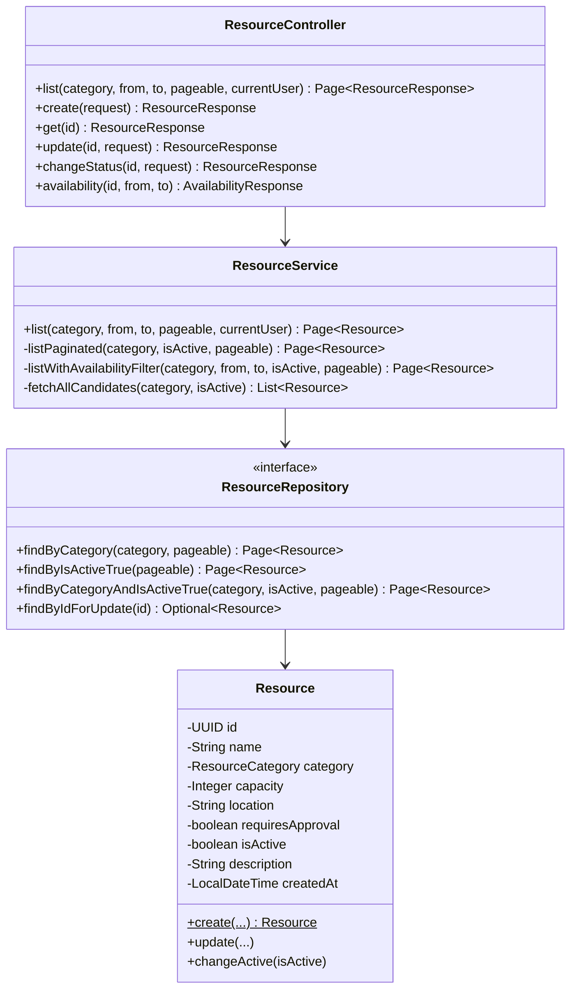

# Code Structure

## Build System

- **Frontend**: pnpm（`packageManager: pnpm@11.5.0`）、Next.js 15 の標準ビルド
- **Backend**: Gradle（Kotlin DSL、`backend/build.gradle.kts`）。Java 25 toolchain、Spring Boot Gradle Plugin `4.0.6`

## Key Classes/Modules（issue #22 関連範囲）

### Existing Files Inventory（issue #22 で変更対象となる候補）

- `backend/src/main/java/com/example/bookflow/presentation/ResourceController.java` - `GET /api/resources` のエンドポイント定義。`sort` パラメータの受け取り口が必要になる
- `backend/src/main/java/com/example/bookflow/application/ResourceService.java` - 一覧取得ロジック。`listWithAvailabilityFilter` 系にソート適用が必要
- `backend/src/main/java/com/example/bookflow/domain/ResourceRepository.java` - `Sort` を受け取るメソッドが必要になる可能性
- `backend/src/main/java/com/example/bookflow/domain/Resource.java` - 変更不要見込み（カラム追加なし）
- `frontend/src/app/(authenticated)/resources/page.tsx` - `searchParams` に `sort` を追加
- `frontend/src/app/(authenticated)/resources/ResourceFilterForm.tsx` - ソート選択UIの追加
- `frontend/src/server/actions/resources.ts` - `ListResourcesParams` への `sort` フィールド追加
- `frontend/src/lib/labels.ts` - ソート選択肢のラベル定数追加候補

## Design Patterns

### BFF（Backend for Frontend）

- **Location**: `frontend/src/server/actions/`
- **Purpose**: フロントエンドから直接バックエンドAPIを叩かず、Server Action 経由で認証情報の付与・レスポンス検証を一元化する
- **Implementation**: `resources.ts` の各 `*Action` 関数が `client.getPaginated`/`client.get` 等の共通クライアントをラップする

### 4層アーキテクチャ（バックエンド）

- **Location**: `backend/src/main/java/com/example/bookflow/{domain,application,presentation,infrastructure}`
- **Purpose**: ドメインロジックとプレゼンテーション・インフラ層の分離
- **Implementation**: `presentation`（Controller/DTO）→ `application`（Service）→ `domain`（Entity/Repository interface）。`infrastructure` は JPA実装・外部連携を持つ

## Critical Dependencies

### Spring Data JPA（`Pageable`/`Sort`）

- **Version**: Spring Boot 4.0.6 付属
- **Usage**: `ResourceController.list` の `Pageable pageable` 引数（`@PageableDefault(size = 20)`）。標準リゾルバが `sort` クエリパラメータを自動的に `Pageable.getSort()` へマッピングする
- **Purpose**: issue #22 の RES-01（ソートパラメータ）を最小実装で満たすための基盤機構
