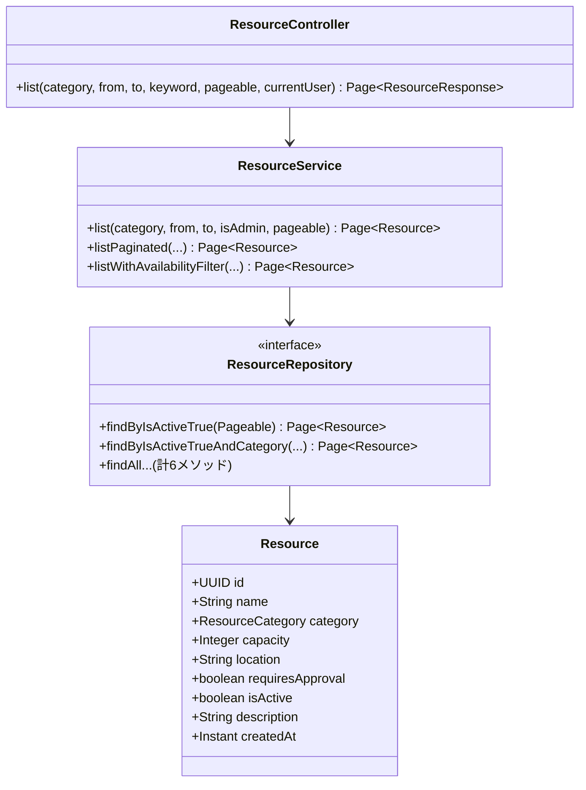

# Code Structure

## Build System

- **Type**: pnpm（frontend） / Gradle Kotlin DSL（backend）
- **Configuration**: `frontend/package.json`、`backend/build.gradle.kts`

## Key Classes/Modules（関連範囲）

```mermaid
classDiagram
    class ResourceController {
        +list(category, from, to, keyword, pageable, currentUser) Page~ResourceResponse~
    }
    class ResourceService {
        +list(category, from, to, isAdmin, pageable) Page~Resource~
        +listPaginated(...) Page~Resource~
        +listWithAvailabilityFilter(...) Page~Resource~
    }
    class ResourceRepository {
        <<interface>>
        +findByIsActiveTrue(Pageable) Page~Resource~
        +findByIsActiveTrueAndCategory(...) Page~Resource~
        +findAll... (計6メソッド)
    }
    class Resource {
        +UUID id
        +String name
        +ResourceCategory category
        +Integer capacity
        +String location
        +boolean requiresApproval
        +boolean isActive
        +String description
        +Instant createdAt
    }
    ResourceController --> ResourceService
    ResourceService --> ResourceRepository
    ResourceRepository --> Resource
```

### 現状のファイル一覧（今回変更対象になる候補）

- `backend/src/main/java/com/example/bookflow/presentation/ResourceController.java` - リソース一覧APIのエンドポイント
- `backend/src/main/java/com/example/bookflow/presentation/dto/ResourceResponse.java` - レスポンスDTO
- `backend/src/main/java/com/example/bookflow/application/ResourceService.java` - 検索ユースケースの本体
- `backend/src/main/java/com/example/bookflow/domain/Resource.java` - リソースエンティティ
- `backend/src/main/java/com/example/bookflow/domain/ResourceRepository.java` - 派生クエリメソッド6種を提供する現状のリポジトリ
- `backend/src/test/java/com/example/bookflow/application/ResourceServiceTest.java` - 372行、Mockitoでリポジトリをモック
- `backend/src/test/java/com/example/bookflow/presentation/ResourceControllerTest.java` - 451行、MockMvc + H2実DB
- `frontend/src/app/(authenticated)/resources/page.tsx` - リソース一覧画面
- `frontend/src/app/(authenticated)/resources/ResourceFilterForm.tsx` - フィルタフォーム（Client Component）
- `frontend/src/server/actions/resources.ts` - BFF層のServer Action
- `frontend/tests/unit/server/actions/resources.test.ts` - 187行、MSWモックで検証

## Design Patterns

### 派生クエリメソッド（Spring Data JPA Derived Query）
- **Location**: `ResourceRepository`
- **Purpose**: `isActive`×`category` の組み合わせを型安全に表現
- **Implementation**: メソッド名から自動生成されるクエリ（`findByIsActiveTrueAndCategory` 等）。ただし条件が増えると組み合わせが指数的に増える弱点がある（後述の技術的負債参照）

### Server Actions による BFF 層
- **Location**: `frontend/src/server/actions/`
- **Purpose**: クライアントから直接バックエンドを呼ばせず、フロントエンドのサーバー側でAPI呼び出しとレスポンス検証（Zod）を行う
- **Implementation**: `'use server'` 指定の関数がバックエンドAPIを呼び出し、`ResourceResponseSchema.parse()` で検証してから画面に返す

## Critical Dependencies

### Spring Data JPA
- **Version**: Spring Boot 4.0.6 に同梱
- **Usage**: `ResourceRepository` の派生クエリ・`@Query` JPQL
- **Purpose**: リソースの永続化・検索

### Zod
- **Version**: `^3.25.76`
- **Usage**: Server Actions でのAPIレスポンス検証
- **Purpose**: バックエンドの契約破りを型・実行時検証の両方で検出する
