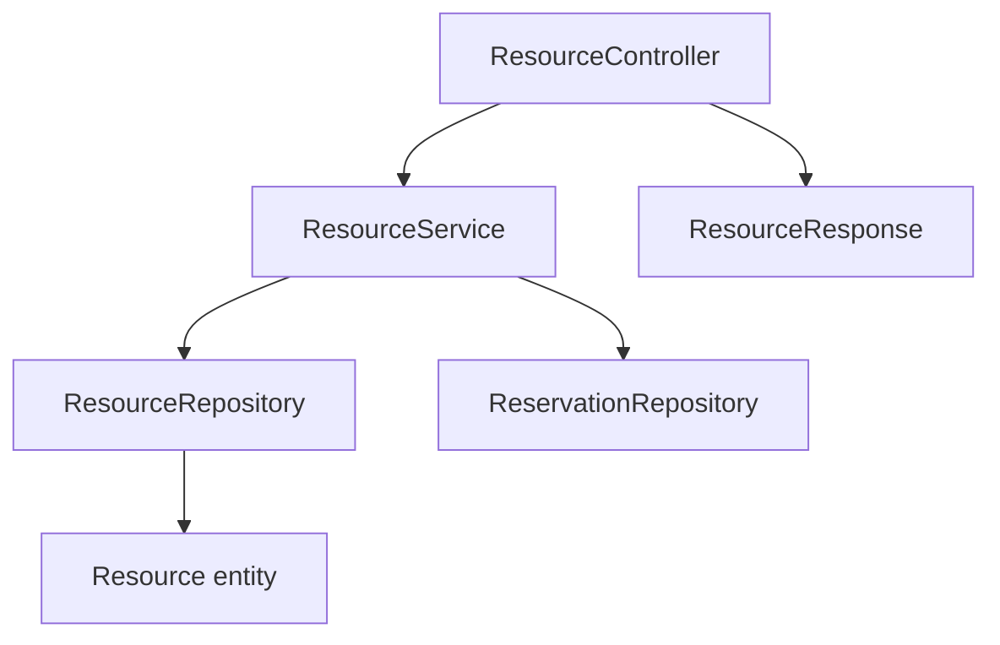

# Code Structure

## Build System

- **Type**: Gradle Kotlin DSL（backend）/ pnpm（frontend）
- **Configuration**: `backend/build.gradle.kts`（Spotless + Checkstyle 有効）、`frontend/package.json`（oxlint / oxfmt / vitest）

## Key Classes/Modules

```mermaid
flowchart TD
    RC["ResourceController"] --> RS["ResourceService"]
    RS --> RR["ResourceRepository"]
    RS --> ResvR["ReservationRepository"]
    RR --> RE["Resource entity"]
    RC --> DTO["ResourceResponse"]
```

### Existing Files Inventory

本課題で変更候補になるファイルのみ列挙する。

**backend**
- `backend/src/main/java/com/example/bookflow/presentation/ResourceController.java` - 一覧 API の受け口。`category` / `from` / `to` / `pageable` を受ける。変更候補
- `backend/src/main/java/com/example/bookflow/application/ResourceService.java` - 一覧ロジック。`from`/`to` なしは `listPaginated`、ありは `listWithAvailabilityFilter`（全件取得し Java で絞り込み後に手動ページング）。変更候補
- `backend/src/main/java/com/example/bookflow/domain/ResourceRepository.java` - 派生クエリ 6 本（`findByIsActiveTrue` 系、`findByCategory` 系、各ページング有無）。変更候補
- `backend/src/main/java/com/example/bookflow/domain/Resource.java` - エンティティ（`name` 100 文字、`description` TEXT）。変更なし
- `backend/src/test/java/com/example/bookflow/application/ResourceServiceTest.java` - Mockito 単体テスト。変更候補
- `backend/src/test/java/com/example/bookflow/presentation/ResourceControllerTest.java` - H2 + MockMvc の統合テスト。変更候補

**frontend**
- `frontend/src/app/(authenticated)/resources/page.tsx` - 一覧ページ（Server Component）。`SearchParams` に `category` / `from` / `to` / `page`。変更候補
- `frontend/src/app/(authenticated)/resources/ResourceFilterForm.tsx` - フィルタフォーム（Client Component）。送信時に `URLSearchParams` を組み立てる。変更候補
- `frontend/src/server/actions/resources.ts` - `listResourcesAction`。クエリパラメータを個別に詰め替える。変更候補
- `frontend/src/components/ui/pagination-nav.tsx` - ページ送り。`query` を引き継ぐ。変更なし（動作確認のみ）
- `frontend/tests/unit/server/actions/` と `frontend/tests/unit/msw/handlers.ts` - Server Action のテストと MSW。変更候補

**docs**
- `docs-next/docs/spec/api-spec.md`、`docs-next/docs/spec/screen-spec.md` - 更新対象の仕様

## Design Patterns

### 4 レイヤーアーキテクチャ
- **Location**: `backend/src/main/java/com/example/bookflow/`
- **Purpose**: 責務分離
- **Implementation**: Controller は薄く、業務ルールは Service、永続化は Repository

### URL を状態とするフィルタ
- **Location**: `ResourceFilterForm.tsx` / `page.tsx`
- **Purpose**: フィルタ条件を URL に保持し Server Component で再取得する
- **Implementation**: 送信時に `router.push("/resources?...")`、`page.tsx` が `searchParams` を読む

## Critical Dependencies

### Spring Data JPA
- **Version**: Spring Boot 4.0.6 BOM
- **Usage**: `ResourceRepository`（派生クエリ・`@Query`）
- **Purpose**: 永続化
