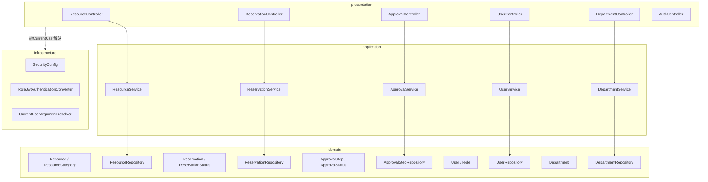

# Code Structure

> **スコープ**: 全量インベントリではなく、backend/frontend の主要クラス一覧＋本タスク（リソース検索・フィルタ）に関わるリソーススライスの詳細を記載する。

## Build System

- **Type**: Gradle（Kotlin DSL, backend） / pnpm（frontend） / npm（docs-next）
- **Configuration**: `backend/build.gradle.kts`、`frontend/package.json`（`packageManager: pnpm@11.5.0`）

## Key Classes/Modules（backend, 4層）

```mermaid
flowchart TB
    subgraph presentation["presentation"]
        RC["ResourceController"]
        RVC["ReservationController"]
        AC["ApprovalController"]
        DC["DepartmentController"]
        UC["UserController"]
        AuthC["AuthController"]
    end
    subgraph application["application"]
        RS["ResourceService"]
        RVS["ReservationService"]
        AS["ApprovalService"]
        DS["DepartmentService"]
        US["UserService"]
    end
    subgraph domain["domain"]
        RE["Resource / ResourceCategory"]
        RR["ResourceRepository"]
        RVE["Reservation / ReservationStatus"]
        RVR["ReservationRepository"]
        APE["ApprovalStep / ApprovalStatus"]
        APR["ApprovalStepRepository"]
        UE["User / Role"]
        UR["UserRepository"]
        DE["Department"]
        DR["DepartmentRepository"]
    end
    subgraph infrastructure["infrastructure"]
        SC["SecurityConfig"]
        JWT["RoleJwtAuthenticationConverter"]
        CU["CurrentUserArgumentResolver"]
    end

    RC --> RS --> RR
    RVC --> RVS --> RVR
    AC --> AS --> APR
    DC --> DS --> DR
    UC --> US --> UR
    presentation -.->|"@CurrentUser解決"| infrastructure
```

### Existing Files Inventory（リソーススライス、詳細）

- `backend/src/main/java/com/example/bookflow/presentation/ResourceController.java` - `GET/POST/PUT/PATCH /api/resources` のエンドポイント定義。`from`/`to` 片方のみ指定時に `ValidationException` を送出
- `backend/src/main/java/com/example/bookflow/application/ResourceService.java` - `list` / `fetchAllCandidates` / `get` / `create` / `update` / `changeStatus` / `availability` / `overlaps`（静的・予約重複判定）
- `backend/src/main/java/com/example/bookflow/domain/Resource.java` - `@Entity`。`name`（VARCHAR(100)）・`description`（TEXT）を含む
- `backend/src/main/java/com/example/bookflow/domain/ResourceCategory.java` - `ROOM` / `EQUIPMENT` / `VEHICLE` の enum
- `backend/src/main/java/com/example/bookflow/domain/ResourceRepository.java` - `JpaRepository<Resource, UUID>`。派生クエリメソッドのみ（後述）
- `backend/src/main/java/com/example/bookflow/presentation/dto/ResourceResponse.java` ほか `CreateResourceRequest` / `UpdateResourceRequest` / `StatusUpdateRequest`（record）
- `backend/src/test/java/com/example/bookflow/application/ResourceServiceTest.java` - Mockito 単体テスト。`@Nested` で `Overlaps` / `List_` / `Get` / `Availability` に分割
- `backend/src/test/java/com/example/bookflow/presentation/ResourceControllerTest.java` - MockMvc + H2 結合テスト。`@WithMockMember` / `@WithMockAdmin` でロール切替

### Existing Files Inventory（その他の主要ファイル、概要）

- `backend/src/main/java/com/example/bookflow/domain/{Reservation,ReservationRepository,ReservationStatus}.java` - 予約エンティティ・Repository
- `backend/src/main/java/com/example/bookflow/domain/{ApprovalStep,ApprovalStepRepository,ApprovalStatus}.java` - 承認エンティティ・Repository
- `backend/src/main/java/com/example/bookflow/domain/{User,UserRepository,Role}.java`、`{Department,DepartmentRepository}.java`
- `backend/src/main/java/com/example/bookflow/infrastructure/security/*.java` - JWT 検証・ロール変換・`@CurrentUser` 解決
- `backend/src/main/java/com/example/bookflow/infrastructure/config/{OpenApiConfig,RequestLoggingConfig,WebMvcConfig}.java`

### Existing Files Inventory（frontend, リソーススライス）

- `frontend/src/app/(authenticated)/resources/page.tsx` - Server Component。`searchParams`（`category`/`from`/`to`/`page`）をそのまま `listResourcesAction` に渡す
- `frontend/src/app/(authenticated)/resources/ResourceFilterForm.tsx` - `"use client"`。素の `FormData` → `URLSearchParams` → `router.push` 実装。React Hook Form / Zod 不使用
- `frontend/src/app/(authenticated)/resources/[id]/` - 詳細ページ
- `frontend/src/server/actions/resources.ts` - `listResourcesAction` ほか `getResourceAction` / `getAvailabilityAction` / `createResourceAction` / `updateResourceAction` / `changeResourceStatusAction`
- `frontend/src/lib/schemas/resource.ts` - `CreateResourceSchema` / `UpdateResourceSchema`（登録・更新用。一覧フィルタ用スキーマは現状なし）
- `frontend/src/app/(authenticated)/admin/resources/` - 管理画面側の CRUD UI（一覧フィルタとは別系統、本タスクの対象外）

## Design Patterns

### Repository メソッド命名規約（Spring Data derived query）

- **Location**: `ResourceRepository`（および `ReservationRepository` 等、ドメイン層全般）
- **Purpose**: カテゴリ・有効フラグによる絞り込みをメソッド名から自動生成されるクエリで実現
- **Implementation**: `findByCategoryAndIsActiveTrue(ResourceCategory, Pageable)` のような派生メソッド。`JpaSpecificationExecutor` は未実装（Specification パターンは不使用）

### Server Actions による BFF 集約

- **Location**: `frontend/src/server/actions/`
- **Purpose**: クライアントコンポーネントに認証トークンを露出せず、サーバー側でバックエンド API を呼び出す
- **Implementation**: 各ドメインごとに `actions/{domain}.ts` を配置し、`client.getPaginated` 等の共通クライアントでラップする

## Critical Dependencies

### Spring Data JPA

- **Version**: Spring Boot 4.0.6 に同梱
- **Usage**: `ResourceRepository` 等のドメイン層 Repository インターフェース
- **Purpose**: 派生クエリによる宣言的なデータアクセス

### Zod

- **Version**: `^3.25.76`
- **Usage**: `frontend/src/lib/schemas/`（登録・更新フォーム）、API レスポンス検証（`ResourceResponseSchema` 等、`frontend/src/lib/types/api.ts`）
- **Purpose**: フォーム・API 境界での型安全なバリデーション（ただし一覧フィルタフォームには現状未適用）
