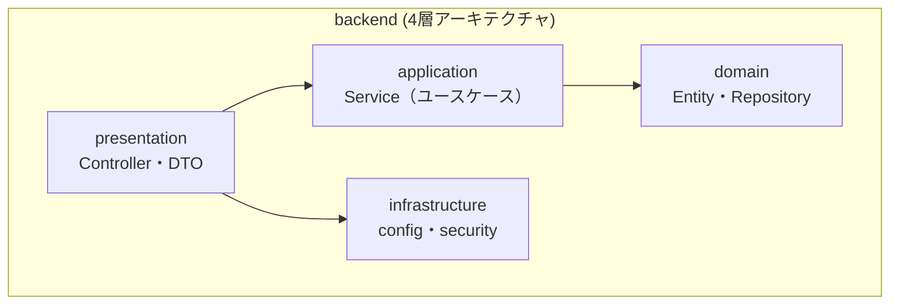

# Code Structure

## Build System

- **Frontend**: pnpm（`pnpm-lock.yaml`）、Next.js 15 App Router
- **Backend**: Gradle Kotlin DSL（`build.gradle.kts`）、Spring Boot Gradle Plugin 4.0.6

## Key Modules

```mermaid
flowchart TB
    subgraph backend["backend (4層アーキテクチャ)"]
        presentation["presentation<br/>Controller・DTO"]
        application["application<br/>Service（ユースケース）"]
        domain["domain<br/>Entity・Repository"]
        infrastructure["infrastructure<br/>config・security"]
    end
    presentation --> application
    application --> domain
    presentation --> infrastructure
```

## リソース検索まわりの既存ファイル一覧（Issue #23 対象）

### Backend

| ファイル | 役割 |
|---|---|
| `backend/src/main/java/com/example/bookflow/presentation/ResourceController.java` | `GET /api/resources` エンドポイント。`category`/`from`/`to`/`page`/`size` を受け付け `ResourceService#list` に委譲 |
| `backend/src/main/java/com/example/bookflow/application/ResourceService.java` | ロール別一覧取得・空き判定ロジック。`listPaginated`（from/to 未指定）と `listWithAvailabilityFilter`（from/to 指定時、Java 側で重複判定後に手動ページネーション）の 2 経路を持つ |
| `backend/src/main/java/com/example/bookflow/domain/ResourceRepository.java` | Spring Data JPA。**派生クエリメソッド名**（`findByIsActiveTrue`・`findByCategoryAndIsActiveTrue`・`findByCategory`・`findAll` の 4 パターン×ページネーション有無）で category × isActive の組み合わせを表現。`@Query` は悲観ロック用の 1 件のみで、一覧系はすべて派生クエリ |
| `backend/src/main/java/com/example/bookflow/domain/Resource.java` | `resources` テーブルにマップする JPA エンティティ。`name`（VARCHAR 100）・`description`（TEXT、NULL 可） |
| `backend/src/test/java/com/example/bookflow/application/ResourceServiceTest.java` | Mockito 単体テスト。`List_` ネストクラスに一覧取得のテストケースあり |
| `backend/src/test/java/com/example/bookflow/presentation/ResourceControllerTest.java` | Controller の MockMvc テスト |

### Frontend

| ファイル | 役割 |
|---|---|
| `frontend/src/app/(authenticated)/resources/page.tsx` | Server Component。`searchParams`（`category`/`from`/`to`/`page`）を読み取り `listResourcesAction` を呼び出す |
| `frontend/src/app/(authenticated)/resources/ResourceFilterForm.tsx` | Client Component。フォーム送信時に空でない値のみ `URLSearchParams` に設定し `router.push` |
| `frontend/src/server/actions/resources.ts` | Server Actions（BFF 層）。`listResourcesAction` が `ListResourcesParams` を受け取りバックエンド `/resources` を呼ぶ。値が存在するパラメータのみ `queryParams` に含める |
| `frontend/tests/unit/server/actions/resources.test.ts` | MSW を使った Server Actions のユニットテスト |

## Design Patterns

### 派生クエリメソッド名（Spring Data JPA）
- **Location**: `ResourceRepository`
- **Purpose**: category × isActive の 2 条件を型安全に表現
- **Implementation**: `findByCategoryAndIsActiveTrue` のようにメソッド名で条件を組み立てる方式。**keyword を追加すると組み合わせが 2 倍（8 パターン）に増え、この方式のままでは破綻する**ため、Issue #23 の実装では `@Query`（JPQL、null 許容パラメータ分岐）または JPA `Specification` への切り替えが必要（エンハンス課題シートの「AI 活用ポイント」でも同じ論点が指摘されている）

### 「未指定時は既存パラメータを付与しない」パターン（フロントエンド）
- **Location**: `ResourceFilterForm.tsx`（`if (category && ...) params.set(...)`）、`resources.ts`（`if (params?.category) queryParams.category = ...`）
- **Purpose**: フィルタ未指定時に既存の動作（全件取得）を変えない
- **Implementation**: 空文字列・undefined のキーは `URLSearchParams` / `queryParams` に含めない。keyword もこのパターンを踏襲する必要がある（受入条件「キーワードを空にして絞り込むと、キーワード条件が解除される」に対応）

## Critical Dependencies

### Spring Data JPA / Hibernate
- **Usage**: `ResourceRepository` の派生クエリ・エンティティマッピング
- **Purpose**: `ddl-auto: validate` のため、エンティティのカラム定義は Flyway マイグレーション（`V001__create_initial_schema.sql`）と完全一致させる必要がある

### H2（テスト） / PostgreSQL（本番）
- **Usage**: `backend/src/test/resources/application-test.yml` で `jdbc:h2:mem:testdb;MODE=PostgreSQL;...` を使用
- **Purpose**: テストは H2 の PostgreSQL 互換モードで実行されるため、大文字小文字を区別しない検索の実装（`LOWER()+LIKE` か `ILIKE` か）は両 DB で同じ挙動になることを確認する必要がある
