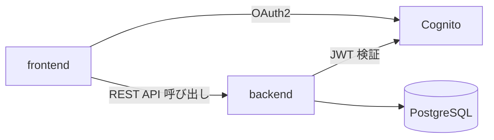

# Dependencies

## Internal Dependencies

### frontend depends on backend

- **Type**: Runtime（HTTP API 呼び出し）
- **Reason**: BFF として Server Actions からバックエンド API を呼び出す

### backend depends on PostgreSQL

- **Type**: Runtime
- **Reason**: 予約・リソース・ユーザー等のデータ永続化

## External Dependencies（本タスクに関連するもののみ）

### spring-boot-starter-oauth2-resource-server

- **Version**: Spring Boot 4.0 BOM 管理
- **Purpose**: Cognito 発行 JWT の検証。CSV エンドポイントも同じ認可基盤（`@PreAuthorize`）に乗る
- **License**: Apache 2.0

### spring-boot-starter-web

- **Version**: Spring Boot 4.0 BOM 管理
- **Purpose**: REST コントローラ基盤。CSV レスポンス（`Content-Type: text/csv`）もこの上に実装する
- **License**: Apache 2.0

その他の依存関係の網羅的な一覧は `backend/build.gradle.kts` / `frontend/package.json` を参照（本タスクの影響範囲外のため詳細化しない）。
