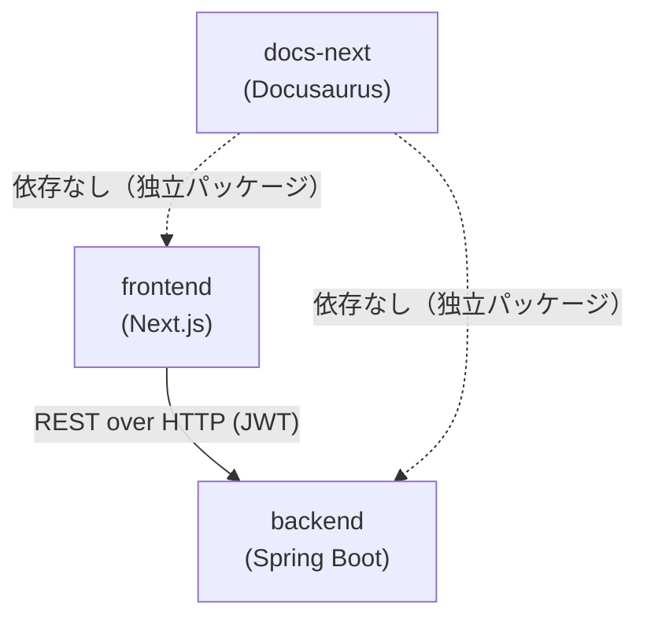

# Dependencies

## Internal Dependencies

### frontend depends on backend

- **Type**: Runtime（HTTP経由、コンパイル時依存ではない）
- **Reason**: `src/server/actions/*.ts` がバックエンドの REST API を呼び出し、Zod でレスポンス形状を検証するため。型定義（`src/lib/types/`）はバックエンドの DTO と手動で同期させる必要があり、自動生成の仕組みはない（エンハンス課題カタログの「OpenAPI クライアント自動生成」が未着手のため）。

### docs-next / Docs/spec は frontend・backend いずれにも依存しない

- **Type**: なし
- **Reason**: ドキュメントサイトとAI-DLC作業ファイルはアプリケーションコードとビルド・実行時の依存関係を持たない独立パッケージ。

## External Dependencies

### frontend（主要なもののみ、全量は `technology-stack.md` 参照）

- **next** ^15.3.2 - Purpose: アプリケーションフレームワーク - License: MIT
- **better-auth** ^1.2.7 - Purpose: 認証（Cognito連携） - License: MIT
- **zod** ^3.25.76 - Purpose: スキーマバリデーション - License: MIT
- **react-hook-form** ^7.76.1 - Purpose: フォーム状態管理 - License: MIT
- **tailwindcss** ^4.1.8 - Purpose: スタイリング - License: MIT

### backend（主要なもののみ、全量は `technology-stack.md` 参照）

- **Spring Boot** 4.0.6 - Purpose: アプリケーションフレームワーク - License: Apache-2.0
- **springdoc-openapi-starter-webmvc-ui** 3.0.1 - Purpose: OpenAPI ドキュメント自動生成 - License: Apache-2.0
- **Flyway**（flyway-core / flyway-database-postgresql / spring-boot-flyway） - Purpose: DBマイグレーション - License: Apache-2.0
- **Lombok** 1.18.38 - Purpose: ボイラープレート削減 - License: MIT
- **H2**（testRuntimeOnly） - Purpose: テスト用インメモリDB - License: EPL/MPL
