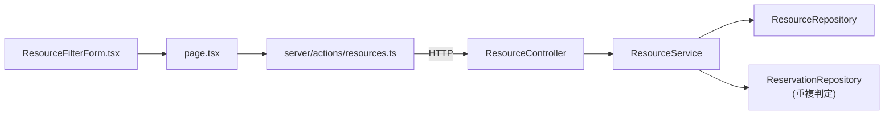

# Dependencies

## Internal Dependencies

### frontend depends on backend

- **Type**: Runtime（HTTP経由）
- **Reason**: `resources.ts` の Server Action がバックエンドの `GET /api/resources` を呼び出すため

### ResourceService depends on ResourceRepository

- **Type**: Compile
- **Reason**: 一覧取得ロジックの永続化アクセス

### ResourceService depends on ReservationRepository

- **Type**: Compile
- **Reason**: 空き確認フィルタ（`from`/`to`指定時）で対象期間に重複予約があるリソースを除外するため

## External Dependencies

### Spring Data JPA（`Sort`/`Pageable`）

- **Version**: Spring Boot 4.0.6 付属
- **Purpose**: issue #22 の `sort` パラメータをORDER BYへ変換する標準機構
- **License**: Apache 2.0

### PostgreSQL JDBC Driver

- **Version**: `runtimeOnly("org.postgresql:postgresql")`（バージョン指定はSpring Boot BOM管理）
- **Purpose**: 本番DB接続
- **License**: BSD-2-Clause
