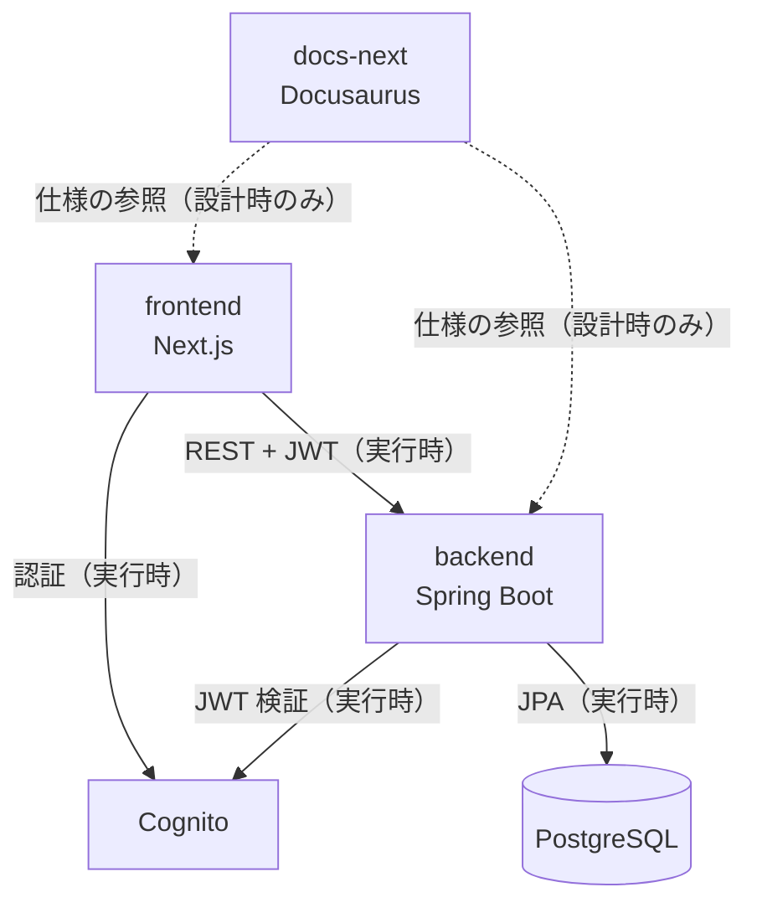

# Dependencies

## Internal Dependencies

### frontend depends on backend

- **Type**: Runtime
- **Reason**: Server Actions が REST API を呼び出して業務データを取得する。ビルド時の型共有は無く、`src/lib/types/api.ts` の Zod スキーマが手書きで API 契約を写している。
- **本課題への含意**: バックエンドにクエリパラメータを追加しても、フロントエンド側を別途変更しなければ利用されない。両者を同じユニットで変更する必要がある（縦切り）。

### backend depends on PostgreSQL

- **Type**: Runtime
- **Reason**: Spring Data JPA による永続化。テスト時は H2 に差し替わるため、PostgreSQL 固有構文への依存は移植性の問題を生む。

### backend depends on Cognito

- **Type**: Runtime
- **Reason**: OAuth2 Resource Server として JWK セットを取得し JWT を検証する。

### docs-next depends on backend / frontend

- **Type**: 設計時のみ（コード依存なし）
- **Reason**: `docs/spec/` が実装の仕様を記述する。Spec-first の原則により仕様更新が実装に先行する。

## External Dependencies

### Spring Boot Starter Data JPA

- **Version**: Spring Boot 4.0.6 BOM
- **Purpose**: リポジトリ層の実装生成。動的条件の組み立てには `JpaSpecificationExecutor` と `Specification` API が利用可能だが、現状のコードでは未使用。
- **License**: Apache-2.0

### Hibernate（JPA 実装）

- **Version**: Spring Boot BOM 管理
- **Purpose**: JPQL / Criteria API の解釈と SQL 生成。方言は本番が PostgreSQL、テストが H2。
- **License**: LGPL-2.1

### H2 Database

- **Version**: Spring Boot BOM 管理
- **Purpose**: テスト用インメモリ DB。`MODE=PostgreSQL` で PostgreSQL の一部構文を受け付けるが、互換性は完全ではない。
- **License**: MPL-2.0 / EPL-1.0

### Zod

- **Version**: `^3.25.76`
- **Purpose**: API 応答の実行時検証と TypeScript 型の導出。
- **License**: MIT

### MSW

- **Version**: `^2.7.5`
- **Purpose**: フロントエンド単体テストでの API モック。`frontend/tests/unit/msw/handlers.ts` にハンドラを置く。
- **License**: MIT
