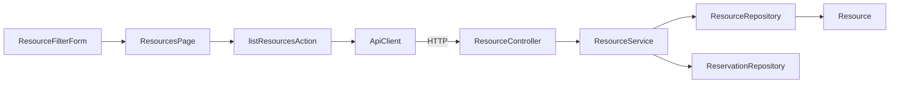

# Dependencies

## Internal Dependencies

### `ResourceService` depends on `ReservationRepository`
- **Type**: Runtime（DI 経由）
- **Reason**: `from`/`to` 指定時に占有予約（`PENDING`/`APPROVED`）を判定するため。keyword フィルタ自体はこの依存に影響しない。

### `ResourceController` depends on `ResourceService`
- **Type**: Runtime（DI 経由）
- **Reason**: 4 レイヤーアーキテクチャの Controller → Service 呼び出し。

## External Dependencies

### `org.springframework.boot:spring-boot-starter-data-jpa`
- **Version**: Spring Boot 4.0.6 BOM 管理
- **Purpose**: `ResourceRepository` のクエリメソッド基盤。keyword 検索実装（`Specification` か `@Query`）の選択肢を提供する。
- **License**: Apache-2.0

### `next` (15.3.2)
- **Version**: ^15.3.2
- **Purpose**: `ResourcesPage`（App Router Server Component）の基盤。
- **License**: MIT

### `zod` (3.25.76)
- **Version**: ^3.25.76
- **Purpose**: `ResourceResponseSchema` によるレスポンスバリデーション（`lib/types/api.ts`）。keyword 追加時もレスポンス形状は変わらないため既存スキーマ変更は不要見込み。
- **License**: MIT
