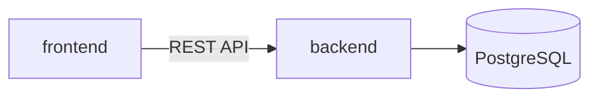

# Dependencies

## Internal Dependencies

```mermaid
flowchart LR
    FE["frontend"] -->|REST API| BE["backend"]
    BE --> DB[("PostgreSQL")]
```

### frontend depends on backend
- **Type**: Runtime
- **Reason**: Server Action（`listResourcesAction` ほか）が `/api/*` を呼ぶ

### backend 内部（本課題に関係する部分）
- `ResourceController` → `ResourceService` → `ResourceRepository` / `ReservationRepository`（Compile）
- `ResourceService.overlaps` は予約の重複判定でも再利用される。一覧の変更で挙動を変えない

## External Dependencies

### Spring Data JPA
- **Version**: Spring Boot 4.0.6 BOM
- **Purpose**: 永続化。検索条件の実装は派生クエリ、`@Query`、`Specification` が選択肢になる
- **License**: Apache-2.0

### Zod / MSW / Vitest
- **Version**: 上記の技術スタック参照
- **Purpose**: フロントの型検証とテスト
- **License**: MIT
