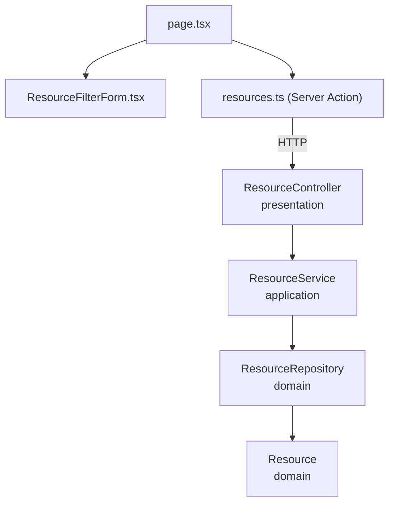

# Dependencies

## Internal Dependencies

```mermaid
flowchart TD
    Controller["ResourceController<br/>presentation"] --> Service["ResourceService<br/>application"]
    Service --> Repository["ResourceRepository<br/>domain"]
    Repository --> Entity["Resource<br/>domain"]
    FrontPage["page.tsx"] --> FilterForm["ResourceFilterForm.tsx"]
    FrontPage --> Action["resources.ts (Server Action)"]
    Action -->|HTTP| Controller
```

### ResourceController は ResourceService に依存
- **Type**: Compile
- **Reason**: プレゼンテーション層はユースケース実装をアプリケーション層に委譲する（4層アーキテクチャの規約）

### ResourceService は ResourceRepository に依存
- **Type**: Compile
- **Reason**: 永続化操作をドメイン層のリポジトリインターフェースに委譲する

### frontend の Server Action はバックエンド API に依存
- **Type**: Runtime（HTTP）
- **Reason**: BFF層はブラウザから直接呼ばれず、Server Action 経由でバックエンドを呼ぶ規約（コーディング規約）

## External Dependencies

### Spring Data JPA
- **Version**: Spring Boot 4.0.6 同梱
- **Purpose**: `ResourceRepository` の派生クエリ・JPQL実行
- **License**: Apache-2.0

### Zod
- **Version**: `^3.25.76`
- **Purpose**: Server Actions でのAPIレスポンス実行時検証
- **License**: MIT

### react-hook-form
- **Version**: `^7.76.1`
- **Purpose**: `ResourceFilterForm` のフォーム状態管理
- **License**: MIT
