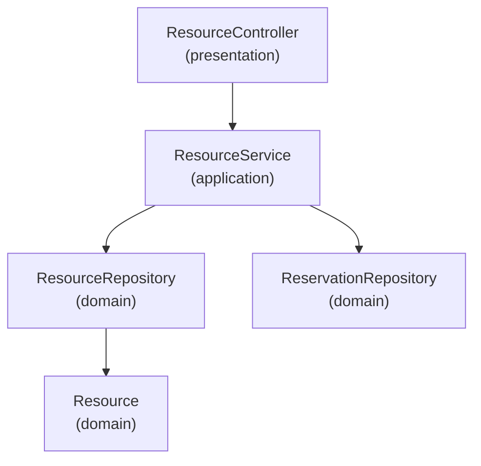

# Dependencies

## Internal Dependencies

```mermaid
flowchart TD
    Controller["ResourceController\n(presentation)"] --> Service["ResourceService\n(application)"]
    Service --> Repo["ResourceRepository\n(domain)"]
    Service --> ReservationRepo["ReservationRepository\n(domain)"]
    Repo --> Entity["Resource\n(domain)"]
```

### `ResourceService` depends on `ReservationRepository`

- **Type**: Compile
- **Reason**: 空き確認（`list` の from/to フィルタ）で、該当期間に占有予約があるリソースを除外するため（`ResourceService#overlaps` を介した重複判定）。Issue #25（設備情報・利用上の注意の追加）はこの依存に影響しない。

## External Dependencies

### Spring Boot（4.0.6）

- **Version**: 4.0.6
- **Purpose**: REST API フレームワーク一式（Web・Data JPA・Security・Validation）。
- **License**: Apache-2.0

### Next.js（15.3.2）

- **Version**: ^15.3.2
- **Purpose**: フロントエンドフレームワーク（App Router）。
- **License**: MIT

本課題のスコープでは新規外部依存の追加は不要。
