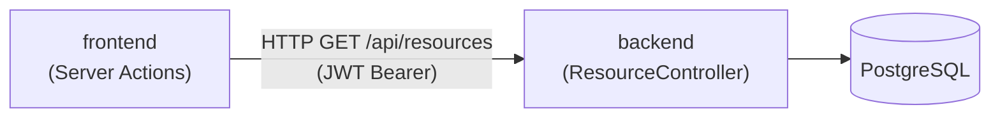

# Dependencies

## Internal Dependencies

```mermaid
flowchart LR
    FE["frontend<br/>(Server Actions)"] -->|"HTTP GET /api/resources<br/>(JWT Bearer)"| BE["backend<br/>(ResourceController)"]
    BE --> DB[("PostgreSQL")]
```

### frontend は backend に依存する
- **Type**: Runtime（HTTP）
- **Reason**: frontend は Server Actions（BFF 層）経由で backend の REST API を呼び出す。ビルド時の直接依存はなく、`NEXT_PUBLIC_API_BASE_URL`（または同等の環境変数）で疎結合

### backend は PostgreSQL に依存する
- **Type**: Runtime
- **Reason**: `ResourceRepository`（Spring Data JPA）がデータアクセスに使用。テストでは H2（`MODE=PostgreSQL`）で代替

## External Dependencies（Issue #23 関連のみ抜粋）

### spring-boot-starter-data-jpa
- **Version**: Spring Boot BOM 4.0.6 管理下
- **Purpose**: `ResourceRepository` の派生クエリ・`@Query` JPQL・将来的な `Specification` 利用の基盤

### zod
- **Version**: ^3.25.76
- **Purpose**: frontend のフォーム・入力スキーマ定義（`frontend/src/lib/schemas/resource.ts`）。keyword 入力欄を `ResourceFilterForm` に追加する場合、既存の `CreateResourceSchema` とは別に、フィルタフォーム側で追加のスキーマ定義が必要になる可能性がある（現状フィルタフォームは Zod スキーマ未使用、`FormData` を直接読み取る実装）
