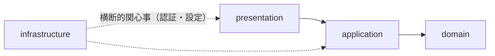

# Dependencies

## Internal Dependencies

```mermaid
flowchart LR
    presentation --> application
    application --> domain
    infrastructure -.->|"横断的関心事（認証・設定）"| presentation
    infrastructure -.-> application
```

### presentation depends on application

- **Type**: Compile
- **Reason**: Controller（例：`ResourceController`）がユースケースサービス（例：`ResourceService`）を呼び出す

### application depends on domain

- **Type**: Compile
- **Reason**: サービス（例：`ResourceService`）がエンティティ・Repository インターフェース（例：`Resource`, `ResourceRepository`）を利用する

### infrastructure cross-cuts presentation / application

- **Type**: Compile
- **Reason**: `CurrentUserArgumentResolver`（`@CurrentUser` 引数解決）・`SecurityConfig`・`RoleJwtAuthenticationConverter` が Controller 呼び出し前後の認証・認可を担う。4層アーキテクチャ上は「domain に依存されない」横断層として扱う

### frontend depends on backend（API 経由、コンパイル依存ではない）

- **Type**: Runtime（HTTP）
- **Reason**: `frontend/src/server/actions/*.ts` が backend の REST API を呼び出す。ビルド時の型共有はなく、Zod スキーマで実行時検証する

## External Dependencies

### Spring Boot 4.0.6

- **Version**: 4.0.6
- **Purpose**: バックエンドアプリケーションフレームワーク一式（Web, Data JPA, Security, Validation, Actuator）
- **License**: Apache License 2.0

### PostgreSQL JDBC Driver

- **Version**: Spring Boot 4.0.6 管理バージョン（`runtimeOnly`）
- **Purpose**: PostgreSQL 接続
- **License**: BSD-2-Clause

### Next.js

- **Version**: ^15.3.2
- **Purpose**: フロントエンド + BFF フレームワーク
- **License**: MIT

### Zod

- **Version**: ^3.25.76
- **Purpose**: スキーマバリデーション（フォーム・API レスポンス検証）
- **License**: MIT
