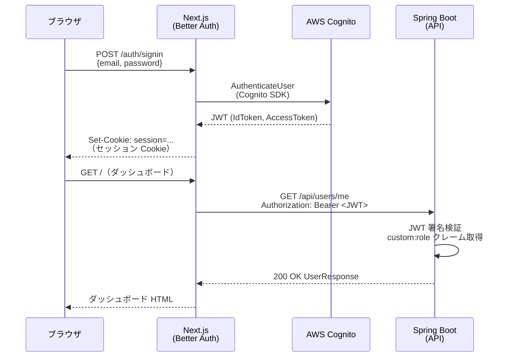
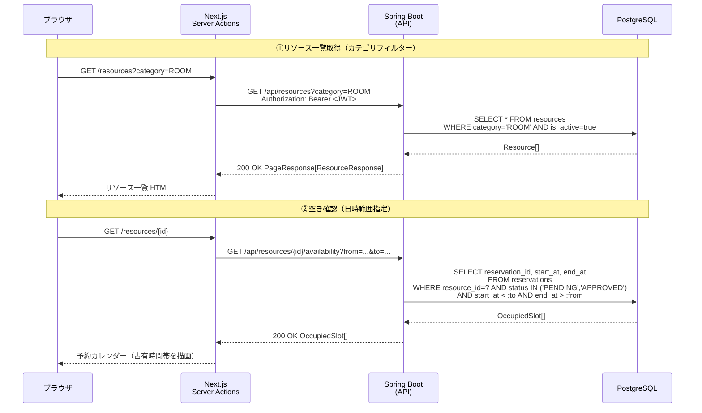
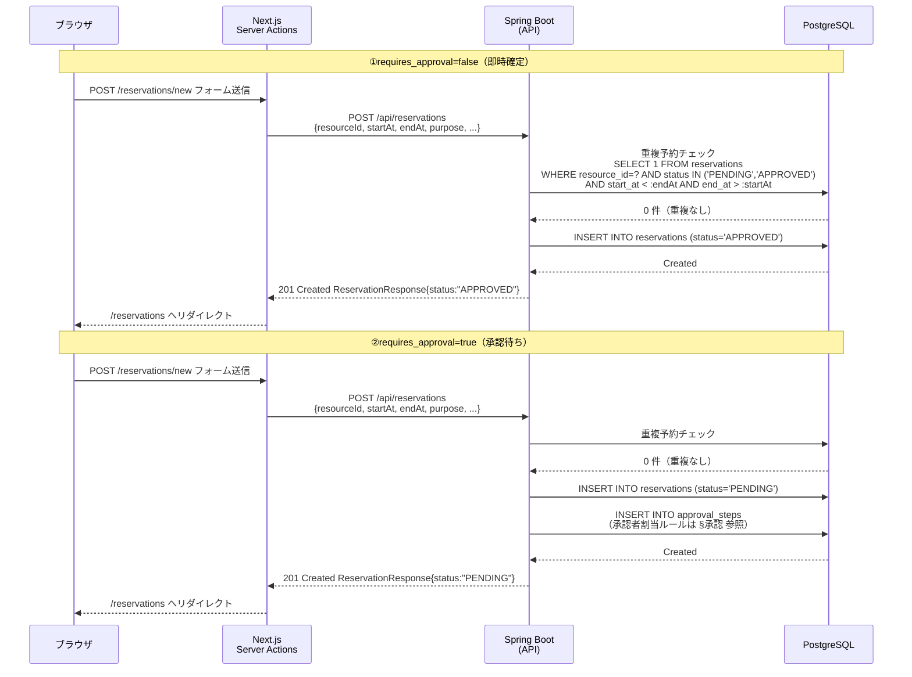
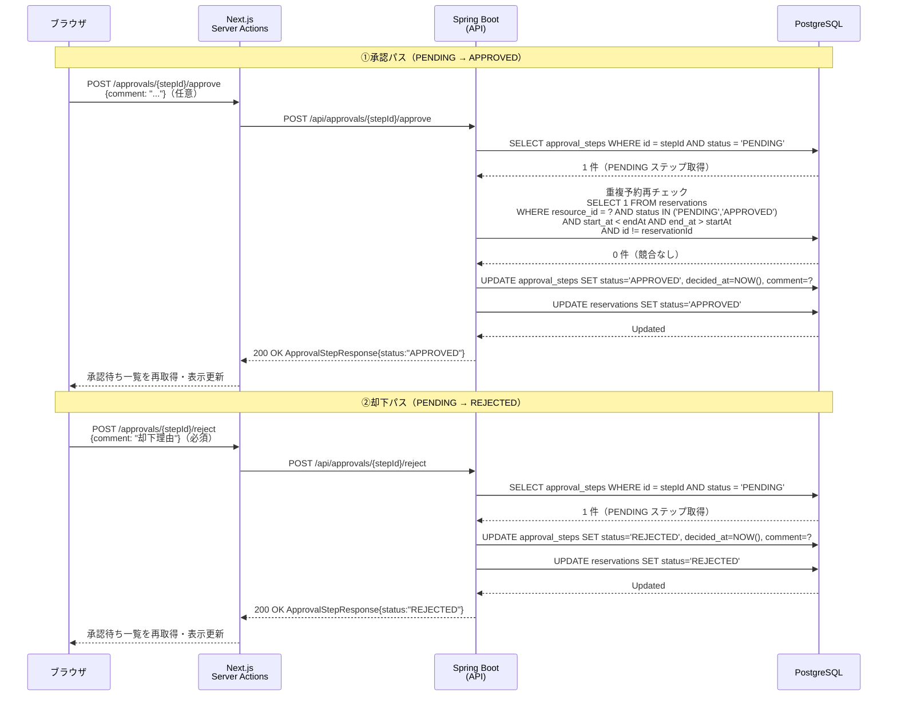
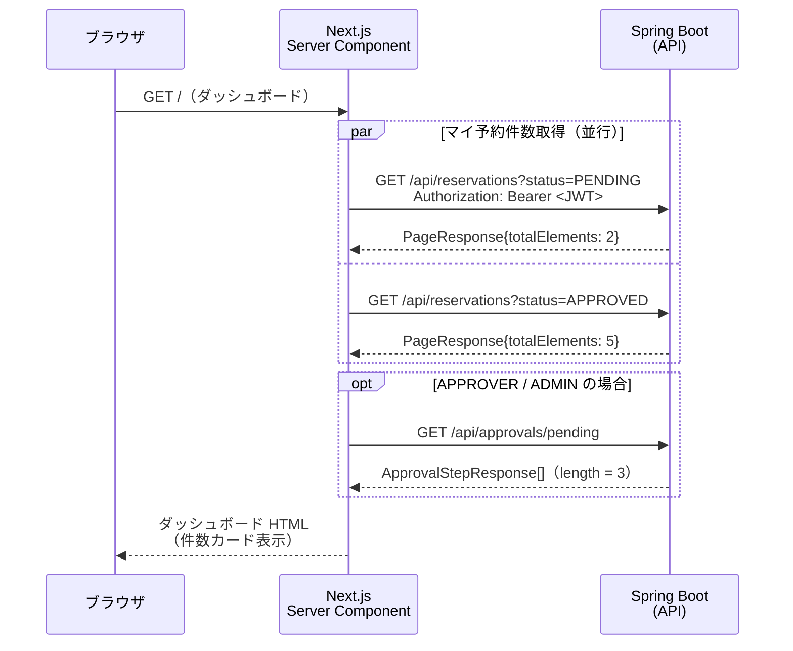

# REST API 仕様書

> 対象読者：学習者・メンター
> 参照：[requirements.md](./requirements.md) / [er-diagram.md](./er-diagram.md) / [03_SAMPLE_SERVICE_DOMAIN.md](../plan/03_SAMPLE_SERVICE_DOMAIN.md)

---

## API 設計方針

| 項目 | 方針 |
|------|------|
| ベース URL | `/api` プレフィックスを全エンドポイントに付与 |
| リソース命名 | `/api/<複数形>` の REST 命名規則（例：`/api/resources`・`/api/reservations`） |
| バージョニング | バージョニングなし（URL パスに `/v1` 等を含めない） |
| 認証方式 | Bearer JWT（Cognito 発行）。詳細は[§共通 認証方式](#auth-method)を参照 |
| レスポンス形式 | JSON（`Content-Type: application/json`） |
| エラー形式 | 全エラーを共通フォーマット `{ "code", "message" }` で返却（詳細は[§共通 共通エラーレスポンス](#common-error)） |

---

## §共通

### 認証方式 { #auth-method }

全エンドポイント（`POST /api/auth/signout` を除く）はリクエストヘッダーに AWS Cognito が発行した JWT を付与すること。

```
Authorization: Bearer <Cognito JWT>
```

- JWT の検証は Spring Security（OAuth2 Resource Server）が行う
- JWT の `custom:role` クレームからロールを取得し、権限チェックに使用する
- 認証トークンが不正・期限切れの場合は `401 Unauthorized` を返す
- トークンは認証済みだが操作権限がない場合は `403 Forbidden` を返す

### 共通エラーレスポンス { #common-error }

エラー発生時は以下の JSON 形式で返却する。

```json
{
  "code": "ERROR_CODE",
  "message": "人間が読めるエラーメッセージ"
}
```

#### HTTP ステータスコード一覧

| ステータス | 意味 | 例 |
|---------|------|----|
| `400 Bad Request` | リクエストのバリデーション失敗 | 必須フィールド未入力・不正な日時範囲 |
| `401 Unauthorized` | 認証トークン未設定・不正・期限切れ | JWT なし・期限切れ JWT |
| `403 Forbidden` | 認証済みだが操作権限なし | MEMBER が `/api/resources` に POST |
| `404 Not Found` | 指定リソースが存在しない | 存在しない ID を指定 |
| `409 Conflict` | 競合（重複予約） | 同一リソース・同一時間帯に承認済み or 承認待ち予約が存在する |
| `500 Internal Server Error` | サーバー内部エラー | 予期しない例外 |

#### エラーコード例

| コード | 説明 |
|--------|------|
| `VALIDATION_ERROR` | リクエストボディのバリデーション失敗 |
| `UNAUTHORIZED` | 認証が必要 |
| `FORBIDDEN` | 操作権限なし |
| `NOT_FOUND` | 指定リソースが存在しない |
| `RESERVATION_CONFLICT` | 重複予約（409 Conflict） |
| `INTERNAL_SERVER_ERROR` | サーバー内部エラー |

### ページネーション規約

一覧系エンドポイント（`/api/resources`・`/api/reservations`・`/api/users`）は Spring Data `Pageable` 準拠の page/size 方式を採用する。

#### リクエストクエリパラメーター

| パラメーター | 型 | デフォルト | 説明 |
|------------|-----|---------|------|
| `page` | integer | `0` | ページ番号（0 始まり） |
| `size` | integer | `20` | 1 ページあたりの件数 |

#### レスポンス構造

```json
{
  "content": [ ...items... ],
  "totalElements": 42,
  "totalPages": 3,
  "number": 0,
  "size": 20,
  "first": true,
  "last": false
}
```

> `GET /api/approvals/pending`・`GET /api/departments` はページネーション不要（件数が少ない想定）。全件返却。

---

## エンドポイント一覧

### 認証

| メソッド | パス | 概要 | 権限 |
|--------|------|------|------|
| POST | `/api/auth/signout` | サインアウト | 認証不要 |

### ユーザー・部署

| メソッド | パス | 概要 | 権限 |
|--------|------|------|------|
| GET | `/api/users/me` | 自プロフィール取得 | 全ロール |
| GET | `/api/users` | ユーザー一覧 | ADMIN |
| GET | `/api/departments` | 部署一覧 | 全ロール |

### リソース

| メソッド | パス | 概要 | 権限 |
|--------|------|------|------|
| GET | `/api/resources` | リソース一覧（カテゴリ・空き日時でフィルタ可） | 全ロール |
| POST | `/api/resources` | リソース登録 | ADMIN |
| GET | `/api/resources/{id}` | リソース詳細 | 全ロール |
| PUT | `/api/resources/{id}` | リソース更新 | ADMIN |
| PATCH | `/api/resources/{id}/status` | 有効/無効切替 | ADMIN |
| GET | `/api/resources/{id}/availability` | 空き状況照会（日付範囲指定） | 全ロール |

### 予約

| メソッド | パス | 概要 | 権限 |
|--------|------|------|------|
| GET | `/api/reservations` | 予約一覧（自分の予約。ADMIN は全件） | 全ロール |
| POST | `/api/reservations` | 予約申請 | 全ロール |
| GET | `/api/reservations/{id}` | 予約詳細 | 全ロール（本人 or APPROVER/ADMIN） |
| PUT | `/api/reservations/{id}` | 予約内容更新（PENDING のみ） | 申請者本人 |
| POST | `/api/reservations/{id}/cancel` | キャンセル | 申請者本人 or ADMIN |

### 承認

| メソッド | パス | 概要 | 権限 |
|--------|------|------|------|
| GET | `/api/approvals/pending` | 承認待ち一覧 | APPROVER / ADMIN |
| POST | `/api/approvals/{stepId}/approve` | 承認（`stepId` = `approval_steps.id`） | APPROVER / ADMIN |
| POST | `/api/approvals/{stepId}/reject` | 却下（`stepId` = `approval_steps.id`） | APPROVER / ADMIN |

---

## §認証

### `POST /api/auth/signout` — サインアウト

#### リクエスト

```http
POST /api/auth/signout
```

認証トークン不要（サインアウト処理のため）。

#### レスポンス（200 OK）

ボディなし。サーバー側でセッションを無効化する。

---

### `GET /api/users/me` — 自プロフィール取得

#### リクエスト

```http
GET /api/users/me
Authorization: Bearer <JWT>
```

#### レスポンス（200 OK）

```json
{
  "id": "550e8400-e29b-41d4-a716-446655440001",
  "name": "山田 太郎",
  "email": "yamada@example.com",
  "role": "MEMBER",
  "departmentId": "550e8400-e29b-41d4-a716-446655440010",
  "departmentName": "開発部",
  "createdAt": "2025-04-01T09:00:00"
}
```

**UserResponse 型定義**

| フィールド | 型 | 説明 |
|-----------|-----|------|
| `id` | UUID | ユーザー ID |
| `name` | string | 表示名 |
| `email` | string | メールアドレス |
| `role` | string | `MEMBER` / `APPROVER` / `ADMIN` |
| `departmentId` | UUID | 所属部署 ID |
| `departmentName` | string | 所属部署名（JOIN） |
| `createdAt` | TIMESTAMP | アカウント作成日時 |

---

### サインイン〜JWT 検証シーケンス図



---

## §リソース

### `GET /api/resources` — リソース一覧

#### リクエスト

```http
GET /api/resources?category=ROOM&from=2025-06-01T09:00:00&to=2025-06-01T18:00:00&page=0&size=20
Authorization: Bearer <JWT>
```

#### クエリパラメータ

| パラメータ | 型 | 必須 | 説明 |
|------------|-----|------|------|
| `category` | string | ❌ | `ROOM` / `EQUIPMENT` / `VEHICLE` でフィルタ |
| `from` | TIMESTAMP | ❌ | 空き確認の開始日時（`to` と同時指定必須） |
| `to` | TIMESTAMP | ❌ | 空き確認の終了日時（`from` と同時指定必須） |
| `page` | integer | ❌ | ページ番号（デフォルト 0） |
| `size` | integer | ❌ | 1 ページあたりの件数（デフォルト 20） |

> `from` / `to` を指定した場合、当該時間帯に `status IN ('PENDING', 'APPROVED')` の予約が存在しないリソースのみを返す。ADMIN は `is_active = false` のリソースも含む。

#### レスポンス（200 OK）

```json
{
  "content": [
    {
      "id": "550e8400-e29b-41d4-a716-446655440020",
      "name": "第1会議室",
      "category": "ROOM",
      "capacity": 10,
      "location": "3F",
      "requiresApproval": false,
      "isActive": true,
      "description": "プロジェクター完備",
      "createdAt": "2025-04-01T09:00:00"
    }
  ],
  "totalElements": 5,
  "totalPages": 1,
  "number": 0,
  "size": 20,
  "first": true,
  "last": true
}
```

**ResourceResponse 型定義**

| フィールド | 型 | 説明 |
|-----------|-----|------|
| `id` | UUID | リソース ID |
| `name` | string | リソース名 |
| `category` | string | `ROOM` / `EQUIPMENT` / `VEHICLE` |
| `capacity` | integer / null | 定員（会議室など） |
| `location` | string / null | 場所・棚番号など |
| `requiresApproval` | boolean | 承認フロー要否 |
| `isActive` | boolean | 有効/無効 |
| `description` | string / null | 説明文 |
| `createdAt` | TIMESTAMP | 登録日時 |

---

### `POST /api/resources` — リソース登録（ADMIN）

#### リクエスト

```http
POST /api/resources
Authorization: Bearer <JWT>
Content-Type: application/json

{
  "name": "プロジェクター A",
  "category": "EQUIPMENT",
  "capacity": null,
  "location": "3F 備品棚",
  "requiresApproval": true,
  "isActive": true,
  "description": "4K 対応プロジェクター"
}
```

#### レスポンス（201 Created）

作成後の ResourceResponse（`POST /api/resources` レスポンスは ResourceResponse 型と同形式）。

---

### `GET /api/resources/{id}` — リソース詳細

#### リクエスト

```http
GET /api/resources/550e8400-e29b-41d4-a716-446655440020
Authorization: Bearer <JWT>
```

#### レスポンス（200 OK）

ResourceResponse 型。存在しない ID の場合は `404 Not Found`。

---

### `PUT /api/resources/{id}` — リソース更新（ADMIN）

#### リクエスト

```http
PUT /api/resources/550e8400-e29b-41d4-a716-446655440020
Authorization: Bearer <JWT>
Content-Type: application/json

{
  "name": "第1会議室（改装後）",
  "category": "ROOM",
  "capacity": 12,
  "location": "3F",
  "requiresApproval": false,
  "isActive": true,
  "description": "2026年改装。4K プロジェクター追加"
}
```

#### レスポンス（200 OK）

更新後の ResourceResponse。

---

### `PATCH /api/resources/{id}/status` — 有効/無効切替（ADMIN）

#### リクエスト

```http
PATCH /api/resources/550e8400-e29b-41d4-a716-446655440020/status
Authorization: Bearer <JWT>
Content-Type: application/json

{
  "isActive": false
}
```

#### レスポンス（200 OK）

更新後の ResourceResponse（`isActive` が変更済み）。

---

### `GET /api/resources/{id}/availability` — 空き状況照会

#### リクエスト

```http
GET /api/resources/550e8400-e29b-41d4-a716-446655440020/availability?from=2025-06-01T00:00:00&to=2025-06-07T23:59:59
Authorization: Bearer <JWT>
```

#### クエリパラメータ

| パラメータ | 型 | 必須 | 説明 |
|------------|-----|------|------|
| `from` | TIMESTAMP | ✅ | 照会開始日時 |
| `to` | TIMESTAMP | ✅ | 照会終了日時 |

#### レスポンス（200 OK）

指定期間内の占有済み時間帯（`status IN ('PENDING', 'APPROVED')` の予約）の配列を返す。空きスロットの計算はフロントエンド側の責務。

```json
[
  {
    "reservationId": "550e8400-e29b-41d4-a716-446655440030",
    "startAt": "2025-06-02T10:00:00",
    "endAt": "2025-06-02T12:00:00"
  },
  {
    "reservationId": "550e8400-e29b-41d4-a716-446655440031",
    "startAt": "2025-06-03T14:00:00",
    "endAt": "2025-06-03T16:00:00"
  }
]
```

---

### シーケンス図



---

## §予約

### `GET /api/reservations` — 予約一覧

#### リクエスト

```http
GET /api/reservations?status=PENDING&page=0&size=20
Authorization: Bearer <JWT>
```

#### クエリパラメータ

| パラメータ | 型 | 必須 | 説明 |
|------------|-----|------|------|
| `status` | string | ❌ | ステータスフィルター（`PENDING` / `APPROVED` / `REJECTED` / `CANCELLED`）。複数指定可（例：`?status=PENDING&status=APPROVED`） |
| `page` | integer | ❌ | ページ番号（デフォルト 0） |
| `size` | integer | ❌ | 1 ページあたりの件数（デフォルト 20） |

> MEMBER / APPROVER は自分の予約のみ返却。ADMIN は全ユーザーの予約を返却。

#### レスポンス（200 OK）

```json
{
  "content": [
    {
      "id": "550e8400-e29b-41d4-a716-446655440030",
      "resourceId": "550e8400-e29b-41d4-a716-446655440020",
      "resourceName": "第1会議室",
      "requesterId": "550e8400-e29b-41d4-a716-446655440001",
      "requesterName": "山田 太郎",
      "startAt": "2025-06-02T10:00:00",
      "endAt": "2025-06-02T12:00:00",
      "purpose": "週次ミーティング",
      "attendeesCount": 5,
      "status": "APPROVED",
      "createdAt": "2025-06-01T09:00:00",
      "updatedAt": "2025-06-01T09:00:00"
    }
  ],
  "totalElements": 3,
  "totalPages": 1,
  "number": 0,
  "size": 20,
  "first": true,
  "last": true
}
```

**ReservationResponse 型定義**

| フィールド | 型 | 説明 |
|-----------|-----|------|
| `id` | UUID | 予約 ID |
| `resourceId` | UUID | リソース ID |
| `resourceName` | string | リソース名（JOIN） |
| `requesterId` | UUID | 申請者ユーザー ID |
| `requesterName` | string | 申請者名（JOIN） |
| `startAt` | TIMESTAMP | 利用開始日時 |
| `endAt` | TIMESTAMP | 利用終了日時 |
| `purpose` | string | 利用目的 |
| `attendeesCount` | integer / null | 参加人数 |
| `status` | string | `PENDING` / `APPROVED` / `REJECTED` / `CANCELLED` |
| `createdAt` | TIMESTAMP | 申請日時 |
| `updatedAt` | TIMESTAMP | 最終更新日時 |

---

### `POST /api/reservations` — 予約申請

#### リクエスト

```http
POST /api/reservations
Authorization: Bearer <JWT>
Content-Type: application/json

{
  "resourceId": "550e8400-e29b-41d4-a716-446655440020",
  "startAt": "2025-06-02T10:00:00",
  "endAt": "2025-06-02T12:00:00",
  "purpose": "週次ミーティング",
  "attendeesCount": 5
}
```

#### レスポンス（201 Created）

- `requires_approval = false` の場合：`status = "APPROVED"`（即時確定）
- `requires_approval = true` の場合：`status = "PENDING"`（承認待ち）

```json
{
  "id": "550e8400-e29b-41d4-a716-446655440030",
  "resourceId": "550e8400-e29b-41d4-a716-446655440020",
  "resourceName": "第1会議室",
  "requesterId": "550e8400-e29b-41d4-a716-446655440001",
  "requesterName": "山田 太郎",
  "startAt": "2025-06-02T10:00:00",
  "endAt": "2025-06-02T12:00:00",
  "purpose": "週次ミーティング",
  "attendeesCount": 5,
  "status": "APPROVED",
  "createdAt": "2025-06-01T09:00:00",
  "updatedAt": "2025-06-01T09:00:00"
}
```

重複予約の場合は `409 Conflict`（`code: "RESERVATION_CONFLICT"`）を返す。

---

### `GET /api/reservations/{id}` — 予約詳細

#### リクエスト

```http
GET /api/reservations/550e8400-e29b-41d4-a716-446655440030
Authorization: Bearer <JWT>
```

#### レスポンス（200 OK）

ReservationResponse 型。

**アクセス制御**：MEMBER は本人の予約のみ取得可。他人の予約へのアクセスは `403 Forbidden`。

---

### `PUT /api/reservations/{id}` — 予約内容更新

#### リクエスト

```http
PUT /api/reservations/550e8400-e29b-41d4-a716-446655440030
Authorization: Bearer <JWT>
Content-Type: application/json

{
  "startAt": "2025-06-02T13:00:00",
  "endAt": "2025-06-02T15:00:00",
  "purpose": "週次ミーティング（時間変更）",
  "attendeesCount": 6
}
```

**制約**：`status = 'PENDING'` の予約のみ更新可（`APPROVED` への更新は不可）。申請者本人のみ操作可能。日時変更時は重複予約チェックを再実行する（自分自身を除外）。

#### レスポンス（200 OK）

更新後の ReservationResponse。重複予約の場合は `409 Conflict`（`code: "RESERVATION_CONFLICT"`）。

---

### `POST /api/reservations/{id}/cancel` — キャンセル

#### リクエスト

```http
POST /api/reservations/550e8400-e29b-41d4-a716-446655440030/cancel
Authorization: Bearer <JWT>
```

**制約**：申請者本人または ADMIN のみ操作可。`PENDING` / `APPROVED` の予約のみキャンセル可。

#### レスポンス（200 OK）

```json
{
  "id": "550e8400-e29b-41d4-a716-446655440030",
  "resourceId": "550e8400-e29b-41d4-a716-446655440020",
  "resourceName": "第1会議室",
  "requesterId": "550e8400-e29b-41d4-a716-446655440001",
  "requesterName": "山田 太郎",
  "startAt": "2025-06-02T10:00:00",
  "endAt": "2025-06-02T12:00:00",
  "purpose": "週次ミーティング",
  "attendeesCount": 5,
  "status": "CANCELLED",
  "createdAt": "2025-06-01T09:00:00",
  "updatedAt": "2025-06-01T10:00:00"
}
```

---

### 申請シーケンス図（2 パターン）



---

## §承認

### `GET /api/approvals/pending` — 承認待ち一覧

#### リクエスト

```http
GET /api/approvals/pending
Authorization: Bearer <JWT>
```

**権限**：APPROVER / ADMIN のみ。MEMBER は `403 Forbidden`。

**可視範囲**：APPROVER は `approver_id = 自分` の PENDING ステップのみ。ADMIN は全 PENDING ステップ。

#### レスポンス（200 OK）

```json
[
  {
    "id": "550e8400-e29b-41d4-a716-446655440100",
    "reservationId": "550e8400-e29b-41d4-a716-446655440050",
    "resourceName": "第1会議室",
    "requesterName": "山田 太郎",
    "startAt": "2025-07-10T10:00:00",
    "endAt": "2025-07-10T12:00:00",
    "purpose": "プロジェクトキックオフ",
    "stepOrder": 1,
    "status": "PENDING",
    "createdAt": "2025-07-05T09:00:00"
  }
]
```

#### `ApprovalStepResponse` 型定義

| フィールド | 型 | 説明 |
|-----------|-----|------|
| `id` | UUID | approval_steps.id（`{stepId}` パスパラメータに使用） |
| `reservationId` | UUID | 対象予約の ID |
| `resourceName` | STRING | リソース名（reservations → resources の JOIN） |
| `requesterName` | STRING | 申請者名（reservations → users の JOIN） |
| `startAt` | TIMESTAMP | 利用開始日時 |
| `endAt` | TIMESTAMP | 利用終了日時 |
| `purpose` | STRING | 利用目的 |
| `stepOrder` | INTEGER | 承認ステップの順序（ベースは常に `1`） |
| `status` | STRING | 承認ステータス（`PENDING` / `APPROVED` / `REJECTED`） |
| `createdAt` | TIMESTAMP | 承認ステップ生成日時 |

> **注意**：`{stepId}` は `approval_steps.id`（`reservation.id` ではない）。クライアントは `ApprovalStepResponse.id` をそのままパスパラメータとして使用する。

---

### `POST /api/approvals/{stepId}/approve` — 承認

#### リクエスト

```http
POST /api/approvals/{stepId}/approve
Authorization: Bearer <JWT>
Content-Type: application/json

{
  "comment": "問題ありません。承認します。"
}
```

**権限**：APPROVER / ADMIN のみ。`comment` は**任意**（省略可）。

**副作用**：
1. 重複予約再チェック（§予約「重複予約チェック仕様」と同一条件、対象予約自身を除外）。競合時は `409 Conflict`（`code: RESERVATION_CONFLICT`）を返し、ステータス変更を行わない。
2. `approval_steps.status = 'APPROVED'`、`approval_steps.decided_at = 現在時刻`、`approval_steps.comment` 更新。
3. `reservations.status = 'APPROVED'`。

#### レスポンス（200 OK）

```json
{
  "id": "550e8400-e29b-41d4-a716-446655440100",
  "reservationId": "550e8400-e29b-41d4-a716-446655440050",
  "resourceName": "第1会議室",
  "requesterName": "山田 太郎",
  "startAt": "2025-07-10T10:00:00",
  "endAt": "2025-07-10T12:00:00",
  "purpose": "プロジェクトキックオフ",
  "stepOrder": 1,
  "status": "APPROVED",
  "createdAt": "2025-07-05T09:00:00"
}
```

---

### `POST /api/approvals/{stepId}/reject` — 却下

#### リクエスト

```http
POST /api/approvals/{stepId}/reject
Authorization: Bearer <JWT>
Content-Type: application/json

{
  "comment": "当該日程は他の予約と競合しています。日時を変更してください。"
}
```

**権限**：APPROVER / ADMIN のみ。`comment` は**必須**（欠落または空文字の場合 `400 Bad Request`）。

**副作用**：
1. `approval_steps.status = 'REJECTED'`、`approval_steps.decided_at = 現在時刻`、`approval_steps.comment` 更新。
2. `reservations.status = 'REJECTED'`。

#### レスポンス（200 OK）

```json
{
  "id": "550e8400-e29b-41d4-a716-446655440100",
  "reservationId": "550e8400-e29b-41d4-a716-446655440050",
  "resourceName": "第1会議室",
  "requesterName": "山田 太郎",
  "startAt": "2025-07-10T10:00:00",
  "endAt": "2025-07-10T12:00:00",
  "purpose": "プロジェクトキックオフ",
  "stepOrder": 1,
  "status": "REJECTED",
  "createdAt": "2025-07-05T09:00:00"
}
```

#### 共通エラー（approve / reject 共通）

| HTTP | `code` | 条件 |
|------|--------|------|
| 400 | `COMMENT_REQUIRED` | reject でコメントが欠落または空文字 |
| 403 | `FORBIDDEN` | MEMBER がアクセス |
| 404 | `APPROVAL_STEP_NOT_FOUND` | `{stepId}` が存在しない |
| 409 | `RESERVATION_CONFLICT` | approve 時に重複予約が検出された |
| 422 | `APPROVAL_ALREADY_DECIDED` | すでに APPROVED / REJECTED のステップに再操作 |

---

### 承認・却下シーケンス図



---

## §ユーザー・部署

### `GET /api/users` — ユーザー一覧（ADMIN）

#### リクエスト

```http
GET /api/users?page=0&size=20
Authorization: Bearer <JWT>
```

**権限**：ADMIN のみ。他ロールからのリクエストは `403 Forbidden`。

#### レスポンス（200 OK）

```json
{
  "content": [
    {
      "id": "550e8400-e29b-41d4-a716-446655440001",
      "name": "山田 太郎",
      "email": "yamada@example.com",
      "role": "MEMBER",
      "departmentId": "550e8400-e29b-41d4-a716-446655440010",
      "departmentName": "開発部",
      "createdAt": "2025-04-01T09:00:00"
    }
  ],
  "totalElements": 10,
  "totalPages": 1,
  "number": 0,
  "size": 20,
  "first": true,
  "last": true
}
```

UserResponse 型定義は [`GET /api/users/me`](#get-apiusersme) を参照。

---

### `GET /api/departments` — 部署一覧

#### リクエスト

```http
GET /api/departments
Authorization: Bearer <JWT>
```

**権限**：全ロール。ページネーションなし（全件返却）。

#### レスポンス（200 OK）

```json
[
  {
    "id": "550e8400-e29b-41d4-a716-446655440010",
    "name": "本社",
    "parentId": null
  },
  {
    "id": "550e8400-e29b-41d4-a716-446655440011",
    "name": "開発部",
    "parentId": "550e8400-e29b-41d4-a716-446655440010"
  }
]
```

**DepartmentResponse 型定義**

| フィールド | 型 | 説明 |
|-----------|-----|------|
| `id` | UUID | 部署 ID |
| `name` | string | 部署名 |
| `parentId` | UUID / null | 親部署 ID。`null` はルート部署 |

---

### ダッシュボード情報取得シーケンス図


