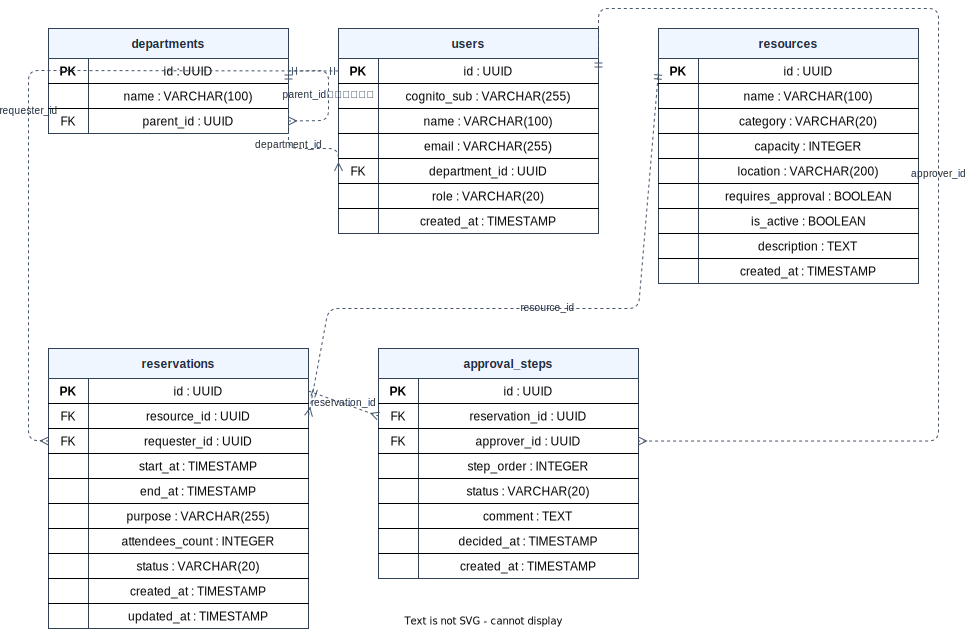

# ER 図

---

## ER 図

> **注意**：タイムスタンプ型は `TIMESTAMP`（`TIMESTAMPTZ` ではない）。H2 PostgreSQL 互換モードで動作するため PostgreSQL 固有型（`jsonb`・`gen_random_uuid` 等）は不使用。

---

## エンティティ定義

### departments

| カラム名 | 型 | 制約 | 備考 |
|---------|-----|------|------|
| `id` | `UUID` | PK / NOT NULL | |
| `name` | `VARCHAR(100)` | NOT NULL | 部署名 |
| `parent_id` | `UUID` | FK → departments(id) / NULL 可 | 親部署。NULL = ルート部署 |

### users

| カラム名 | 型 | 制約 | 備考 |
|---------|-----|------|------|
| `id` | `UUID` | PK / NOT NULL | |
| `cognito_sub` | `VARCHAR(255)` | NOT NULL / UNIQUE | Cognito ユーザー識別子 |
| `name` | `VARCHAR(100)` | NOT NULL | 表示名 |
| `email` | `VARCHAR(255)` | NOT NULL / UNIQUE | |
| `department_id` | `UUID` | NOT NULL / FK → departments(id) | 所属部署（必須） |
| `role` | `VARCHAR(20)` | NOT NULL / CHECK (`MEMBER` / `APPROVER` / `ADMIN`) | ロール |
| `created_at` | `TIMESTAMP` | NOT NULL / DEFAULT CURRENT_TIMESTAMP | |

### resources

| カラム名 | 型 | 制約 | 備考 |
|---------|-----|------|------|
| `id` | `UUID` | PK / NOT NULL | |
| `name` | `VARCHAR(100)` | NOT NULL | リソース名 |
| `category` | `VARCHAR(20)` | NOT NULL / CHECK (`ROOM` / `EQUIPMENT` / `VEHICLE`) | 種別 |
| `capacity` | `INTEGER` | NULL 可 | 定員（会議室など） |
| `location` | `VARCHAR(200)` | NULL 可 | 場所・棚番号など |
| `requires_approval` | `BOOLEAN` | NOT NULL / DEFAULT `FALSE` | 承認フロー要否 |
| `is_active` | `BOOLEAN` | NOT NULL / DEFAULT `TRUE` | 有効/無効 |
| `description` | `TEXT` | NULL 可 | 説明文 |
| `created_at` | `TIMESTAMP` | NOT NULL / DEFAULT CURRENT_TIMESTAMP | |

### reservations

| カラム名 | 型 | 制約 | 備考 |
|---------|-----|------|------|
| `id` | `UUID` | PK / NOT NULL | |
| `resource_id` | `UUID` | NOT NULL / FK → resources(id) | 予約対象リソース |
| `requester_id` | `UUID` | NOT NULL / FK → users(id) | 申請者 |
| `start_at` | `TIMESTAMP` | NOT NULL | 利用開始日時 |
| `end_at` | `TIMESTAMP` | NOT NULL / CHECK (`end_at > start_at`) | 利用終了日時 |
| `purpose` | `VARCHAR(255)` | NOT NULL | 利用目的 |
| `attendees_count` | `INTEGER` | NULL 可 | 参加人数 |
| `status` | `VARCHAR(20)` | NOT NULL / CHECK (`DRAFT` / `PENDING` / `APPROVED` / `REJECTED` / `CANCELLED`) | **DB DEFAULT なし**（アプリ層で設定）。`DRAFT` はベース実装では未使用（拡張課題用の予約値。[requirements.md](./requirements.md) の「予約申請」セクション参照） |
| `created_at` | `TIMESTAMP` | NOT NULL / DEFAULT CURRENT_TIMESTAMP | |
| `updated_at` | `TIMESTAMP` | NOT NULL / DEFAULT CURRENT_TIMESTAMP | |

> **重複予約防止**：同一リソース・同一時間帯に `status IN ('PENDING', 'APPROVED')` の予約が複数存在することを禁止する。V001 に専用 DB 制約はないため**アプリ層（Service）での排他制御**が実装責務。

### approval_steps

| カラム名 | 型 | 制約 | 備考 |
|---------|-----|------|------|
| `id` | `UUID` | PK / NOT NULL | |
| `reservation_id` | `UUID` | NOT NULL / FK → reservations(id) | 対象予約 |
| `approver_id` | `UUID` | NOT NULL / FK → users(id) | 承認者 |
| `step_order` | `INTEGER` | NOT NULL | 多段階承認の順序（ベース実装は 1 段階のみ） |
| `status` | `VARCHAR(20)` | NOT NULL / DEFAULT `'PENDING'` / CHECK (`PENDING` / `APPROVED` / `REJECTED`) | 承認ステータス |
| `comment` | `TEXT` | NULL 可 | 承認者コメント（承認時は任意・却下時は必須） |
| `decided_at` | `TIMESTAMP` | NULL 可 | 承認・却下日時 |
| `created_at` | `TIMESTAMP` | NOT NULL / DEFAULT CURRENT_TIMESTAMP | |

---

## リレーション説明

| リレーション | 種別 | 説明 |
|------------|------|------|
| `departments` → `departments` | 自己参照（0..1 対 多） | `parent_id` により部署の階層構造を表現。NULL = ルート部署 |
| `departments` → `users` | 1 対 多 | ユーザーは必ず 1 つの部署に所属（`department_id` NOT NULL） |
| `resources` → `reservations` | 1 対 多 | リソースに対して複数の予約が紐づく |
| `users` → `reservations` | 1 対 多 | ユーザー（申請者）が複数の予約を持つ |
| `reservations` → `approval_steps` | 1 対 多 | 1 つの予約に対して 1 つ以上の承認ステップ（ベースは 1 段階） |
| `users` → `approval_steps` | 1 対 多 | ユーザー（承認者）が複数の承認ステップを担当 |

---

## インデックス方針

V001 で定義された 5 つのインデックス。予約一覧・承認待ち一覧の検索性能を最適化する。

| インデックス名 | テーブル | カラム | 用途 |
|--------------|---------|-------|------|
| `idx_reservations_resource_id` | `reservations` | `resource_id` | リソース別予約一覧・空き確認 |
| `idx_reservations_requester_id` | `reservations` | `requester_id` | マイ予約一覧 |
| `idx_reservations_status` | `reservations` | `status` | ステータスフィルター |
| `idx_approval_steps_reservation_id` | `approval_steps` | `reservation_id` | 予約に紐づく承認ステップ取得 |
| `idx_approval_steps_approver_id` | `approval_steps` | `approver_id` | 承認者別の承認待ち一覧 |
