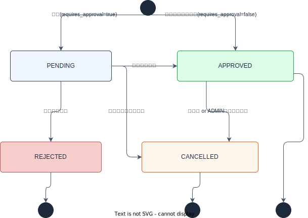
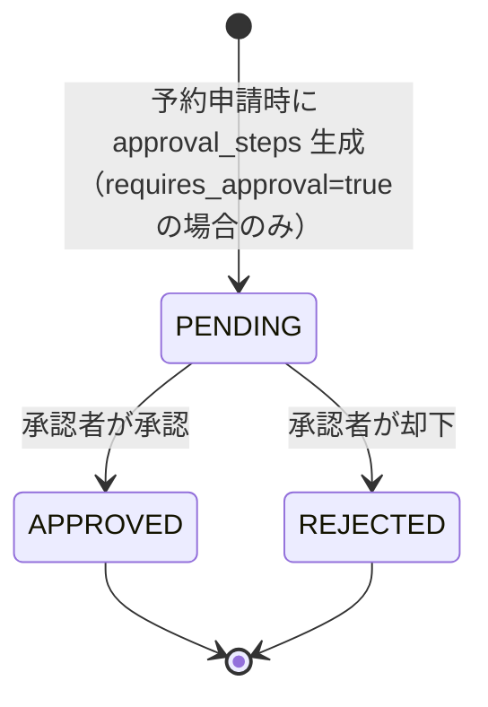

# 要件定義

---

## 背景・目的

**BookFlow** は、社内の施設・備品を予約し、必要に応じて上長承認を経て確定する業務システムである。会議室・社用車・プロジェクターなど複数カテゴリのリソースを一元管理し、予約申請から承認・確定・利用実績の可視化までをカバーする。

本システムは AI 駆動開発チュートリアルのサンプルサービスとして設計されており、以下の観点で採用している。

| 観点 | 理由 |
|------|------|
| SIer 案件への近接性 | 施設予約・申請承認ワークフローは官公庁・一般企業を問わず頻出する業務システム。実務で接する要件・用語をそのまま使える |
| アーキテクチャ網羅性 | 認証（Cognito）・承認ワークフロー（Spring Boot）・カレンダーUI（Next.js）・データ集計（PostgreSQL）と全レイヤーを体験できる |
| ビジネスロジックの豊富さ | 重複予約チェック・承認ステート遷移・役割ベースの画面制御など、実装が面白い設計課題を多く含む |
| 発展課題の多様さ | 繰り返し予約・PDF 帳票・多段階承認・利用率レポートなど、スキルに応じた課題を幅広く設計できる |

---

## スコープ

### 対象（初期実装に含める機能）

| 機能 | 概要 |
|------|------|
| ユーザー認証 | Cognito によるサインイン・サインアウト・ロール判定（一般・承認者・管理者） |
| リソース一覧・空き確認 | カテゴリ別リソース一覧、日時を指定した空き確認 |
| 予約申請 | リソース・日時・利用目的を指定して予約申請（承認不要リソースは即時確定） |
| 予約一覧（マイ予約） | 自分の予約申請の一覧・詳細確認・編集・キャンセル |
| 承認ワークフロー | 承認者による承認・却下・コメント付与 |
| 承認待ち一覧 | 承認者向けの承認待ち予約一覧 |
| リソース管理 | 管理者によるリソースの登録・編集・有効/無効切替 |

### 対象外（学習者拡張課題） { #learner-extensions }

| 課題例 | 対象レイヤー |
|--------|------------|
| 繰り返し予約（毎週・毎月）の追加 | frontend + backend |
| カレンダービュー（週/月表示）の実装 | frontend |
| 利用実績の集計・グラフ表示 | frontend + backend |
| CSV / PDF 帳票出力 | backend + frontend |
| 多段階承認フローの設定 | backend |
| 部署ごとの承認者設定（管理者機能） | frontend + backend |
| E2E テストの追加 | frontend |
| OpenAPI Spec からクライアント自動生成 | frontend + backend |

---

## 用語定義

| 用語 | 定義 |
|------|------|
| **リソース** | 予約対象となる施設・備品の総称。カテゴリは `ROOM`（会議室）/ `EQUIPMENT`（備品）/ `VEHICLE`（社用車）の 3 種 |
| **予約** | ユーザーがリソースの特定日時を占有申請したレコード。ステータスにより状態が管理される |
| **承認ステップ** | 承認必要リソースの予約に紐づく承認者の判断レコード。ベース実装は 1 段階（`step_order = 1`） |
| **ロール** | ユーザーの権限種別。`MEMBER`（一般社員）/ `APPROVER`（承認者）/ `ADMIN`（管理者）の 3 種 |
| **承認フロー** | `requires_approval = true` のリソースを予約した際に発生するワークフロー。承認者が承認・却下するまで予約は `PENDING` 状態を保つ |
| **即時確定** | `requires_approval = false` のリソースを予約した際の動作。`approval_steps` を生成せず即座に `APPROVED` へ遷移する |
| **重複予約** | 同一リソース・同一時間帯に `status IN ('PENDING', 'APPROVED')` の予約が存在する状態。新規申請時にアプリ層で検出し拒否する |

---

## 主要ユースケース一覧

ベース実装がカバーする 8 ユースケース。詳細は各セクションを参照。

| UC | ユースケース | 主なロール | 記載セクション |
|----|-------------|-----------|---------------|
| [UC-01](#uc-01) | 社員がサインインする | 全員 | §認証 |
| [UC-02](#uc-02) | 社員がリソース一覧と空き状況を確認する | 全員 | §リソース |
| [UC-03](#uc-03) | 社員がリソースを予約申請する | 全員 | §予約 |
| [UC-04](#uc-04) | 承認不要リソースの予約が即時確定される | 全員（システム挙動） | §予約 |
| [UC-05](#uc-05) | 承認必要リソースの予約が承認者に回覧される | システム（申請時に自動生成） | §承認 |
| [UC-06](#uc-06) | 承認者が予約を承認 or 却下する | APPROVER / ADMIN | §承認 |
| [UC-07](#uc-07) | 社員が自分の予約一覧を確認・編集・キャンセルする | 全員（ADMIN は全件） | §予約 |
| [UC-08](#uc-08) | 管理者がリソースを登録・編集する | ADMIN | §リソース |

---

## §共通

### ロール・権限定義

BookFlow は 3 種のロールで操作権限を制御する。

| ロール | 基本定義 |
|--------|---------|
| `MEMBER`（一般社員） | リソース閲覧・予約申請・自分の予約管理 |
| `APPROVER`（承認者） | MEMBER の全権限 ＋ 担当リソースの承認・却下 |
| `ADMIN`（管理者） | 全権限 ＋ リソース管理・ユーザー管理 |

#### API 権限マトリクス

| API | MEMBER | APPROVER | ADMIN |
|-----|--------|----------|-------|
| `GET /api/resources` | ✅ | ✅ | ✅ |
| `POST /api/resources` | ❌ | ❌ | ✅ |
| `GET /api/resources/{id}` | ✅ | ✅ | ✅ |
| `PUT /api/resources/{id}` | ❌ | ❌ | ✅ |
| `PATCH /api/resources/{id}/status` | ❌ | ❌ | ✅ |
| `GET /api/resources/{id}/availability` | ✅ | ✅ | ✅ |
| `GET /api/reservations` | ✅（自分のみ） | ✅（自分のみ） | ✅（全件） |
| `POST /api/reservations` | ✅ | ✅ | ✅ |
| `GET /api/reservations/{id}` | ✅（本人のみ） | ✅ | ✅ |
| `PUT /api/reservations/{id}` | ✅（本人のみ） | ✅（本人のみ） | ❌ |
| `POST /api/reservations/{id}/cancel` | ✅（本人のみ） | ✅（本人のみ） | ✅（全件） |
| `GET /api/approvals/pending` | ❌ | ✅ | ✅ |
| `POST /api/approvals/{stepId}/approve` | ❌ | ✅ | ✅ |
| `POST /api/approvals/{stepId}/reject` | ❌ | ✅ | ✅ |
| `GET /api/users/me` | ✅ | ✅ | ✅ |
| `GET /api/users` | ❌ | ❌ | ✅ |
| `GET /api/departments` | ✅ | ✅ | ✅ |

#### 画面アクセス権限

| 画面パス | MEMBER | APPROVER | ADMIN |
|---------|--------|----------|-------|
| `/`（ダッシュボード） | ✅ | ✅ | ✅ |
| `/resources` | ✅ | ✅ | ✅ |
| `/resources/{id}` | ✅ | ✅ | ✅ |
| `/reservations/new` | ✅ | ✅ | ✅ |
| `/reservations` | ✅ | ✅ | ✅ |
| `/reservations/{id}` | ✅（本人のみ） | ✅ | ✅ |
| `/reservations/{id}/edit` | ✅（本人のみ） | ✅（本人のみ） | ❌ |
| `/approvals` | ❌ | ✅ | ✅ |
| `/admin/resources` | ❌ | ❌ | ✅ |
| `/admin/users` | ❌ | ❌ | ✅ |
| `/auth/signin` | ✅（未認証） | ✅（未認証） | ✅（未認証） |

### 予約ステータス遷移図



> **注意**：`reservations.status` に DB DEFAULT はない。アプリ層（Service）が申請時に `PENDING`（requires_approval=true）または `APPROVED`（requires_approval=false）を設定する。`DRAFT` はベース実装では未使用（下書き保存は拡張課題用の予約値）。

### 承認ステップ ステータス遷移図



> `approval_steps.status` の DB DEFAULT は `'PENDING'`。`requires_approval = false` のリソースの予約では `approval_steps` レコードを生成しない。

---

## §認証

### UC-01：社員がサインインする { #uc-01 }

#### 機能要件

| # | 要件 |
|---|------|
| AUTH-01 | メールアドレス・パスワードで AWS Cognito User Pool に認証できる |
| AUTH-02 | サインアウト時にセッションを無効化し `/auth/signin` へリダイレクトする |
| AUTH-03 | Cognito JWT の `custom:role` クレームから `MEMBER` / `APPROVER` / `ADMIN` のロールを取得し、操作権限を制御する |
| AUTH-04 | セッション有効期限内は再サインイン不要（Better Auth が Cookie セッションを管理） |
| AUTH-05 | 要認証画面へ未認証でアクセスした場合は `/auth/signin` へリダイレクトする |
| AUTH-06 | 権限不足のロールが制限画面（`/approvals`・`/admin/*`）にアクセスした場合は 403 エラーを返す |

#### 技術的前提

| 項目 | 内容 |
|------|------|
| 認証クライアント | Better Auth（ADR-008）が Next.js フロント側のセッション管理・Cognito との連携を担う |
| JWT 検証 | Spring Security OAuth2 Resource Server がバックエンド側で JWT を検証する |
| ロール属性 | Cognito ユーザー属性 `custom:role` に `MEMBER` / `APPROVER` / `ADMIN` を設定する |
| ロール変更 | アプリ内でのロール変更はベース対象外（拡張課題）。seed データで初期ロールを設定する |
| サインアウト | `POST /api/auth/signout` でサーバー側処理後、フロント側もセッション Cookie を破棄する |

---

## §リソース

### UC-02：社員がリソース一覧と空き状況を確認する { #uc-02 }

#### 機能要件

| # | 要件 |
|---|------|
| RES-01 | リソース一覧をカテゴリ（`ROOM` / `EQUIPMENT` / `VEHICLE`）でフィルタリングできる |
| RES-02 | `is_active = true` のリソースのみ一覧に表示する（ADMIN は全件表示） |
| RES-03 | 日時範囲（`from` / `to`）を指定して、当該期間内の占有予約一覧（`status IN ('PENDING', 'APPROVED')` の予約の時間帯）を取得できる |
| RES-04 | リソース詳細（名称・カテゴリ・定員・場所・説明・承認フロー要否）を閲覧できる |

### UC-08：管理者がリソースを登録・編集する { #uc-08 }

#### 機能要件

| # | 要件 |
|---|------|
| RES-05 | ADMIN はリソースを新規登録できる（名称・カテゴリ・定員・場所・説明・`requires_approval`・`is_active` を入力） |
| RES-06 | ADMIN はリソースの情報を更新できる |
| RES-07 | ADMIN はリソースの有効/無効（`is_active`）を切り替えられる |
| RES-08 | `is_active = false` にしても既存の申請中・承認済み予約には影響しない（予約の削除は行わない） |

#### カテゴリ定義

| カテゴリ値 | 表示名 |
|-----------|--------|
| `ROOM` | 会議室 |
| `EQUIPMENT` | 備品 |
| `VEHICLE` | 社用車 |

---

## §予約

### UC-03：社員がリソースを予約申請する { #uc-03 }

#### 入力項目

| フィールド | 型 | 必須 | 説明 |
|-----------|-----|------|------|
| `resourceId` | UUID | ✅ | 予約対象リソース |
| `startAt` | TIMESTAMP | ✅ | 利用開始日時 |
| `endAt` | TIMESTAMP | ✅ | 利用終了日時（`startAt` より後であること） |
| `purpose` | VARCHAR(255) | ✅ | 利用目的 |
| `attendeesCount` | INTEGER | ❌ | 参加人数 |

#### ステータス初期値（ワンステップ申請）

`POST /api/reservations` を呼び出すと、対象リソースの `requires_approval` 値に基づいてステータスが即時決定される。下書き保存（DRAFT 生成）はベース実装の対象外。

| `requires_approval` | 申請後ステータス | `approval_steps` 生成 |
|--------------------|---------------|----------------------|
| `false` | `APPROVED`（即時確定） | 生成しない |
| `true` | `PENDING`（承認待ち） | 生成する（→ §承認 参照） |

### UC-04：承認不要リソースの予約が即時確定される { #uc-04 }

`requires_approval = false` のリソースを予約申請した場合、`approval_steps` を生成せず即座に `status = APPROVED` で確定する（UC-03 の即時確定パスと同一）。

### UC-07：社員が自分の予約一覧を確認・編集・キャンセルする { #uc-07 }

#### 機能要件

| # | 要件 |
|---|------|
| RSV-01 | 自分の予約一覧を `status`（`PENDING` / `APPROVED` / `REJECTED` / `CANCELLED`）でフィルタリングできる |
| RSV-02 | ADMIN は全ユーザーの予約を閲覧できる |
| RSV-03 | 予約の詳細（リソース名・日時・目的・参加人数・ステータス）を確認できる |
| RSV-04 | 申請者本人は `PENDING` または `APPROVED` の予約をキャンセルできる |
| RSV-05 | ADMIN はすべての予約をキャンセルできる |
| RSV-06 | `REJECTED` / `CANCELLED` の予約はキャンセル操作の対象外 |
| RSV-07 | 申請者本人（MEMBER / APPROVER）は `PENDING` の予約の開始日時・終了日時・利用目的・参加人数を編集できる。リソースの変更は不可。編集時は重複予約チェックを再実行する（自分自身の予約を除外）。`APPROVED` / `REJECTED` / `CANCELLED` の予約は編集不可 |

### 重複予約チェック仕様

同一リソース・同一時間帯の重複申請をアプリ層で検出し拒否する。

**チェック条件**：`POST /api/reservations`（および `PUT /api/reservations/{id}` での日時更新）受信時に、以下の条件を満たす予約の存在を確認する。

```
resource_id = :resourceId
AND status IN ('PENDING', 'APPROVED')
AND start_at < :endAt
AND end_at > :startAt
```

- 上記レコードが存在する場合は `409 Conflict`（`code: RESERVATION_CONFLICT`）を返す
- `PUT` 時は自分自身の予約（`id = :id`）を除外してチェックする
- V001 に DB 制約（専用 UNIQUE INDEX 等）は定義されていないため、**アプリ層（Service）での排他制御が実装責務**

---

## §承認

### UC-05：承認必要リソースの予約が承認者に回覧される { #uc-05 }

`requires_approval = true` のリソースを予約申請すると、申請と同時に `approval_steps` レコードが 1 件生成される（ワンステップ申請）。生成された承認ステップは承認者の承認待ち一覧（`GET /api/approvals/pending`）に表示される。

#### approval_steps 生成ルール

| フィールド | 値 |
|-----------|-----|
| `reservation_id` | 申請した予約の ID |
| `step_order` | `1`（ベース実装は 1 段階のみ） |
| `approver_id` | `APPROVER` ロールのユーザーの ID |
| `status` | `PENDING`（DB DEFAULT） |
| `comment` | NULL |
| `decided_at` | NULL |

> **承認者の選定**：ベース実装では `role = 'APPROVER'` のユーザーを承認者として割り当てる。seed データには APPROVER が 1 名のため決定的。部署別・リソース別の承認者ルーティングは**拡張課題**（V001 にリソース→承認者のマッピング列は存在しない）。

> **多段階承認**：V001 の `step_order` カラムは多段階承認の順序管理に備えた設計だが、ベース実装では 1 段階（`step_order=1` のみ）。複数ステップは**拡張課題**。

---

### UC-06：承認者が予約を承認・却下する { #uc-06 }

#### 承認フロー

承認者が `POST /api/approvals/{stepId}/approve` を呼び出すと以下の処理が行われる。

1. **重複再チェック**：`PENDING → APPROVED` 遷移の前に §予約「重複予約チェック仕様」と同一条件で再確認（申請〜承認の間に同一スロットで別予約が APPROVED になっている可能性がある）。競合が発生した場合は `409 Conflict`（`RESERVATION_CONFLICT`）を返し承認を中断する。
2. **ステータス更新**：
   - `approval_steps.status = 'APPROVED'`
   - `approval_steps.decided_at = 現在時刻`
   - `reservations.status = 'APPROVED'`

#### 却下フロー

承認者が `POST /api/approvals/{stepId}/reject` を呼び出すと以下の処理が行われる（重複再チェックは不要）。

1. `approval_steps.status = 'REJECTED'`
2. `approval_steps.comment = リクエストボディの comment`（必須）
3. `approval_steps.decided_at = 現在時刻`
4. `reservations.status = 'REJECTED'`

---

### 機能要件

| # | 要件 |
|---|------|
| APRV-01 | APPROVER は自分が担当する（`approver_id = 自分`）`approval_steps.status = 'PENDING'` のステップ一覧を閲覧できる |
| APRV-02 | ADMIN はすべての `approval_steps.status = 'PENDING'` のステップ一覧を閲覧できる（可視範囲：全件） |
| APRV-03 | 承認操作（approve）のコメントは任意 |
| APRV-04 | 却下操作（reject）のコメントは必須（欠落時は 400 Bad Request） |
| APRV-05 | 承認時は `PENDING → APPROVED` 遷移の前に重複予約再チェックを実行し、競合時は 409 Conflict を返す |
| APRV-06 | `approval_steps.status = 'APPROVED'` または `'REJECTED'` のステップ（決済済み）は再度 approve/reject の操作対象外 |
| APRV-07 | MEMBER は `/approvals` にアクセスできない（403 Forbidden） |

> 承認ステップのステータス遷移（`PENDING → APPROVED / REJECTED`）は §共通「承認ステップ ステータス遷移図」を参照。

---

## §ユーザー・部署

### ユーザー管理要件

| # | 要件 |
|---|------|
| USER-01 | ADMIN はユーザー一覧を閲覧できる（名前・メールアドレス・ロール・部署名） |
| USER-02 | 全ユーザーは自分のプロフィール（名前・メールアドレス・ロール・部署名）を確認できる |
| USER-03 | ユーザーのロール変更はベース実装の対象外（拡張課題） |

### 部署表示要件

| # | 要件 |
|---|------|
| DEPT-01 | 全ユーザーは部署一覧を取得できる |
| DEPT-02 | 部署は `departments.parent_id` による階層構造を持つ。`parent_id = NULL` はルート部署 |
| DEPT-03 | ユーザー一覧・プロフィール表示では部署名を表示する（`department_id` から JOIN） |

### ダッシュボード要件

| # | 要件 |
|---|------|
| DASH-01 | ダッシュボードにサインイン中ユーザーのマイ予約件数（`PENDING` / `APPROVED` 件数）を集計表示する |
| DASH-02 | APPROVER / ADMIN は承認待ち件数（自分が担当する `approval_steps.status = 'PENDING'` の件数）を表示する |

---

## 非機能要件

| 分類 | 要件 |
|------|------|
| 認証・認可 | 全 API エンドポイント（`POST /api/auth/signout` を除く）は `Authorization: Bearer <JWT>` ヘッダーを必須とする |
| パスワード管理 | パスワードは AWS Cognito で管理する。バックエンドはパスワードを保持しない |
| DB 互換性 | H2（テスト用インメモリ）と PostgreSQL（本番）の両方で動作する SQL のみ使用する（PostgreSQL 固有型・関数は使用しない） |
| 動作環境 | DevContainer（Docker Compose）上での動作を前提とする |
| 重複予約防止 | 同一リソース・同一時間帯の `status IN ('PENDING', 'APPROVED')` 予約の重複申請を 409 Conflict で拒否する（アプリ層排他制御） |
| エラーレスポンス形式 | 全 API のエラーは `{ "code": "...", "message": "..." }` 形式の JSON で返却する |
| ページネーション | 一覧系 API は page/size 方式（page 0 始まり・デフォルト size=20）で返却する |
| ロギング / 可観測性 | 受信 HTTP リクエストをログ出力する（クエリストリングは含む・ヘッダ／ペイロード除外）。出力形式はプロファイルで切替（`prod`=JSON 構造化 / `!prod`=ANSI 色付きテキスト）。詳細は [ADR-017](../decision/ADR-017-backend-logging.md) |

---

## 技術マッピング

[ARCHITECTURE.md](../ARCHITECTURE.md) の標準アーキテクチャ各レイヤーと BookFlow での実装の対応。

| ARCHITECTURE.md のレイヤー | BookFlow での実装 |
|--------------------------|----------------|
| フロントエンド / BFF（Next.js） | 予約申請・一覧・承認画面 ＋ Server Actions で Spring Boot を呼び出す |
| 認証（Cognito） | サインイン・JWT 検証・ロール（MEMBER / APPROVER / ADMIN）判定 |
| バックエンド（Spring Boot） | リソース・予約・承認フローの CRUD API |
| RDS (PostgreSQL) | resources・reservations・approval_steps・users・departments テーブル |
| S3 | リソース画像の保存先（**拡張課題**・ベース実装では未使用） |
| DynamoDB | 操作ログ・監査証跡（**拡張課題**・ベース実装では未使用） |
| Lambda | 承認通知・リマインド（**拡張課題**・ベース実装では未使用） |

> S3 / DynamoDB / Lambda はベース実装に登場しないが、標準アーキテクチャ上の位置づけとして学習者拡張課題の実装先に予約されている（→ [スコープ > 対象外（学習者拡張課題）](#learner-extensions)、ローカルでは LocalStack でエミュレート）。
