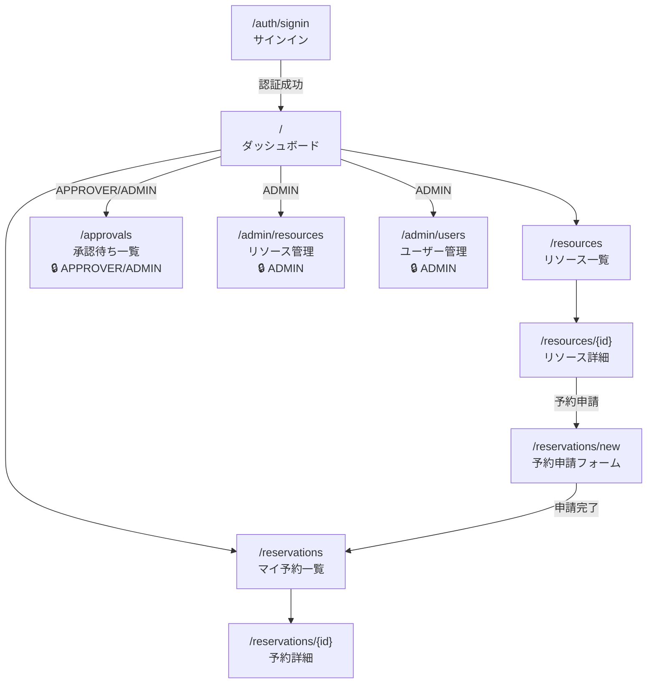

# 画面仕様書

---

## 画面一覧

| # | パス | 画面名 | 主な機能 | アクセス権限 |
|---|------|--------|---------|------------|
| 1 | `/` | ダッシュボード | マイ予約件数・承認待ち件数の集計表示 | 全ロール（要認証） |
| 2 | `/resources` | リソース一覧 | カテゴリ別一覧・空き確認日時入力 | 全ロール（要認証） |
| 3 | `/resources/{id}` | リソース詳細 | 詳細情報・予約カレンダー表示 | 全ロール（要認証） |
| 4 | `/reservations/new` | 予約申請フォーム | リソース・日時・目的を入力して申請 | 全ロール（要認証） |
| 5 | `/reservations` | マイ予約一覧 | 自分の予約一覧・ステータスバッジ | 全ロール（要認証） |
| 6 | `/reservations/{id}` | 予約詳細 | 詳細表示・編集導線・キャンセル操作 | 全ロール（本人・APPROVER・ADMIN） |
| 7 | `/approvals` | 承認待ち一覧 | 承認待ち予約一覧・承認/却下操作 | APPROVER / ADMIN のみ |
| 8 | `/admin/resources` | リソース管理 | リソース登録・編集・有効/無効切替 | ADMIN のみ |
| 9 | `/admin/users` | ユーザー管理 | ユーザー一覧・ロールバッジ・部署名表示 | ADMIN のみ |
| 10 | `/auth/signin` | サインイン | Cognito OAuth2 ソーシャルログインでサインイン（ADR-008） | 未認証のみ |
| 11 | `/reservations/{id}/edit` | 予約編集 | 日時・目的・参加人数を変更（PENDING のみ・リソース変更不可） | 本人（MEMBER / APPROVER）のみ |

---

## 画面遷移図



> **アクセス制御**：未認証ユーザーが要認証画面にアクセスした場合は `/auth/signin` にリダイレクトする。権限不足のロールが `/approvals` / `/admin/*` にアクセスした場合は 403 エラー画面を表示する。

---

## §共通レイアウト・ナビゲーション

### 共通レイアウト構造

全認証済み画面（`/auth/signin` を除く）は以下のレイアウトを共有する。

```
┌─────────────────────────────────────────┐
│  ヘッダー（BookFlow ロゴ ／ ユーザー名・ロールバッジ ／ サインアウトボタン）  │
├──────────┬──────────────────────────────┤
│          │                              │
│ サイド   │  メインコンテンツエリア       │
│ ナビ     │                              │
│          │                              │
└──────────┴──────────────────────────────┘
```

### ヘッダー

| 要素 | 内容 |
|------|------|
| ロゴ | 「BookFlow」テキスト or ロゴマーク。クリックで `/` へ遷移 |
| ユーザー情報 | サインイン中のユーザー名・ロールバッジ（`MEMBER` / `APPROVER` / `ADMIN`） |
| サインアウトボタン | クリックで `POST /api/auth/signout` を実行後 `/auth/signin` へリダイレクト |

### サイドナビゲーション（ロール別表示制御）

| メニュー項目 | 遷移先 | MEMBER | APPROVER | ADMIN |
|------------|--------|--------|----------|-------|
| ダッシュボード | `/` | ✅ | ✅ | ✅ |
| リソース一覧 | `/resources` | ✅ | ✅ | ✅ |
| マイ予約 | `/reservations` | ✅ | ✅ | ✅ |
| 承認待ち一覧 | `/approvals` | ❌（非表示） | ✅ | ✅ |
| リソース管理 | `/admin/resources` | ❌（非表示） | ❌（非表示） | ✅ |
| ユーザー管理 | `/admin/users` | ❌（非表示） | ❌（非表示） | ✅ |

> **注意**：メニュー項目の非表示はナビゲーション上の UI 制御。サーバーサイドでも権限チェックを行い、不正アクセスには 403 を返す（フロントの制御だけに依存しない）。

---

## §認証

### `/auth/signin` — サインイン

> **実装注記（ADR-008 適用）**：ADR-008（Status: Accepted）により Cognito OAuth2 ソーシャルログインを採用。以下の「メールアドレス/パスワードフォーム」記述は廃止済み。Better Auth の `signIn.social({ provider: 'cognito' })` を使用した単一ボタン方式を実装済み。

#### 画面概要

未認証ユーザー専用のサインイン画面。Better Auth + cognito-local（本番は Amazon Cognito）を経由した OAuth2 フローでサインインする。

#### UI 要素

| 要素 | 説明 |
|------|------|
| サインインボタン | クリックで Cognito OAuth2 フローを開始（`authClient.signIn.social({ provider: 'cognito' })`） |
| 開発用ロール別ログインボタン | **開発環境限定**（`NODE_ENV !== 'production'` でのみ表示）。MEMBER / APPROVER / ADMIN の各シードユーザーで cognito-local に直接ログインする（`devLoginAction` → `InitiateAuth` → IdToken を httpOnly Cookie `dev-id-token` に保存）。本番ビルドには含まれない |

#### バリデーション

Cognito 側で認証を処理するため、フォームバリデーションは不要。認証失敗時は Cognito のエラーが返る。

#### 画面フロー

1. サインインボタンクリック → Better Auth 経由で Cognito OAuth2 認可エンドポイントへリダイレクト
2. Cognito 認証完了 → コールバック URL（`/`）へリダイレクト
3. 認証失敗 → Cognito エラーページまたは `/auth/signin` に戻る

---

## §リソース

### `/resources` — リソース一覧・空き確認

#### UI 要素

| 要素 | 説明 |
|------|------|
| カテゴリフィルター | 「すべて」／「会議室（ROOM）」／「備品（EQUIPMENT）」／「社用車（VEHICLE）」のタブまたはセレクト |
| リソースカード一覧 | 名称・カテゴリ・場所・定員・承認フロー要否を表示。`is_active = false` のリソースは MEMBER / APPROVER には非表示（ADMIN はグレーアウトして表示） |
| 空き確認フォーム | 開始日時・終了日時の入力欄。入力後にリソース一覧を再取得し、当該時間帯に空きのあるリソースのみを表示する（占有予約のあるリソースは一覧から除外。`GET /api/resources` の `from`/`to` フィルタ仕様に準拠）。絞り込み中は対象期間と件数のメッセージを表示 |
| 「詳細を見る」リンク | リソース詳細（`/resources/{id}`）へ遷移 |
| ページネーション | page/size 方式（デフォルト 20 件/ページ） |

---

### `/resources/{id}` — リソース詳細

#### UI 要素

| 要素 | 説明 |
|------|------|
| リソース情報 | 名称・カテゴリ・場所・定員・説明・承認フロー要否 |
| 空き状況リスト | 当日〜7 日後の占有時間帯（`status IN ('PENDING', 'APPROVED')` の予約。`GET /api/resources/{id}/availability` で取得）をリスト表示。占有なしの場合は「予約はありません」メッセージ |
| 「このリソースを予約する」ボタン | 予約申請フォーム（`/reservations/new?resourceId={id}`）へ遷移。`is_active = false` のリソースでは非表示 |

---

### `/admin/resources` — リソース管理（ADMIN）

**アクセス制御**：ADMIN のみアクセス可。他ロールがアクセスした場合は 403 エラー画面を表示する。

#### UI 要素

| 要素 | 説明 |
|------|------|
| 「新規登録」ボタン | リソース登録フォームを表示（モーダルまたはページ内フォーム） |
| リソース一覧テーブル | 全リソース（`is_active` の状態に関わらず）を表示 |
| 有効/無効トグル | `is_active` を切り替える。`PATCH /api/resources/{id}/status` を呼び出す |
| 「編集」ボタン | 選択リソースの情報を編集するフォームを表示 |

#### 登録・編集フォーム入力項目

| フィールド | 型 | 必須 |
|-----------|-----|------|
| 名称 | テキスト | ✅ |
| カテゴリ | セレクト（ROOM / EQUIPMENT / VEHICLE） | ✅ |
| 定員 | 数値 | ❌ |
| 場所 | テキスト | ❌ |
| 説明 | テキストエリア | ❌ |
| 承認フロー要否（requires_approval） | チェックボックス | ✅ |
| 有効（is_active） | チェックボックス | ✅ |

---

## §予約

### `/reservations/new` — 予約申請フォーム

#### UI 要素

| 要素 | 説明 |
|------|------|
| リソース選択 | セレクトボックス（`GET /api/resources` から取得した有効リソース一覧） |
| 開始日時 | 日付時刻入力欄（必須） |
| 終了日時 | 日付時刻入力欄（必須） |
| 利用目的 | テキスト入力欄（必須） |
| 参加人数 | 数値入力欄（任意） |
| 「申請する」ボタン | フォーム送信 |

> `/resources/{id}` からの遷移時は `resourceId` をクエリパラメータ（`?resourceId={id}`）で受け取り、リソース選択欄に初期値として設定する。

#### バリデーション

| ルール | 条件 |
|--------|------|
| リソース必須 | リソース未選択は申請不可 |
| 開始・終了日時必須 | 両方の入力が必要 |
| 終了 > 開始 | 終了日時は開始日時より後であること |
| 重複予約 | 申請後に 409 Conflict が返された場合、「指定した時間帯は既に予約が入っています」を表示 |

#### 申請後フロー

- 申請成功 → マイ予約一覧（`/reservations`）へリダイレクト
- `requires_approval = false` のリソース → ステータスは `APPROVED`（即時確定）
- `requires_approval = true` のリソース → ステータスは `PENDING`（承認待ち）

---

### `/reservations` — マイ予約一覧

#### UI 要素

| 要素 | 説明 |
|------|------|
| ステータスフィルター | 「すべて」／「承認待ち（PENDING）」／「承認済み（APPROVED）」／「却下（REJECTED）」／「キャンセル済み（CANCELLED）」のタブ |
| 予約一覧テーブル | リソース名・日時・目的・ステータスバッジを表示 |
| ステータスバッジ | `PENDING`=黄・`APPROVED`=緑・`REJECTED`=赤・`CANCELLED`=グレー |
| 「詳細」リンク | 予約詳細（`/reservations/{id}`）へ遷移 |
| ページネーション | page/size 方式（デフォルト 20 件/ページ） |

> ADMIN は全ユーザーの予約一覧を閲覧できる（フィルターに申請者を絞る UI を追加してもよい）。

---

### `/reservations/{id}` — 予約詳細

#### UI 要素

| 要素 | 説明 |
|------|------|
| 予約情報 | リソース名・日時（開始〜終了）・目的・参加人数・ステータスバッジ |
| 編集ボタン | `PENDING` の予約かつ申請者本人の場合に表示。予約編集画面（`/reservations/{id}/edit`）へ遷移 |
| キャンセルボタン | `PENDING` または `APPROVED` の予約に対して表示。クリック後に確認ダイアログを表示 |

#### アクセス制御

| ロール | 閲覧可能な予約 |
|--------|-------------|
| MEMBER | 自分の予約のみ |
| APPROVER | すべての予約 |
| ADMIN | すべての予約 |

他人の予約に MEMBER がアクセスした場合は 403 エラーを表示する。キャンセル操作は申請者本人または ADMIN のみ可能。編集操作は申請者本人（MEMBER / APPROVER）のみ可能。

---

### `/reservations/{id}/edit` — 予約編集

#### UI 要素

| 要素 | 説明 |
|------|------|
| 開始日時 | 日付時刻入力欄（必須・現在値を初期表示） |
| 終了日時 | 日付時刻入力欄（必須・現在値を初期表示） |
| 利用目的 | テキスト入力欄（必須・現在値を初期表示） |
| 参加人数 | 数値入力欄（任意・現在値を初期表示） |
| リソース | 変更不可。現在のリソース名を読み取り専用で表示 |
| 「更新する」ボタン | フォーム送信（`PUT /api/reservations/{id}`） |
| 「戻る」リンク | 予約詳細（`/reservations/{id}`）へ戻る |

#### バリデーション

| ルール | 条件 |
|--------|------|
| 開始・終了日時必須 | 両方の入力が必要 |
| 終了 > 開始 | 終了日時は開始日時より後であること |
| 重複予約 | 更新後に 409 Conflict が返された場合、「指定した時間帯は既に予約が入っています」を表示 |

#### 更新後フロー

- 更新成功 → 予約詳細（`/reservations/{id}`）へリダイレクト

#### アクセス制御

| 条件 | 動作 |
|------|------|
| `PENDING` 以外の予約 | 422 エラー（API が返す） |
| 申請者本人以外 | 403 エラー（API が返す） |
| ADMIN | 編集不可（権限マトリクス上 `PUT /api/reservations/{id}` は ADMIN 不可） |

---

## §承認

### `/approvals` — 承認待ち一覧（APPROVER / ADMIN）

**アクセス制御**：APPROVER / ADMIN のみアクセス可。MEMBER がアクセスした場合は 403 エラー画面を表示する。

#### 表示データの可視範囲

| ロール | 表示対象 |
|--------|---------|
| APPROVER | 自分が担当する（`approver_id = 自分`）`status = 'PENDING'` のステップのみ |
| ADMIN | すべての `status = 'PENDING'` のステップ |

#### UI 要素

| 要素 | 説明 |
|------|------|
| 承認待ち一覧テーブル | リソース名・申請者名・利用開始〜終了日時・利用目的・申請日時を表示 |
| 承認ボタン | クリック後に確認ダイアログを表示。コメント入力欄（任意）とともに `POST /api/approvals/{stepId}/approve` を実行 |
| 却下ボタン | クリック後に確認ダイアログを表示。コメント入力欄（必須）とともに `POST /api/approvals/{stepId}/reject` を実行 |
| コメント入力欄 | 承認時は任意・却下時は必須。却下時に空欄のまま送信しようとした場合はバリデーションエラー（「却下理由を入力してください」） |
| 操作後の更新 | 承認・却下が成功した後、一覧を再取得して表示を更新する（当該ステップは PENDING でなくなるため一覧から消える） |

---

## §ユーザー・部署

### `/` — ダッシュボード

#### UI 要素

| 要素 | 表示対象ロール | 説明 |
|------|-------------|------|
| マイ予約サマリカード（承認待ち） | 全ロール | 自分の `status = 'PENDING'` の予約件数 |
| マイ予約サマリカード（承認済み） | 全ロール | 自分の `status = 'APPROVED'` の予約件数 |
| 承認待ち件数カード | APPROVER / ADMIN | 自分が担当する `approval_steps.status = 'PENDING'` の件数 |
| 「予約を申請する」ボタン | 全ロール | `/reservations/new` へ遷移 |
| 「マイ予約を見る」リンク | 全ロール | `/reservations` へ遷移 |

#### データ取得

- マイ予約件数：`GET /api/reservations?status=PENDING` / `GET /api/reservations?status=APPROVED` の `totalElements` を使用
- 承認待ち件数：`GET /api/approvals/pending` のレスポンス配列の長さ（APPROVER / ADMIN のみ）

---

### `/admin/users` — ユーザー管理（ADMIN）

**アクセス制御**：ADMIN のみアクセス可。他ロールがアクセスした場合は 403 エラー画面を表示する。

#### UI 要素

| 要素 | 説明 |
|------|------|
| ユーザー一覧テーブル | 名前・メールアドレス・ロールバッジ・部署名を表示 |
| ロールバッジ | `MEMBER`=グレー・`APPROVER`=青・`ADMIN`=紫 |
| ページネーション | page/size 方式（デフォルト 20 件/ページ） |

> ロール変更機能はベース実装の対象外（拡張課題）。ユーザー管理画面は閲覧専用。
