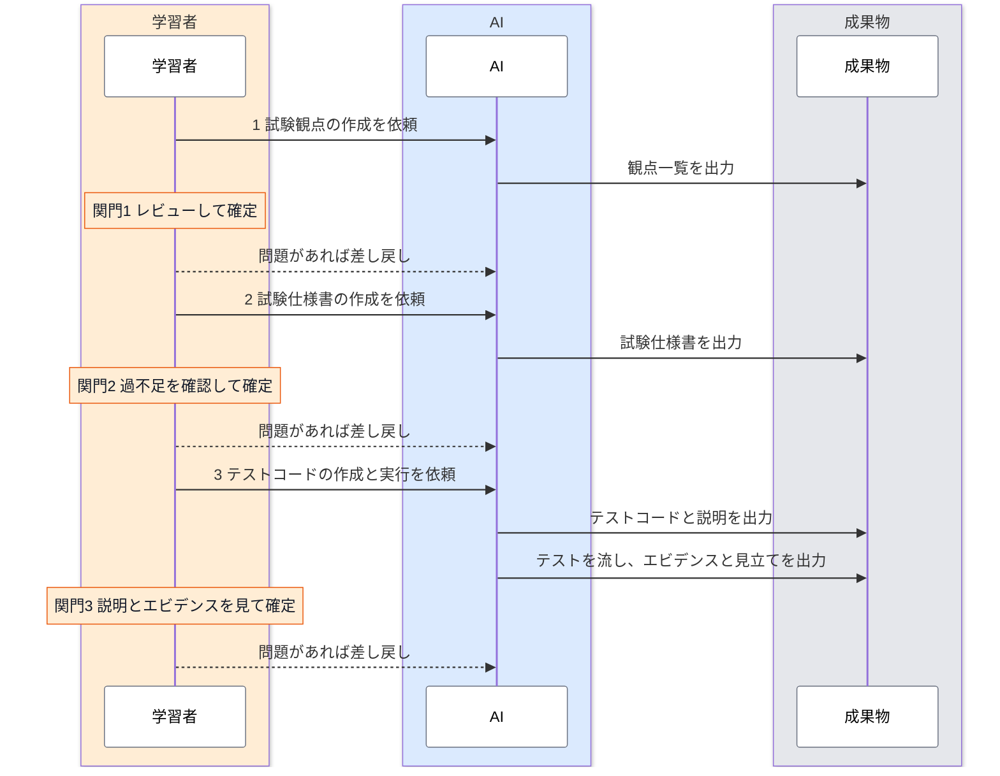

# 結合テストのワークフロー

結合テストは、試験観点、試験仕様書、テストコードと実行の3つの段階を順に進めて作ります。どの段階も、AI が成果物を出力し、学習者がレビューして確定させる形をとります。学習者が確定させるまで、次の段階へは進みません。

このページは、3つの段階の全体像と、今どの段階にいて次に何をすればよいかの見分け方をまとめたものです。各段階の具体的な手順は、段階ごとのページにあります。

---

## 全体の流れ {#overview}

<div class="diagram-compact">



</div>

図は、学習者、AI、成果物の3つのレーンで、上から順に読みます。各段階は、学習者が AI に依頼し、AI が成果物を出力し、学習者が関門（橙のメモ）でレビューして確定する、の繰り返しです。

問題が見つかったら、差し戻しの理由にコメントを書いて AI に差し戻します。AI はそのコメントをもとに、その段階の成果物を直します。

テストを実行したあとのレビューでテストコードの誤りが分かったときは、同じように差し戻しの理由にコメントを書きます。AI がテストコードを直して、流し直します。

---

## 段階ごとの役割分担 {#stages}

<div class="stage-table">

| 段階 | AI がやること | 学習者がやること（関門） | 成果物 | 手順 |
|---|---|---|---|---|
| 1 試験観点 | 仕様書（要件定義書、画面仕様書、API 仕様書、ER 図）のみを根拠に、観点のたたき台を出力する（`generate-test-perspectives` スキル） | すべての観点の根拠を仕様書で確かめ、仕様の矛盾に回答して、観点を確定する | 観点一覧（`Docs/test/<画面>/perspectives.md`） | [試験観点を作る](./viewpoints.md) |
| 2 試験仕様書 | 作成した観点を、前提条件、手順と入力、期待結果、確認箇所に展開する（`generate-test-cases` スキル） | すべてのケースを展開元の観点と突き合わせ、AI が仮に決めた値と試験ケースにできなかった観点を判断して、確定する | 試験仕様書（`Docs/test/<画面>/cases.md`） | [試験仕様書を作る](./cases.md) |
| 3 テストコードと実行 | 確定したケースを Playwright のテストコードに変換し、判断が要るところを説明に書き出す（`generate-test-code` スキル）。環境を整えてテストを流し、フェイルしたケースに見立てを書く | テストコードは読まずに、説明に書かれた判断事項（名前の違い、ケースどおりに書けなかった点、テストコードにできなかったケース）を判断し、ケースごとの実行のエビデンスを期待結果と照らして、確定する | テストコード（`frontend/tests/e2e/workflow/<画面>.spec.ts`）、説明（`Docs/test/<画面>/code.md`）、実行の結果（`run.json`）と見立て（`triage.md`） | [テストの結果を確かめる](./execution.md) |

</div>

---

## 関門の決まり {#gates}

どの関門にも、次の3つの決まりがあります。いずれも、AI の出力が実行のたびに変わり、判断を誤ることもあるという特性から来ています（[AI と学習者の役割分担](./viewpoints.md#roles)を参照）。

- **関門を通すのは人間**：確定させるのは、レビューした学習者です。
- **指摘は差し戻しの理由に書く**：直してほしい点は、差し戻しの理由に書きます。AI はそれをもとに成果物を直します。差し戻しは日時と理由付きで、確定は日時付きで記録に残ります（確定のときに指摘の欄に書いたことも残ります）。
- **減らす判断は学習者がする**：観点やケースを外すと、外したことに後から気づく機会がなく、テストの抜けとして残ります。そのため、観点やケースを外す判断と、テストをスキップする判断は、AI に任せません。

---

## 進み具合を確かめる {#where-am-i}

画面ごとの状態は、状態ファイル（`Docs/test/<画面>/state.json`）に記録されます。各段階の状態は、未着手、レビュー待ち（AI が出力した）、差し戻し、確定の4つです。状態は、次の2つの方法で確かめます。

- **案内スキル**：Claude Code に `/e2e-workflow` と打つと、今の段階と、次に誰が何をするかが示されます。段階が未着手なら、案内スキルがたたき台を出力します。テストコードと実行の段階では、テストを流して見立てを書くところまで行います。スラッシュを付けて打ったときだけ、案内スキルとその中の作業が Opus で動きます（スラッシュなしの依頼でも起動はしますが、Sonnet のまま動きます）。
- **ダッシュボード**：画面ごとの状態の一覧と、観点一覧の表示、仕様の矛盾への回答欄、関門の「確定する」と「差し戻す」のボタンがあります。

ダッシュボードは、案内スキル（`/e2e-workflow`）から起動します。結合テストのチュートリアルに取り組む人だけが使うため、コンテナを起動しただけでは立ち上がらず、案内スキルを実行したときに、止まっていれば起動する作りにしています。起動したら、手元のブラウザで `http://localhost:3130` を開きます。コンテナを落としたあとは、もう一度 `/e2e-workflow` を実行してください。状態ファイルと成果物はリポジトリに残っているので、続きから再開できます。

関門の確定と差し戻しは、ダッシュボードのボタンで行います。差し戻すときは、指摘を書くか、仕様の矛盾に回答します。差し戻したら、もう一度 `/e2e-workflow` を実行すると、AI が指摘と回答に沿って成果物を直し、状態が「レビュー待ち」に戻ります（テストコードと実行の段階では、直したあと流し直します）。確定と差し戻しは記録に残り、ダッシュボードの「記録」で確かめられます。

:::note[確定を学習者に限る仕組みについて]

AI は確定と差し戻しを行わない作りにしていますが、AI が状態ファイルを直接書き換えて「確定」にすること自体は、技術的には防げていません。

:::

:::note[成果物の保存とブランチ]

成果物は作業ブランチにコミットしてかまいませんが、main にはマージしません。

:::

---

## 題材の画面を選ぶ {#other-screens}

このチュートリアルでは、1つの画面を題材に結合テストを作ります。手順と例は予約申請画面（`/reservations/new`）で説明していますが、他の画面を題材に選ぶこともできます。

予約申請画面以外を選ぶときは、`/e2e-workflow` に続けて、画面のパスを書きます。

```text
/e2e-workflow 承認待ち一覧（/approvals）の結合テストを進めたい
```

画面のパスは、[画面仕様書](../../spec/screen-spec.md)の画面一覧にあるものを使います。状態ファイルは画面ごとに作られ、ダッシュボードでも画面ごとに進み具合を確かめられます。

### 画面による注意点

試験ケースから先の段階は、予約申請画面に合わせて作った部分が多く、予約申請画面でのみ動作を確かめています。次のような画面では、うまく進まないことがあります。

| 画面の特徴 | 起こりうること | 例 |
|---|---|---|
| 予約とリソース以外の前提データが要る | テストの前提を用意する仕組み（API でデータを作る補助の関数）が、リソースの選択と無効なリソースの作成、予約の作成、承認と却下、キャンセルしか持たない。ユーザーや部署を作る必要があるケースは、「テストコードにできなかったケース」になる | ユーザー管理（`/admin/users`） |
| 今日の日付や件数を見る | テストの予約は 2027 年以降の時間帯に作る。今日の予定や、期間で絞った件数を見る画面では、テストの予約が確認箇所に写らないことがある（運営者は確かめていない） | ダッシュボード（`/`）、リソース詳細の予約カレンダー（`/resources/{id}`） |
| 一般社員（MEMBER）以外が主役 | 承認者や管理者でサインインした状態を、ケースごとに切り替える。予約申請画面より、ロールを取り違えたテストが出やすい | 承認待ち一覧（`/approvals`）、リソース管理（`/admin/resources`） |
| 確認箇所が別の画面になる | 操作した画面と、期待結果を確かめる画面が違う。確認箇所の画面を撮り忘れたテストが出やすい | 予約詳細のキャンセル操作（`/reservations/{id}`）、承認と却下 |

うまく進まないときは、まず Claude Code に状況を伝えて相談してください。それでも解決しないときは、無理に確定せず、どの段階で何が起きたかを運営者に伝えてください。

---

## 未対応の機能 {#not-ready}

次の機能には、まだ対応していません。

- **観点の行ごとの指摘**：指摘は、差し戻しの理由の欄に観点の ID を添えて文章で書きます。
- **ダッシュボードから確定した段階を開き直す操作**：前の段階の誤りに気づいたときは、今の関門で差し戻し、`/e2e-workflow` を実行します。AI が誤りを確かめ、その段階を戻すかを尋ねるので、戻すと答えると開き直されます（[前の段階の誤りを見つけたとき](./execution.md#upstream)）。
