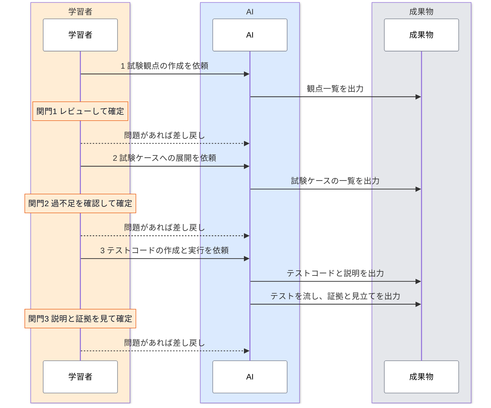

# 結合テストのワークフロー

結合テストは、試験観点、試験ケース、テストコードと実行の3つの段階を順に進めて作ります。どの段階も、AI が成果物を出力し、学習者がレビューして確定させる形をとります。学習者が確定させるまで、次の段階へは進みません。

3つ目の段階で、AI はテストコードを作ったあと、テストを流して実行の証拠を集めるところまで行います。学習者はテストコードを読まず、テストコードから抜き出した確かめ（何をどう確かめたか）と、流した結果と証拠を見て判断します。テストコードの書き方を読み解かなくても、確かめが期待結果に足りているか、今回の実行で期待結果が成り立っていたかを判断できるようにするためです。

このページは、3つの段階の全体像と、今どの段階にいて次に何をすればよいかの見分け方をまとめたものです。各段階の具体的な手順は、段階ごとのページにあります。

---

## 全体の流れ {#overview}

<div class="diagram-compact">



</div>

図は、学習者、AI、成果物の3つのレーンで、上から下へ時間が進みます。各段階は、学習者が AI に依頼し、AI が成果物を出力し、学習者が関門（橙のメモ）でレビューして確定する、の繰り返しです。問題が見つかったら、その段階の作業を AI に差し戻します。関門3 で、テストコードの誤りが分かったときは関門3 で差し戻し、AI が直して流し直します。試験観点や試験ケースの誤りが分かったときは、今の関門で差し戻して運営者に相談し、運営者が原因のある段階まで戻します（[前の段階の誤りを見つけたとき](./execution.md#upstream)）。図の右上のボタンで全画面表示に、右下のボタンで拡大と縮小ができます。

---

## 段階ごとの役割分担 {#stages}

| 段階 | AI がやること | 学習者がやること（関門） | 成果物 | 手順 |
|---|---|---|---|---|
| 1 試験観点 | 仕様書だけを根拠に、観点のたたき台を出力する（`generate-test-perspectives` スキル） | すべての観点の根拠を仕様書で確かめ、仕様の食い違いに仮の回答をして、観点を確定する | 観点一覧（`Docs/test/<画面>/perspectives.md`） | [試験観点を作る](./viewpoints.md) |
| 2 試験ケース | 確定した観点を、前提条件、手順と入力、期待結果、見る場所に展開する（`generate-test-cases` スキル） | すべてのケースを展開元の観点と突き合わせ、AI が仮に決めた値と試験ケースにできなかった観点を判断して、確定する | 試験ケースの一覧（`Docs/test/<画面>/cases.md`、テスト仕様書に当たる） | [試験ケースに展開する](./cases.md) |
| 3 テストコードと実行 | 確定したケースを Playwright のテストコードに変換し、判断が要るところを説明に書き出す（`generate-test-code` スキル）。環境を整えてテストを流し、フェイルしたケースに見立てを書く（案内スキル） | テストコードは読まずに、説明の判断が要るところを判断し、ケースごとの実行の証拠を期待結果と照らして、確定する | テストコード（`frontend/tests/e2e/workflow/<画面>.spec.ts`）、説明（`Docs/test/<画面>/code.md`）、実行の結果（`run.json`）と見立て（`triage.md`） | [Playwright コードを生成する](./code-generation.md)、[テストを実行する](./execution.md) |

---

## 関門の決まり {#gates}

どの関門にも、次の3つの決まりがあります。いずれも、AI の出力が実行のたびに変わり、判断を誤ることもあるという特性から来ています（[AI と学習者の役割分担](./viewpoints.md#roles)を参照）。

- **関門を通すのは学習者だけ**：AI は、自分の出力を自分でレビューして「確定」にしません。確定させるのは、レビューした学習者です。
- **指摘は差し戻しの理由に書く**：直してほしい点は、差し戻しの理由に書きます。AI はそれをもとに成果物を直します。問題のない行に印を付けていく記録は作りません。確定と差し戻しは、日時と理由付きで記録に残ります。
- **減らす判断は学習者がする**：観点やケースを外す判断、テストをスキップする判断は、AI に任せません。外したことは後から気づきにくいためです。

---

## 今どの段階にいるかの確かめ方 {#where-am-i}

画面ごとの状態は、状態ファイル（`Docs/test/<画面>/state.json`）に記録されます。各段階の状態は、未着手、レビュー待ち（AI が出力した）、差し戻し、確定の4つです。状態は、次の2つの方法で確かめます。

- **案内スキル**：Claude Code に `/e2e-workflow` と打つと、今の段階と、次に誰が何をするかが示されます。段階が未着手なら、案内スキルがたたき台を出力します。テストコードと実行の段階では、テストを流して見立てを書くところまで行います。スラッシュを付けて打ったときだけ、案内スキルとその中の作業が Opus で動きます（スラッシュなしの依頼でも起動はしますが、Sonnet のまま動きます）。
- **ダッシュボード**：画面ごとの状態の一覧と、観点一覧の表示、仕様の食い違いへの回答欄、関門の「確定」と「差し戻し」のボタンがあります。

ダッシュボードは、devcontainer の中で次のコマンドで起動します。案内スキル（`/e2e-workflow`）は、ダッシュボードが止まっていれば起動します。コンテナを起動しただけでは立ち上がりません。結合テストのチュートリアルに取り組む人だけが使うためです。

```bash
node scripts/e2e-workflow/server.mjs
```

ポート `3130` は devcontainer の設定で転送されます（VS Code の「ポート」タブに「結合テストのダッシュボード」と出ます）。起動したら、手元のブラウザで `http://localhost:3130` を開きます。コンテナを落としたあとは、もう一度 `/e2e-workflow` を実行するか、上のコマンドで起動し直します。状態ファイルと成果物はリポジトリに残っているので、続きから再開できます。

関門の確定と差し戻しは、ダッシュボードのボタンで行います。差し戻すときは、指摘を書くか、仕様の食い違いに回答します。差し戻したら、もう一度 `/e2e-workflow` を実行すると、AI が指摘と回答に沿って成果物を直し、状態が「レビュー待ち」に戻ります（テストコードと実行の段階では、直したあと流し直します）。どちらも日時と理由付きで記録に残り、ダッシュボードの「記録」で確かめられます。記録の日時は日本時間で表示します。案内スキルは、状態を「レビュー待ち」にするところまでしか進めません。

:::note[確定を学習者に限る仕組みについて]

確定と差し戻しを書けるのはダッシュボードの操作だけ、というのは、スキルとスクリプトの作りで分けているものです。AI が状態ファイルを直接書き換えることまでは、機械的には防いでいません。

:::

:::note[成果物の保存とブランチ]

成果物は作業ブランチにコミットしてかまいませんが、main にはマージしません（[ADR-032 の追記](../../reference/adr/ADR-032-integration-test-tutorial-adoption.md#addendum-2026-09-23)）。

:::

---

## 予約申請画面以外の画面で進める {#other-screens}

このチュートリアルの題材は予約申請画面（`/reservations/new`）です。各段階のページの例と、運営者が通しで試したのも、この画面だけです。予約申請画面を終えたあとで、別の画面で同じ流れを試すこともできます。ただし、画面によっては途中で進めなくなることがあります。

### 始め方

`/e2e-workflow` に続けて、画面のパスを書きます。

```text
/e2e-workflow 承認待ち一覧（/approvals）の結合テストを進めたい
```

画面のパスは、[画面仕様書](../../spec/screen-spec.md)の画面一覧にあるものを使います。AI は画面ごとに状態ファイル（`Docs/test/<画面>/state.json`）を作り、予約申請画面とは別に段階を進めます。`<画面>` には、パスの先頭の `/` を除き、`/` を `-` に、`{id}` を `id` に置き換えた名前が入ります（例：`/reservations/{id}/edit` は `reservations-id-edit`）。ダッシュボードの一覧にも、画面ごとに並びます。

### 試した範囲と、進めなくなりやすいところ

段階ごとに、運営者が試した範囲は次のとおりです。

| 段階 | 運営者が試した画面 |
|---|---|
| 試験観点 | 予約申請、リソース一覧、マイ予約一覧、承認待ち一覧 |
| 試験ケース、テストコードと実行 | 予約申請だけ |

試験ケースから先は、予約申請画面に合わせて作った部分が多く、次のような画面で進めなくなりやすくなります。

| 画面の特徴 | 起きやすいこと | 例 |
|---|---|---|
| 予約とリソース以外の前提データが要る | テストの前提を用意する仕組み（API でデータを作る補助の関数）が、リソースの選択と無効なリソースの作成、予約の作成、承認と却下、キャンセルしか持たない。ユーザーや部署を作る必要があるケースは、「テストコードにできなかったケース」に回る | ユーザー管理（`/admin/users`） |
| 今日の日付や件数を見る | テストの予約は 2027 年以降の時間帯に作る。今日の予定や、期間で絞った件数を見る画面では、テストの予約が見る場所に写らないことがある（運営者は確かめていない） | ダッシュボード（`/`）、リソース詳細の予約カレンダー（`/resources/{id}`） |
| 一般社員（MEMBER）以外が主役 | 承認者や管理者でサインインした状態を、ケースごとに切り替える。予約申請画面より、ロールを取り違えたテストが出やすい | 承認待ち一覧（`/approvals`）、リソース管理（`/admin/resources`） |
| 見る場所が別の画面になる | 操作した画面と、期待結果を確かめる画面が違う。見る場所の画面を撮り忘れたテストが出やすい | 予約詳細のキャンセル操作（`/reservations/{id}`）、承認と却下 |

進めなくなったときは、無理に確定せず、どの段階で何が起きたかを運営者に伝えてください。予約申請画面以外での進めやすさは、[運営者向けの進行状況](../../operations/playwright-adoption.md#status-open)で扱っています。

---

## まだ整っていないこと {#not-ready}

このワークフローは、試験観点の段階から順に整えています。2026-10-04 時点で、次の部分はまだ整っていません。決まった部分と決まっていない部分の一覧は、運営者向けの[Playwright 導入の進行状況](../../operations/playwright-adoption.md#status)にあります。

- **ダッシュボードでの指摘**：指摘は、差し戻しの理由の欄に観点の ID を添えて文章で書きます。観点の行ごとに指摘を付ける機能はありません。
- **確定した段階を開き直す操作**：確定した前の段階へ戻す操作は、運営者だけが使うコマンド（`node scripts/e2e-workflow/state.mjs reopen`）にあり、ダッシュボードにはありません。学習者は差し戻して運営者に相談します。
- **実装の不具合の報告**：関門3 で「実装の不具合」と判断したケースは、原因と根拠が確定の記録に残ります。不具合を Issue にする手順は、まだ決めていません。
