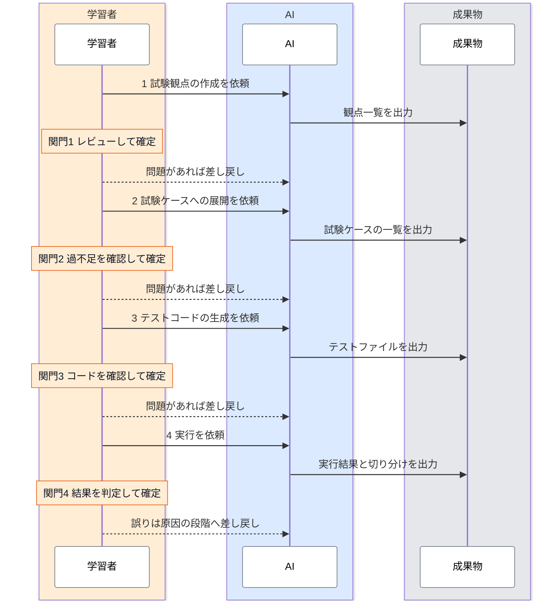

# 結合テストのワークフロー

結合テストは、試験観点、試験ケース、テストコード、実行の4つの段階を順に進めて作ります。どの段階も、AI が成果物を出力し、学習者がレビューして確定させる形をとります。学習者が確定させるまで、次の段階へは進みません。

このページは、4つの段階の全体像と、今どの段階にいて次に何をすればよいかの見分け方をまとめたものです。各段階の具体的な手順は、段階ごとのページにあります。

---

## 全体の流れ {#overview}

<div class="diagram-compact">



</div>

図は、学習者、AI、成果物の3つのレーンで、上から下へ時間が進みます。各段階は、学習者が AI に依頼し、AI が成果物を出力し、学習者が関門（橙のメモ）でレビューして確定する、の繰り返しです。問題が見つかったら、その段階の作業を AI に差し戻します。関門4 で誤りが分かった場合は、原因のある段階まで戻ります。試験観点の誤りなら試験観点へ、試験ケースの入力値や期待結果の誤りなら試験ケースへ、コードの誤りならテストコードへ戻ります。図の右上のボタンで全画面表示に、右下のボタンで拡大と縮小ができます。

---

## 段階ごとの役割分担 {#stages}

| 段階 | AI がやること | 学習者がやること（関門） | 成果物 | 手順 |
|---|---|---|---|---|
| 1 試験観点 | 仕様書だけを根拠に、観点のたたき台を出力する（`generate-test-perspectives` スキル） | すべての観点の根拠を仕様書で確かめ、仕様の食い違いに仮の回答をして、観点を確定する | 観点一覧（`Docs/test/<画面>/perspectives.md`） | [試験観点を作る](./viewpoints.md) |
| 2 試験ケース | 確定した観点を、前提条件、入力する値、操作、期待する結果に展開する | 観点とケースが過不足なく対応しているかを確かめ、確定する | 試験ケースの一覧（テスト仕様書に当たる） | [試験ケースに展開する](./cases.md) |
| 3 テストコード | 確定したケースを Playwright のテストコードに変換する | 要素の指定方法、後片付け、検証の強さなどをレビューし、確定する | `frontend/tests/e2e/` のテストファイル | [Playwright コードを生成する](./code-generation.md) |
| 4 実行 | 環境を整えて実行し、失敗の原因を切り分け、テスト側の問題は直して再実行する | 実装の不具合と報告されたものを仕様に照らして判定し、確かめたことと確かめていないことを確定する | 実行結果と、その判定 | [テストを実行する](./execution.md)（この分担は ADR-032 にはまだ反映していない） |

---

## 関門の決まり {#gates}

どの関門にも、次の3つの決まりがあります。いずれも、AI の出力が実行のたびに変わり、判断を誤ることもあるという特性から来ています（[AI と学習者の役割分担](./viewpoints.md#roles)を参照）。

- **関門を通すのは学習者だけ**：AI は、自分の出力を自分でレビューして「確定」にしません。確定させるのは、レビューした学習者です。
- **指摘は差し戻しの理由に書く**：直してほしい点は、差し戻しの理由に書きます。AI はそれをもとに成果物を直します。問題のない行に印を付けていく記録は作りません。確定と差し戻しは、日時と理由付きで記録に残ります。
- **減らす判断は学習者がする**：観点やケースを外す判断、テストをスキップする判断は、AI に任せません。外したことは後から気づきにくいためです。

---

## 今どの段階にいるかの確かめ方 {#where-am-i}

画面ごとの状態は、状態ファイル（`Docs/test/<画面>/state.json`）に記録されます。各段階の状態は、未着手、レビュー待ち（AI が出力した）、差し戻し、確定の4つです。状態は、次の2つの方法で確かめます。

- **案内スキル**：Claude Code に `/e2e-workflow` と打つと、今の段階と、次に誰が何をするかが示されます。試験観点の段階が未着手なら、案内スキルが観点のたたき台を出力します。スラッシュを付けて打ったときだけ、案内スキルとその中の作業が Opus で動きます（スラッシュなしの依頼でも起動はしますが、Sonnet のまま動きます）。
- **ダッシュボード**：画面ごとの状態の一覧と、観点一覧の表示、仕様の食い違いへの回答欄、関門の「確定」と「差し戻し」のボタンがあります。

ダッシュボードは、devcontainer の中で次のコマンドで起動します。案内スキルが起動することもあります。

```bash
node scripts/e2e-workflow/server.mjs
```

起動したら、VS Code の「ポート」タブで `3130` を転送し、手元のブラウザで `http://localhost:3130` を開きます。

関門の確定と差し戻しは、ダッシュボードのボタンで行います。差し戻すときは、指摘を書くか、仕様の食い違いに回答します。差し戻したら、もう一度 `/e2e-workflow` を実行すると、AI が指摘と回答に沿って成果物を直し、状態が「レビュー待ち」に戻ります（試験観点の段階の場合）。どちらも日時と理由付きで記録に残り、ダッシュボードの「記録」で確かめられます。記録の日時は日本時間で表示します。案内スキルは、状態を「レビュー待ち」にするところまでしか進めません。

:::note[確定を学習者に限る仕組みについて]

確定と差し戻しを書けるのはダッシュボードの操作だけ、というのは、スキルとスクリプトの作りで分けているものです。AI が状態ファイルを直接書き換えることまでは、機械的には防いでいません。

:::

:::note[成果物の保存とブランチ]

成果物は作業ブランチにコミットしてかまいませんが、main にはマージしません（[ADR-032 の追記](../../reference/adr/ADR-032-integration-test-tutorial-adoption.md#addendum-2026-09-23)）。

:::

---

## まだ整っていないこと {#not-ready}

このワークフローは、試験観点の段階から順に整えています。2026-09-30 時点で、次の部分はまだ整っていません。決まった部分と決まっていない部分の一覧は、運営者向けの[Playwright 導入の進行状況](../../operations/playwright-adoption.md#status)にあります。

- **ダッシュボードでの指摘**：指摘は、差し戻しの理由の欄に観点の ID を添えて文章で書きます。観点の行ごとに指摘を付ける機能はありません。
- **試験ケース以降の案内**：状態ファイルは4つの段階すべてを記録しますが、案内スキルが AI の作業を実行するのは試験観点の段階だけです。試験ケース以降は、手順ページを案内します。
- **試験ケース以降の手順**：試験ケース、テストコード、実行の手順ページは、試験観点の段階を作り直す前に書いたものです。試験ケースの保存先、実行結果の報告の様式などは、まだ新しい流れに合わせていません。
