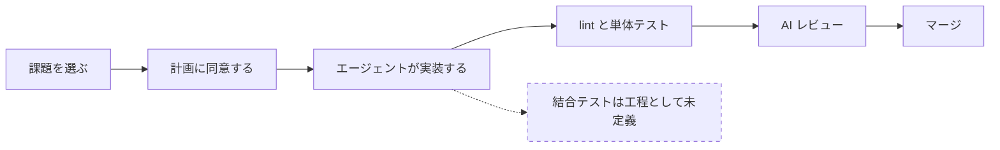
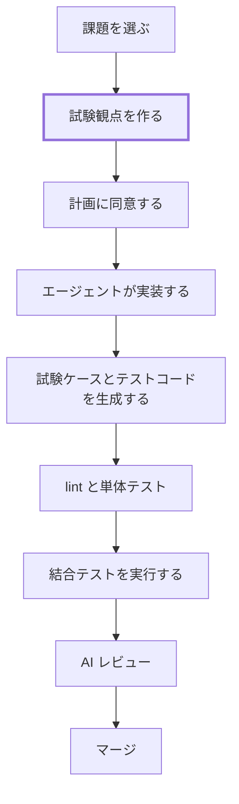

# Playwright 導入検討

:::note[検討段階の文書]

このページは導入を検討している内容の記録であり、確定した運用ではありません。学習者が現在従う手順は[標準開発フロー](../develop/dev-workflow.md#flow)と[学習カリキュラム](../learn/curriculum.md#path-map)のままです。

:::

---

## エージェントが実装を担うとき、品質は誰が担保するのか {#quality-ownership}

AI エージェントを前提とした開発では、実装そのものをエージェントに渡す度合いが上がっている。この読み取りは運営者によるもので、出典となる社内文書はない（[ADR-028](../reference/adr/ADR-028-training-purpose.md) と同じ扱いとする）。

読み取りの当否を措いても、BookFlow の標準フローは既にその状態にある。ADR-028 は次のように書いている。

> 標準フローでは、計画立案から仕様更新、実装、テスト、PR 作成までを AI-DLC エンジンと各スキルが代行する。学習者に強制される行為は Issue の選択、計画への同意、理解度チェックへの回答、マージの4つに限られる。

実装をエージェントに渡した以上、品質を担保する仕組みは実装の外側に置くことになる。現在このリポジトリが持っている手段を並べると、次のようになる。

| 対象 | 担保している仕組み |
|---|---|
| コードの書き方と整形 | oxlint / oxfmt、Spotless / Checkstyle |
| 関数とクラスの振る舞い | Vitest（フロントエンド）、JUnit（バックエンド） |
| 差分の妥当性 | AI レビュー（[総合判定が完了になることが課題の完了条件](../develop/review-criteria.md#ai-review)） |
| 画面から DB までを通した業務フローの成立 | 工程として定義されていない |

最後の行が空いている。ここでいう業務フローとは、サインインしてリソースを閲覧し、予約を申請し、承認者が承認するという一連の操作が、フロントエンド、BFF、バックエンド、データベースをまたいで成立することを指す。学習者が個人的にブラウザで確認している可能性はあるが、その確認は記録されず、次の変更のときに再実行されない。

工程としての結合テストは、従来は人が手順を用意して画面を操作する形で担ってきた。エージェントが実装を担って変更の頻度が上がると、この工程を人手で回す前提が持たなくなる。**結合テストのうち機械的に再実行できる部分を自動化すること**が、品質を落とさずに変更の速度を上げる条件になる。Playwright はその手段の候補である。

---

## Playwright と現在の状態 {#current-state}

Playwright はブラウザを実際に起動して操作するテストツールである。テストコードから画面を開き、要素をクリックし、表示された内容を検証する。フロントエンドの内部実装ではなく、利用者が触る面から動作を確かめる点が、Vitest によるユニットテストとの違いになる。

テスト層ごとの担当は[コーディング規約](../develop/coding-conventions.md)のテスト戦略に定義済みで、Playwright は「統合 / E2E」の担当として記載されている。ツール選定の判断は [ADR-009](../reference/adr/ADR-009-frontend-test-strategy.md) にある。

このリポジトリでの現状は次のとおり。

| 項目 | 状態 |
|---|---|
| 依存パッケージ | `@playwright/test` が `frontend/package.json` に導入済み |
| 設定 | `frontend/playwright.config.ts` が存在し、chromium 1 プロジェクトで動く |
| テスト | `frontend/tests/e2e/example.spec.ts` の 1 件のみ（トップページの見出し表示） |
| 実行コマンド | `pnpm test:e2e` |
| CI | `ci-frontend.yml` に実行ステップがなく、自動実行されていない |

Playwright を導入するかどうかではなく、既にあるものをどう使うかが検討の対象になる。なお、Playwright 自体の習熟は本研修の到達目標ではない。ADR-028 は個別技術の習熟を到達目標に置かないと定めており、Playwright もその扱いに従う。

---

## 結合テストのうち何を任せられるか {#what-to-delegate}

テストコードを書く作業は、AI エージェントによって難しい作業ではなくなった。そのため、学習者にテストコードの書き方を習得させることは主題にならない。

主題になるのは、**何を検証対象として定義するか**の側である。どの業務フローが壊れたら困るのか、正常系として何が成立していれば合格なのかを決めるのは、エージェントではなく人である。この判断は、AI に任せる範囲と自分で判断する範囲の線引きという、ADR-028 が掲げた到達目標そのものにあたる。

結合テストの成果物は 3 つの層に分かれる。層ごとに、人が担うのかエージェントに任せられるのかが変わる。

| 層 | 内容 | 担い手 |
|---|---|---|
| 試験観点 | 何を確認するかを、仕様書を根拠に列挙したもの | 人が決める。エージェントは生成を補助する |
| 試験ケース | 前提条件、操作手順、入力値、期待結果に展開したもの | エージェントに任せられる |
| テストコード | Playwright のテストファイル | エージェントに任せられる |

上の層ほど、判断の材料が仕様と業務の側にある。下の層は上の層が確定していれば機械的に導ける。エージェントが実装を担う開発で人に残るのは、いちばん上の層である。

試験観点の層で人が決めることは、次のような内容になる。

- どの業務フローを検証対象に選ぶか
- 仕様書のどの記述を根拠とするか
- 仕様書だけでは期待結果を確定できない箇所はどれか

テストコードが生成された後も、人が担い続ける作業がある。

- 初めて作る機能を探索的に確かめる
- 画面の見た目が意図どおりかを判断する
- 性能とセキュリティを確認する
- 業務として受け入れてよいかを判断する

ユニットテストとの寿命の違いも、この分担を後押しする。ユニットテストは実装の構造に依存するため、エージェントが内部を書き換えれば書き直しが要る。結合テストは操作と結果という利用者から見える言葉で書かれるため、下の実装が入れ替わっても定義がそのまま残る。

---

## チュートリアルのどこに組み込まれるか {#where}

前提として、学習者が書いたテストをリポジトリに取り込むことは考えていない。学習者は個人のトランクブランチで作業し、実装を `main` へマージしない運用である。テストも同じ扱いになる。学習の過程そのものが目的であり、成果物の蓄積は目的ではない。

現在の必須課題は、課題の選択から実装、AI レビュー、マージまでを次の順で進む。検証にあたる工程は lint とユニットテスト、そして AI レビューの 3 つで、いずれも動作そのものは確かめていない。

結合テストを組み込む場合、3 つの層のうち試験観点だけを実装より前に置く形を検討している。課題ごとのビジネス要求シートには受入条件が書かれているため、これを根拠に試験観点を作る。試験ケースとテストコードは実装後にエージェントが生成し、エージェントの成果物はその結合テストが通るかどうかで判定される。

太い枠が、人が担う工程である。

この形は、実装より先に仕様を更新するという既存の Spec-first 運用に、実行可能性を与えるものになる。仕様が真実の源だと定めながら、その仕様が実行されていない状態が現在は残っている。

なお、結合テストを追加する課題は選択課題カタログの初級に[既存機能の E2E テスト追加](../spec/enhancements/beginner/e2e-test-coverage.md)として存在する。この課題との関係は次節以降の判断による。

---

## 導入に伴うコスト {#cost}

導入すると次の負担が発生する。運営者が可否を判断するための材料として並べる。

**学習時間の配分**：必須課題の合計は 17〜24 時間と定義されている。結合テストをどの STEP にも組み込む場合、この枠のどこを削るか、枠そのものを広げるかという判断が要る。

**CI の実行時間**：`ci-frontend.yml` は、報告されない check がブランチ保護と AI レビューの前提を満たせなくなる事情から、ジョブ自体をスキップしない設計になっている。結合テストをこの check に載せると、frontend に触れない PR も含めてすべての PR がブラウザテストの完了を待つ。

**テストの保守**：画面の構造が変わると、書いた試験ケースとテストコードは壊れる。機能を変更する課題と結合テストを整備する作業の順序を誤ると、同じものを何度も直すことになる。

**実行の不安定さ**：ブラウザを介するテストは、待ち時間の扱いによって同じコードでも成否が変わることがある。失敗したときに実装の問題なのかテストの問題なのかを切り分ける手間が、学習者と運営者の双方に生じる。

---

## 未決事項と決める順序 {#open-questions}

決めていないことを、決める順に並べる。A が決まらないと B と C の選択肢が絞れない。

### A. 位置づけ

| # | 決めること | 選択肢 |
|---|---|---|
| 1 | 何の品質を担保するのか | 既存のベース実装を検証するのか、エージェントが書いた成果物を検証するのか |
| 2 | 試験観点を作る時点 | 実装より前に作るのか、実装の後に作るのか |
| 3 | カリキュラム上の扱い | 独立したチュートリアルとするのか、各実装に必須の作業として組み込むのか |
| 4 | 既存の選択課題の扱い | 3 に従属する。必須の作業とするなら選択課題から外し、結合テストの実装という形で導入するなら内容を書き換えて流用する |

2 について補足する。実装より前に作るのであれば、試験観点は受入条件を実行できる形にしたものになる。実装の後に作るのであれば、完成したものを題材に試験設計の手法そのものを習得することが目的になる。どちらも学習の価値はあるが、身につくものが違う。

### B. 技術的な範囲

| # | 決めること | 選択肢 |
|---|---|---|
| 5 | 結合テストの範囲 | フロントエンドに限るのか、バックエンドを含めるのか |
| 6 | バックエンドへの依存 | 実際の API とデータベースを通すのか、通信経路をモックするのか |

5 は工数、難度、用意する機構に大きく影響する。Playwright は画面からの操作を検証する道具であり、バックエンド単体の結合テストは守備範囲の外にある。バックエンドまで含めるのであれば、別の仕組みを併せて整える必要がある。

この 2 つが決まると、CI での実行方法とサインインの方式も決まる。ローカル環境ではブラウザからのサインインが成立しないため（cognito-local が http で動き、認証クライアントのリダイレクトが失敗する）、開発専用のロール別ログインを正式な手順とするかどうかを、あわせて決めることになる。

### C. 品質を担保する仕組み

| # | 決めること | 選択肢 |
|---|---|---|
| 7 | 完了条件との接続 | 結合テストが通ることを課題の完了条件に加えるのか、加えないのか |
| 8 | 試験観点の作成を SKILL 化するか | SKILL 化する場合、何を目的とするのか |
| 9 | SKILL 以外に整備する仕組み | 試験観点のレビュー基準、テストデータ、CI での実行のうち、何を用意するのか |

7 は、方針としては完了条件に加えたい。ただし、学習者が書いたテストが CI ジョブとして安定して動く状態まで到達できるかが分かっていない。動かないものを完了条件にはできないため、現時点では判断できない。

8 で目的として考えられるのは、学習者間で成果物のブレを抑えること、手順そのものを教材として固定すること、運営者が成果物を比較できるようにすることである。これらは両立しない場合がある。特に手順を固定するほど、学習者が自分で考える範囲は狭くなる。AI 駆動開発の習得という目的との兼ね合いを含めて決める必要がある。

9 は、SKILL が成果物を生成する手順を固定するだけで、生成されたものが正しいかどうかは保証しないことによる。試験観点が仕様を網羅しているか、期待結果が妥当かは、別の仕組みで確かめることになる。

---

## 別軸としての Playwright MCP {#mcp}

ここまではテストコードとしての Playwright を扱った。これとは別に、Claude Code 自身にブラウザを操作させる使い方がある。エージェントが実装後に画面を開いて動作を確かめ、その結果を報告する形になる。

本研修の学習範囲は Claude Code と AI 駆動開発なので、この使い方も範囲に含まれる。ただし本ページでは評価していない。テストコードとしての運用が定まってから、別途検討する。

---

## 実環境の前提 {#environment}

着手する際に前提となる、現在のリポジトリの状態を挙げる。

- フロントエンドには `@playwright/test` と `playwright.config.ts` が既にあり、pnpm で管理している。新たに導入する作業は要らない
- `pnpm test` はユニットテスト（Vitest）を実行する。Playwright は `pnpm test:e2e` である
- 実装に `data-testid` は 1 つも入っていない。要素の指定方法を決める必要がある
- ローカル環境ではブラウザからのサインインが成立しない（未決事項の B を参照）

---

## 次の作業 {#next-steps}

- 未決事項の A から順に判断する
- 判断が定まった時点で、決定内容を ADR として記録する（[ADR-009](../reference/adr/ADR-009-frontend-test-strategy.md) への追記か、新規 ADR かを含めて決める）
- 学習者向けの手順が確定したら、開発ガイド側にページを起こし、運用ガイドの関連ドキュメント一覧に導線を追加する
- 本ページの図は Mermaid で描いている。内容が定まった段階で、他のフロー図と同じく draw.io に置き換える
- 用語集に結合テストの項目を追加するかを検討する
