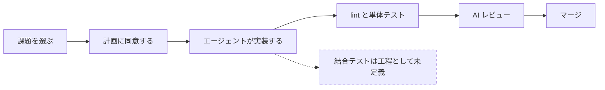
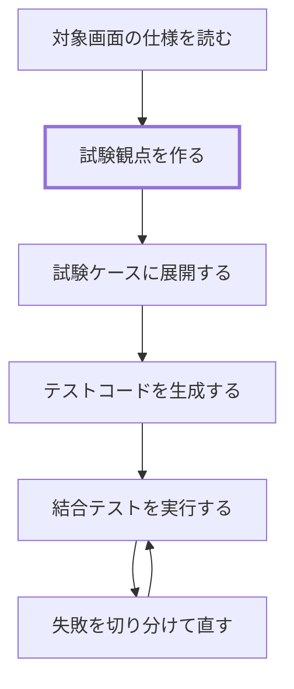

# Playwright 導入の進行状況

Playwright による結合テストを、予約申請画面（`/reservations/new`）を対象とする独立したチュートリアルとして導入する。導入の判断とその理由は [ADR-032](../reference/adr/ADR-032-integration-test-tutorial-adoption.md) に記録している。本ページは進行状況と未決事項、および工程ごとの導入計画を扱う。

:::note[学習者向けの手順はまだない]

学習者が現在従う手順は[標準開発フロー](../develop/dev-workflow.md#flow)と[学習カリキュラム](../learn/curriculum.md#path-map)のままである。チュートリアル本体ができた段階で、学習者向けのページを起こす。

:::

---

## 工程の変化 {#process-change}

現在の必須課題は、課題の選択から実装、AI レビュー、マージまでを次の順で進む。検証にあたる工程は lint とユニットテスト、そして AI レビューの3つで、いずれも画面からの動作そのものは確かめていない。

導入するチュートリアルは、この流れには組み込まない。既にある予約申請画面を題材に、試験観点を作るところからテストを通すところまでを一続きで扱う。

太い枠が、学習者が判断を担う工程である。他の工程は AI に任せ、学習者は出てきたものを仕様に照らして確かめる側に回る。

---

## スケジュール {#schedule}

| 期間 | 内容 |
|---|---|
| 9/9〜9/11 | [技術検証](#plan-verify)（サインイン方式、要素の指定方法、実行可否） |
| 9/14〜9/18 | [チュートリアル本体の作成](#plan-build)。9/18 にマージ |
| 9/24〜9/25 | [先行実施](#plan-pilot)による内容の確認 |
| 9/28〜9/30 | [最終修正](#plan-release) |
| 10/1 | [正式導入](#plan-release) |

工程ごとにやること、成果物、次に進む条件は[導入計画](#plan)に置く。技術検証はチュートリアル本体に影響しないよう、別のブランチで行う。

---

## 未決事項 {#open-questions}

### A. 技術的な前提 {#open-technical}

| # | 決めること | 選択肢 |
|---|---|---|
| 1 | サインインの方式 | 開発専用のロール別ログインを正式な手順とするのか、別の方式を用意するのか |
| 2 | 要素の指定方法 | `data-testid` を実装に入れるのか、役割とラベルで指定するのか |
| 3 | バックエンドへの依存 | 実際の API とデータベースを通すのか、`BACKEND_URL` の位置にスタブサーバーを立てるのか |
| 4 | 試験観点を作る手段 | 独自の SKILL を使うのか、Playwright 公式のテストエージェントを使うのか、両方を併記するのか |

1 は、ローカル環境ではブラウザからのサインインが成立しない（cognito-local が http で動き、認証クライアントのリダイレクトが失敗する）ことによる。2 は、現在の実装に `data-testid` が 1 つも入っていないことによる。3 の選択肢からブラウザ側での差し替えが外れているのは、予約申請画面のデータ取得がサーバー側で行われるためである（[実環境の前提](#environment)を参照）。この4つは机上では決まらないため、[技術検証](#plan-verify)で実際に動かして確かめる。

### B. 品質を担保する仕組み {#open-quality}

| # | 決めること | 選択肢 |
|---|---|---|
| 5 | 完了条件との接続 | 結合テストが通ることを完了条件に加えるのか、加えないのか |
| 6 | 試験観点のレビュー観点 | 生成された試験観点が妥当かを、誰がどの基準で判断するのか |
| 7 | CI での実行 | 独立したチュートリアルの段階では CI に載せるのか、ローカル実行に留めるのか |
| 8 | 既存の選択課題の扱い | [既存機能の E2E テスト追加](../spec/enhancements/beginner/e2e-test-coverage.md)の内容を書き換えて流用するのか、そのまま残すのか |

5 は、方針としては完了条件に加えたい。テストが安定して動く状態を先に作る必要があるため、A の検証結果を見てから判断する。

6 は、成果物を生成する手順を固定するだけでは、生成されたものが正しいかどうかを保証できないことによる。試験観点が仕様を網羅しているか、期待結果が妥当かは、別の仕組みで確かめることになる。暫定版は運営者が用意する（[工程2](#plan-build)）。

B のうち 5 と 7 は A の検証結果を待つ。6 と 8 は A に依存しない。どの工程で判断するかは[導入計画](#plan)に置く。

---

## 導入計画 {#plan}

導入は4つの工程に分ける。各工程は前の工程で決まったことを前提にする。技術的な前提（未決事項 A）を先に確定させる順にしたのは、品質を担保する仕組み（未決事項 B）のうち完了条件との接続と CI での実行が、A の実測結果を判断材料にするためである。

### 工程1 技術検証 {#plan-verify}

未決事項 A の4項目を実測で確定させる。この工程の成果物はテストコードではなく、決定とその根拠である。決まった内容は未決事項の表に反映する。

以下に挙げる見立ての根拠は、いずれもコードを読んで得たものである。実行して確かめたものではないため、覆る可能性がある。

**1 サインインの方式**：現在の `playwright.config.ts` は `webServer.command` が `pnpm dev` なので、テスト実行時の `NODE_ENV` は development になり、開発専用ロール別ログインが発行する cookie の経路が有効になる。確かめることは3つある。サインイン画面のロール別ボタンを Playwright から押して cookie の発行と画面遷移が成立するか、発行された cookie をテスト間で再利用できるか、cookie の有効期限（1時間）がテスト全体の実行時間に耐えるかである。ここで固定される制約も2つある。テスト対象を本番ビルドに切り替えると `NODE_ENV` が production になり、この経路は遮断される。また cognito-local のエンドポイントの既定値は devcontainer のネットワーク内でしか解決しないホスト名であり、CI で動かすなら別の解決方法が要る。

**2 要素の指定方法**：見立ては、役割とラベルによる指定を原則とし、リソース選択が安定しない場合に限って `data-testid` を入れる形である。予約申請フォームのうちリソース選択だけがネイティブの `<select>` ではなく、ラベルからの取得では掴めない（[実環境の前提](#environment)を参照）。確かめることは、選択肢を開いてから選ぶ手順が待ち時間の影響を受けずに安定するかである。安定という言葉だけでは基準にならないので、判断軸を「そのテストはバグで落ちるか、意図した編集で落ちるか」に置く。役割とラベルによる指定は、要素を利用者に見える契約に結びつける。ラベルの文言が変われば落ちるが、それは利用者から見た振る舞いが変わったということなので落ちてよい。一方で DOM の構造を組み替えただけでは落ちない。`data-testid` は逆に、DOM の変更には強い代わりに、利用者に見える契約から切り離された印を追うことになる。全面導入を避けたい理由はもう一つあり、学習者が触る既存実装への差分が増えることである。

**3 バックエンドへの依存**：見立ては、devcontainer の postgres と cognito-local とバックエンドをそのまま起動して実データを通す形である。理由は2つある。devcontainer に一式が揃っており、運営者が用意する機構が最も少ないこと。そして [ADR-032](../reference/adr/ADR-032-integration-test-tutorial-adoption.md) が導入の効果として挙げた「画面から DB までを通した業務フロー」の確認が、スタブサーバーでは成立しないことである。この形を選ぶ場合に確かめることは3つある。バックエンドは手動起動であり Playwright が起動するのはフロントエンドだけなので、起動を手順に書くか設定に足すか。`seed.sql` の投入を手順に含めるか。そして予約申請のテストはデータベースに行を作るため、繰り返し実行しても同じ結果になる状態をどう保つかである。

**4 試験観点を作る手段**：見立ては、リポジトリ独自のスキルを作る形である。ADR-032 は試験観点の中身を運営者が埋めないと決めているため、用意する機構は観点の切り口を促すものに限られる。既存のスキルと同じ呼び出し方に揃えられる点も理由になる。Playwright 公式のテストエージェントは、[Playwright MCP](#mcp) と同じ別軸として後から評価する。スキルを作ると決めた場合は、[Claude Code 設定台帳](../reference/claude-code/agent-config.md)のスキル表に行を追加する作業が同じ変更の中で発生する。

この工程を終える条件は、4項目それぞれに実測の結果と決定が書かれた状態になることである。未決事項 B のうち、完了条件との接続（5）と CI での実行（7）もこの時点で判断する。

### 工程2 チュートリアル本体の作成 {#plan-build}

工程1 の決定を、学習者が使える形にする。ADR-032 が定めた担い手の分離に従い、ここで作るのは学習者が成果物を作れるようにするための機構だけである。

リポジトリに入れるもの：

- 認証の fixture（工程1 で決めた方式を、テスト間で共有できる形にしたもの）
- 実行の前提を揃える手順（postgres と cognito-local とバックエンドの起動、`seed.sql` の投入）
- 要素の指定方法の規約（`data-testid` を入れると決めた箇所は、実装への差分が発生する）
- 試験観点の物差し（後述）
- よくある失敗と切り分け方
- 学習者向けのページ

リポジトリに入れないもの：

- 学習者が書いた試験観点、試験ケース、テストコード（ADR-032 の成果物の扱いに従う）
- 手本として置くテストコード。機構が動くことを確かめる最小の1本は入れるが、これは学習者が写すためのものではない

試験観点の物差しは、観点を作らせるときと、できた観点をレビューするときの両方で使う 1 枚にする。ADR-032 は、手順を固定する仕組みが成果物を生成するだけで正しさを保証しないと述べており、未決事項 6 はその審査側をどう用意するかを問うている。生成用と審査用を別々に作ると、両者がずれたときにどちらが正なのかが決まらない。物差しに書くのは次の2つである。

- **振る舞いの書き方**：実装内部の名前を説明に持ち込まない。体言止めにせず「何をしたら、どうなれば正しいのか」を言い切る。1 項目には 1 つの振る舞いだけを書く。読み手はコードベースを知らない学習者である
- **確認しないと決めた振る舞い**：確認する観点の一覧の後に、意図して外した観点を理由付きで併記させる。理由は語彙を決めておく（取るに足らない、上流のテストで担保済み、手動確認に隔離、など）

除外を併記させるのは、レビューを学習者が担えるようにするためである。観点の一覧に漏れがないかを判断するには仕様の全体を把握している必要があるが、意図して外した理由が妥当かどうかは一つずつ独立に判断できる。[ADR-028](../reference/adr/ADR-028-training-purpose.md) が挙げた「AI が出したものの誤りに気づき、自分で直せる」状態に、この形なら手が届く。

書き方の規範が要るのも同じ理由による。生成された観点が実装内部の言葉で書かれていると、学習者は読み流すしかなくなり、判断役という到達目標そのものが成立しない。

この形は、フューチャー技術ブログの記事「[AI がテストを書く中で、「あるべき仕様」を単体テストで担保するために工夫してみていること](https://future-architect.github.io/articles/20260615a/)」から採っている。同記事が対象にしているのは単体テストで E2E はスコープ外だが、あるべき振る舞いを決めるのは人間であり、生成を任せる範囲との線引きを 1 枚の規範で担保するという考え方は、ADR-032 の担い手の分離と同じ構造である。層ごとのテストの厚みの出し分けは、同記事が presentation と I/O を薄い側に置いているのに対して本チュートリアルはその層そのものを扱うため、流用していない。

この工程で決める派生の項目が2つある。学習者向けのページをどのディレクトリに置くか（一度通すものなので学習者が最初に読む側が自然だが、[選択課題カタログ](../develop/enhancement-catalog.md)との関係で決める）。そして既存の `frontend/tests/e2e/example.spec.ts` の扱い（直すか、機構の疎通確認に置き換えるか）である。

この工程を終える条件は、上の機構が揃い、疎通確認のテストが `pnpm test:e2e` で通ることである。試験観点のレビュー観点（未決事項 6）の暫定版もこの工程で作る。

### 工程3 先行実施 {#plan-pilot}

運営者以外が手順どおりに通せるかを確かめる。見るのは、手順の抜け、環境差による失敗、そして所要時間である。ADR-032 は所要時間を本体ができた段階で見積もるとしているため、ここで実測する。

この工程を終える条件は、先行実施者が手順だけで完走できることである。詰まった箇所が手順の修正では解消できないと判断した場合は、工程2 に戻る。

### 工程4 最終修正と正式導入 {#plan-release}

先行実施で出た指摘を反映し、学習者への導線をつなぐ。やることは4つある。

- 手順とページの修正
- [学習カリキュラム](../learn/curriculum.md#path-map)と[運用ガイド](./operations-guide.md)への導線追加
- 既存の選択課題の扱い（未決事項 8）の判断
- 未決事項 B の判断を [ADR-032](../reference/adr/ADR-032-integration-test-tutorial-adoption.md) に追記

正式導入の条件は、学習者が参照するページから手順まで辿れて、未決事項の8項目すべてに決定が書かれた状態になることである。

---

## 導入に伴うコスト {#cost}

独立したチュートリアルとしたことで、必須課題の学習時間と完了条件には手を入れずに済む。それでも次の負担は残る。

**テストの保守**：画面の構造が変わると、教材として置く試験ケースとテストコードは壊れる。対象画面（予約申請画面）に手を入れる課題が実施されると、教材側の追従が必要になる。

**実行の不安定さ**：ブラウザを介するテストは、待ち時間の扱いによって同じコードでも成否が変わることがある。失敗したときに実装の問題なのかテストの問題なのかを切り分ける手間が、学習者と運営者の双方に生じる。

**CI の実行時間**：未決事項の 7 で CI に載せる判断をした場合に発生する。`ci-frontend.yml` は、報告されない check がブランチ保護と AI レビューの前提を満たせなくなる事情から、ジョブ自体をスキップしない設計になっている。結合テストをこの check に載せると、frontend に触れない PR も含めてすべての PR がブラウザテストの完了を待つ。載せるために要る作業も小さくない。postgres と cognito-local をサービスコンテナとして立て、バックエンドを起動し、ブラウザの実体を入れ、`seed.sql` を投入する必要がある。`playwright.config.ts` は CI での再試行を2回、並列度を1に設定しているため、失敗したときの所要時間はテスト本数に比例して伸びる。既存の check に載せず、独立したワークフローとして手動または夜間に回す形なら、この待ち時間は他の PR に波及しない。

後の2つは、ブラウザと実データを通すことに由来する構造的な差であり、運用の工夫で消えるものではない。結合テストは、ADR-032 が寿命の長さの根拠とした実装の内部に依存しない書き方と引き換えに、フィードバックの速さを手放している。

---

## 別軸としての Playwright MCP {#mcp}

ここまではテストコードとしての Playwright を扱った。これとは別に、Claude Code 自身にブラウザを操作させる使い方がある。エージェントが実装後に画面を開いて動作を確かめ、その結果を報告する形になる。

本研修の学習範囲は Claude Code と AI 駆動開発なので、この使い方も範囲に含まれる。ただし現時点では評価していない。テストコードとしての運用が定まってから、別途検討する。

---

## 実環境の前提 {#environment}

着手する際に前提となる、現在のリポジトリの状態を挙げる。

**テスト基盤**

- フロントエンドには `@playwright/test` と `playwright.config.ts` が既にあり、pnpm で管理している。新たに導入する作業は要らない
- `pnpm test` はユニットテスト（Vitest）を実行する。Playwright は `pnpm test:e2e` である
- `playwright.config.ts` の `webServer.command` は `pnpm dev` である。テスト実行時の `NODE_ENV` が development になることが、開発専用ロール別ログインを使える前提になっている
- `ci-frontend.yml` に Playwright を実行するステップはない
- 既存の `frontend/tests/e2e/example.spec.ts` は、コードを読む限り現在の実装では通らない。トップページを開くと未認証ならサインイン画面へ戻され、そこの「BookFlow」は見出し要素ではない。認証済みでもヘッダーのロゴはリンクであり、見出しは「ダッシュボード」である。このテストが期待する「BookFlow」という名前の見出しは、どちらの状態にも存在しない

**認証**

- ローカル環境ではブラウザからのサインインが成立しない（cognito-local が http で動き、認証クライアントのリダイレクトが失敗する）
- 開発専用ロール別ログインが呼ぶ cognito-local のエンドポイントは、既定値が devcontainer のネットワーク内でしか解決しないホスト名である
- 認証ガードのレイアウトは利用者情報の API（`/api/users/me`）を呼ぶ。バックエンドが起動していないと、cookie があっても全画面がサインイン画面へ戻る

**予約申請画面**

- リソース一覧の取得はサーバー側から行われる。ブラウザを経由しないため、Playwright のルーティング機能では差し替えられない
- リソース選択はネイティブの `<select>` ではない。ラベルからの取得では掴めず、選択肢を開いてから選ぶ手順になる
- 実装に `data-testid` は 1 つも入っていない
- 必須項目のラベルは末尾に半角スペースと `*` が付く。ラベルからの取得を完全一致で書くと外れる

**テストデータ**

- `seed.sql` は Flyway の対象外で手動投入する。予約は2件で、同一リソースの重複時間帯のデータは含まない

:::note[この節の確認状況]

上に挙げた内容は、いずれもコードを読んで確かめたものである。Playwright を実行して確かめたものではない。実行による確認は[技術検証](#plan-verify)で行う。

:::

---

## 次の作業 {#next-steps}

- [技術検証](#plan-verify)の4項目を実測し、決定を未決事項の表に反映する
- 既存の `example.spec.ts` が通らないことを実行で確かめ、扱いを決める
- 決定を踏まえて[チュートリアル本体](#plan-build)を作り、学習者向けのページを起こす
- 学習者向けのページができたら、運用ガイドの関連ドキュメント一覧に導線を追加する
- 未決事項 B の判断が定まった時点で、[ADR-032](../reference/adr/ADR-032-integration-test-tutorial-adoption.md) に追記する
- 本ページの図は Mermaid で描いている。内容が定まった段階で、他のフロー図と同じく draw.io に置き換える
- 用語集に結合テストの項目を追加するかを検討する
