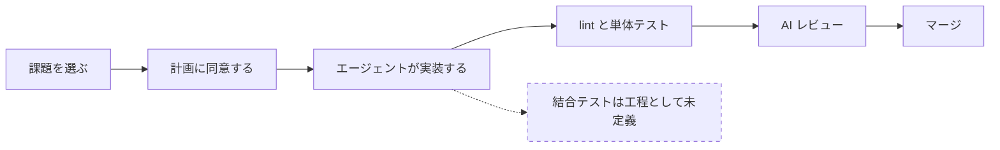
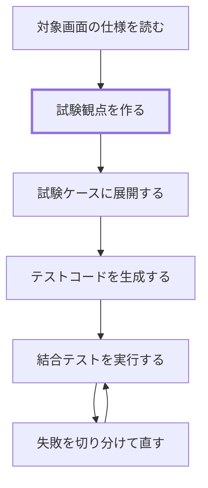

# Playwright 導入の進行状況

Playwright による結合テストを、予約申請画面（`/reservations/new`）を対象とする独立したチュートリアルとして導入する。導入の判断とその理由は [ADR-032](../reference/adr/ADR-032-integration-test-tutorial-adoption.md) に記録している。本ページは進行状況と未決事項を扱う。

:::note[学習者向けの手順はまだない]

学習者が現在従う手順は[標準開発フロー](../develop/dev-workflow.md#flow)と[学習カリキュラム](../learn/curriculum.md#path-map)のままである。チュートリアル本体ができた段階で、学習者向けのページを起こす。

:::

---

## 工程の変化 {#process-change}

現在の必須課題は、課題の選択から実装、AI レビュー、マージまでを次の順で進む。検証にあたる工程は lint とユニットテスト、そして AI レビューの3つで、いずれも画面からの動作そのものは確かめていない。

導入するチュートリアルは、この流れには組み込まない。既にある予約申請画面を題材に、試験観点を作るところからテストを通すところまでを一続きで扱う。

太い枠が、学習者が判断を担う工程である。他の工程は AI に任せ、学習者は出てきたものを仕様に照らして確かめる側に回る。

---

## スケジュール {#schedule}

| 期間 | 内容 |
|---|---|
| 9/9〜9/11 | 技術検証（サインイン方式、要素の指定方法、実行可否） |
| 9/14〜9/18 | チュートリアル本体の作成。9/18 にマージ |
| 9/24〜9/25 | 先行実施による内容の確認 |
| 9/28〜9/30 | 最終修正 |
| 10/1 | 正式導入 |

技術検証はチュートリアル本体に影響しないよう、別のブランチで行う。

---

## 未決事項 {#open-questions}

### A. 技術的な前提 {#open-technical}

| # | 決めること | 選択肢 |
|---|---|---|
| 1 | サインインの方式 | 開発専用のロール別ログインを正式な手順とするのか、別の方式を用意するのか |
| 2 | 要素の指定方法 | `data-testid` を実装に入れるのか、役割とラベルで指定するのか |
| 3 | バックエンドへの依存 | 実際の API とデータベースを通すのか、通信経路をモックするのか |
| 4 | 試験観点を作る手段 | 独自の SKILL を使うのか、Playwright 公式のテストエージェントを使うのか、両方を併記するのか |

1 は、ローカル環境ではブラウザからのサインインが成立しない（cognito-local が http で動き、認証クライアントのリダイレクトが失敗する）ことによる。2 は、現在の実装に `data-testid` が 1 つも入っていないことによる。この4つは机上では決まらないため、実際に動かして確かめる。

### B. 品質を担保する仕組み {#open-quality}

| # | 決めること | 選択肢 |
|---|---|---|
| 5 | 完了条件との接続 | 結合テストが通ることを完了条件に加えるのか、加えないのか |
| 6 | 試験観点のレビュー観点 | 生成された試験観点が妥当かを、誰がどの基準で判断するのか |
| 7 | CI での実行 | 独立したチュートリアルの段階では CI に載せるのか、ローカル実行に留めるのか |
| 8 | 既存の選択課題の扱い | [既存機能の E2E テスト追加](../spec/enhancements/beginner/e2e-test-coverage.md)の内容を書き換えて流用するのか、そのまま残すのか |

5 は、方針としては完了条件に加えたい。テストが安定して動く状態を先に作る必要があるため、A の検証結果を見てから判断する。

6 は、成果物を生成する手順を固定するだけでは、生成されたものが正しいかどうかを保証できないことによる。試験観点が仕様を網羅しているか、期待結果が妥当かは、別の仕組みで確かめることになる。暫定版は運営者が用意する。

---

## 導入に伴うコスト {#cost}

独立したチュートリアルとしたことで、必須課題の学習時間と完了条件には手を入れずに済む。それでも次の負担は残る。

**テストの保守**：画面の構造が変わると、教材として置く試験ケースとテストコードは壊れる。対象画面（予約申請画面）に手を入れる課題が実施されると、教材側の追従が必要になる。

**実行の不安定さ**：ブラウザを介するテストは、待ち時間の扱いによって同じコードでも成否が変わることがある。失敗したときに実装の問題なのかテストの問題なのかを切り分ける手間が、学習者と運営者の双方に生じる。

**CI の実行時間**：未決事項の 7 で CI に載せる判断をした場合に発生する。`ci-frontend.yml` は、報告されない check がブランチ保護と AI レビューの前提を満たせなくなる事情から、ジョブ自体をスキップしない設計になっている。結合テストをこの check に載せると、frontend に触れない PR も含めてすべての PR がブラウザテストの完了を待つ。

---

## 別軸としての Playwright MCP {#mcp}

ここまではテストコードとしての Playwright を扱った。これとは別に、Claude Code 自身にブラウザを操作させる使い方がある。エージェントが実装後に画面を開いて動作を確かめ、その結果を報告する形になる。

本研修の学習範囲は Claude Code と AI 駆動開発なので、この使い方も範囲に含まれる。ただし現時点では評価していない。テストコードとしての運用が定まってから、別途検討する。

---

## 実環境の前提 {#environment}

着手する際に前提となる、現在のリポジトリの状態を挙げる。

- フロントエンドには `@playwright/test` と `playwright.config.ts` が既にあり、pnpm で管理している。新たに導入する作業は要らない
- `pnpm test` はユニットテスト（Vitest）を実行する。Playwright は `pnpm test:e2e` である
- `ci-frontend.yml` に Playwright を実行するステップはない
- 実装に `data-testid` は 1 つも入っていない（未決事項の A を参照）
- ローカル環境ではブラウザからのサインインが成立しない（未決事項の A を参照）

---

## 次の作業 {#next-steps}

- 未決事項 A を実際に動かして確かめる
- 検証結果を踏まえてチュートリアル本体を作り、学習者向けのページを起こす
- 学習者向けのページができたら、運用ガイドの関連ドキュメント一覧に導線を追加する
- 未決事項 B の判断が定まった時点で、[ADR-032](../reference/adr/ADR-032-integration-test-tutorial-adoption.md) に追記する
- 本ページの図は Mermaid で描いている。内容が定まった段階で、他のフロー図と同じく draw.io に置き換える
- 用語集に結合テストの項目を追加するかを検討する
