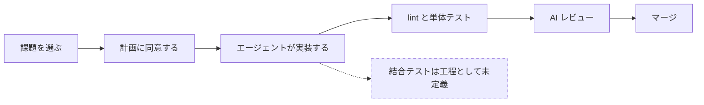
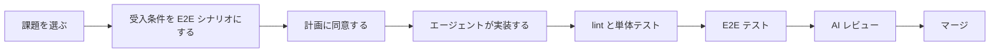

# Playwright 導入検討

:::note[検討段階の文書]

このページは導入を検討している内容の記録であり、確定した運用ではありません。学習者が現在従う手順は[標準開発フロー](../develop/dev-workflow.md#flow)と[学習カリキュラム](../learn/curriculum.md#path-map)のままです。

:::

---

## エージェントが実装を担うとき、品質は誰が担保するのか {#quality-ownership}

AI エージェントを前提とした開発では、実装そのものをエージェントに渡す度合いが上がっている。この読み取りは運営者によるもので、出典となる社内文書はない（[ADR-028](../reference/adr/ADR-028-training-purpose.md) と同じ扱いとする）。

読み取りの当否を措いても、BookFlow の標準フローは既にその状態にある。ADR-028 は次のように書いている。

> 標準フローでは、計画立案から仕様更新、実装、テスト、PR 作成までを AI-DLC エンジンと各スキルが代行する。学習者に強制される行為は Issue の選択、計画への同意、理解度チェックへの回答、マージの4つに限られる。

実装をエージェントに渡した以上、品質を担保する仕組みは実装の外側に置くことになる。現在このリポジトリが持っている手段を並べると、次のようになる。

| 対象 | 担保している仕組み |
|---|---|
| コードの書き方と整形 | oxlint / oxfmt、Spotless / Checkstyle |
| 関数とクラスの振る舞い | Vitest（フロントエンド）、JUnit（バックエンド） |
| 差分の妥当性 | AI レビュー（[総合判定が完了になることが課題の完了条件](../develop/review-criteria.md#ai-review)） |
| 画面から DB までを通した業務フローの成立 | 工程として定義されていない |

最後の行が空いている。ここでいう業務フローとは、サインインしてリソースを閲覧し、予約を申請し、承認者が承認するという一連の操作が、フロントエンド、BFF、バックエンド、データベースをまたいで成立することを指す。学習者が個人的にブラウザで確認している可能性はあるが、その確認は記録されず、次の変更のときに再実行されない。

工程としての結合テストは、従来は人が手順を用意して画面を操作する形で担ってきた。エージェントが実装を担って変更の頻度が上がると、この工程を人手で回す前提が持たなくなる。**結合テストのうち機械的に再実行できる部分を自動化すること**が、品質を落とさずに変更の速度を上げる条件になる。Playwright はその手段の候補である。

---

## Playwright と現在の状態 {#current-state}

Playwright はブラウザを実際に起動して操作するテストツールである。テストコードから画面を開き、要素をクリックし、表示された内容を検証する。フロントエンドの内部実装ではなく、利用者が触る面から動作を確かめる点が、Vitest によるユニットテストとの違いになる。

テスト層ごとの担当は[コーディング規約](../develop/coding-conventions.md)のテスト戦略に定義済みで、Playwright は「統合 / E2E」の担当として記載されている。ツール選定の判断は [ADR-009](../reference/adr/ADR-009-frontend-test-strategy.md) にある。

このリポジトリでの現状は次のとおり。

| 項目 | 状態 |
|---|---|
| 依存パッケージ | `@playwright/test` が `frontend/package.json` に導入済み |
| 設定 | `frontend/playwright.config.ts` が存在し、chromium 1 プロジェクトで動く |
| テスト | `frontend/tests/e2e/example.spec.ts` の 1 件のみ（トップページの見出し表示） |
| 実行コマンド | `pnpm test:e2e` |
| CI | `ci-frontend.yml` に実行ステップがなく、自動実行されていない |

Playwright を導入するかどうかではなく、既にあるものをどう使うかが検討の対象になる。なお、Playwright 自体の習熟は本研修の到達目標ではない。ADR-028 は個別技術の習熟を到達目標に置かないと定めており、Playwright もその扱いに従う。

---

## 結合テストのうち何を任せられるか {#what-to-delegate}

テストコードを書く作業は、AI エージェントによって難しい作業ではなくなった。そのため、学習者にテストコードの書き方を習得させることは主題にならない。

主題になるのは、**何を検証対象として定義するか**の側である。どの業務フローが壊れたら困るのか、正常系として何が成立していれば合格なのかを決めるのは、エージェントではなく人である。この判断は、AI に任せる範囲と自分で判断する範囲の線引きという、ADR-028 が掲げた到達目標そのものにあたる。

任せられる範囲と、人が担い続ける範囲は次のように分かれる。

**Playwright に任せられるもの**

- 一度定義した業務フローを、変更のたびに機械的に再実行する
- 以前は通っていた操作が通らなくなったことを検出する
- 実行結果を記録として残し、誰が実行しても同じ判定を得る

**人が担い続けるもの**

- どの業務フローを検証対象に選ぶか
- 初めて作る機能を探索的に確かめる作業
- 画面の見た目が意図どおりかという判断
- 性能とセキュリティの確認
- 業務として受け入れてよいかの最終判断

ユニットテストとの寿命の違いも、この分担を後押しする。ユニットテストは実装の構造に依存するため、エージェントが内部を書き換えれば書き直しが要る。結合テストは操作と結果という利用者から見える言葉で書かれるため、下の実装が入れ替わっても定義がそのまま残る。

---

## チュートリアルのどこに組み込まれるか {#where}

現在の必須課題は、課題の選択から実装、AI レビュー、マージまでを次の順で進む。検証にあたる工程は lint とユニットテスト、そして AI レビューの 3 つで、いずれも動作そのものは確かめていない。

E2E を組み込む場合、テストの追加を実装の後ろに置くのではなく、実装より前に置く形を検討している。課題ごとのビジネス要求シートには受入条件が書かれているため、これを実行できる形に翻訳したものが E2E シナリオになる。エージェントの成果物は、そのシナリオが通るかどうかで判定される。

この形は、実装より先に仕様を更新するという既存の Spec-first 運用に、実行可能性を与えるものになる。仕様が真実の源だと定めながら、その仕様が実行されていない状態が現在は残っている。

なお、E2E テストを追加する課題は選択課題カタログの初級に[既存機能の E2E テスト追加](../spec/enhancements/beginner/e2e-test-coverage.md)として存在する。任意の 1 課題として扱うのか、必須ステップの手順に組み込むのかは、次節以降の判断による。

---

## 導入に伴うコスト {#cost}

導入すると次の負担が発生する。運営者が可否を判断するための材料として並べる。

**学習時間の配分**：必須課題の合計は 17〜24 時間と定義されている。E2E をどの STEP にも組み込む場合、この枠のどこを削るか、枠そのものを広げるかという判断が要る。

**CI の実行時間**：`ci-frontend.yml` は、報告されない check がブランチ保護と AI レビューの前提を満たせなくなる事情から、ジョブ自体をスキップしない設計になっている。E2E をこの check に載せると、frontend に触れない PR も含めてすべての PR がブラウザテストの完了を待つ。

**テストの保守**：画面の構造が変わると、E2E シナリオは壊れる。機能を変更する課題と E2E を整備する作業の順序を誤ると、書いたシナリオを何度も直すことになる。

**実行の不安定さ**：ブラウザを介するテストは、待ち時間の扱いによって同じコードでも成否が変わることがある。失敗したときに実装の問題なのかテストの問題なのかを切り分ける手間が、学習者と運営者の双方に生じる。

---

## 未決事項と決める順序 {#open-questions}

決めていないことを、決める順に並べる。上の判断が下の選択肢を制約するため、この順序で扱う。

| 順 | 決めること | 選択肢 |
|---|---|---|
| 1 | E2E の主目的 | 学習者が書く教材とするか、ベースシステムの回帰検出とするか、学習者の PR の完了条件とするか |
| 2 | カリキュラム上の扱い | 選択課題の 1 つに留めるか、必須ステップの手順に組み込むか |
| 3 | CI での実行 | 既存の frontend check に載せるか、別ワークフローに分けるか、定時実行とするか |
| 4 | バックエンド依存 | 実際の API とデータベースを CI で起動するか、通信経路をモックするか |
| 5 | サインインの方式 | 開発用のロール別ログインと認証状態の再利用を正式な手順とするか |

5 について補足する。ローカル環境ではブラウザからのサインインが成立しない。cognito-local が http で動くため、認証クライアントのリダイレクトが失敗するからである。現在の動作確認は開発専用のロール別ログインを使っており、E2E でも同じ経路を使うかどうかを決める必要がある。

---

## 別軸としての Playwright MCP {#mcp}

ここまではテストコードとしての Playwright を扱った。これとは別に、Claude Code 自身にブラウザを操作させる使い方がある。エージェントが実装後に画面を開いて動作を確かめ、その結果を報告する形になる。

本研修の学習範囲は Claude Code と AI 駆動開発なので、この使い方も範囲に含まれる。ただし本ページでは評価していない。テストコードとしての運用が定まってから、別途検討する。

---

## 次の作業 {#next-steps}

- 未決事項の 1 から順に判断する
- 判断が定まった時点で、決定内容を ADR として記録する（[ADR-009](../reference/adr/ADR-009-frontend-test-strategy.md) への追記か、新規 ADR かを含めて決める）
- 学習者向けの手順が確定したら、開発ガイド側にページを起こす
- 本ページの図は Mermaid で描いている。内容が定まった段階で、他のフロー図と同じく draw.io に置き換える
- 用語集に E2E テストと結合テストの項目を追加するかを検討する
