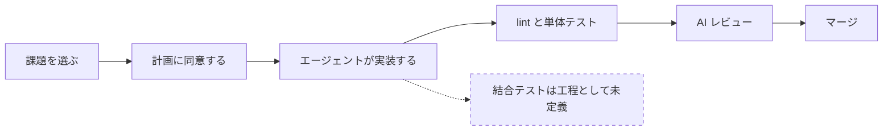
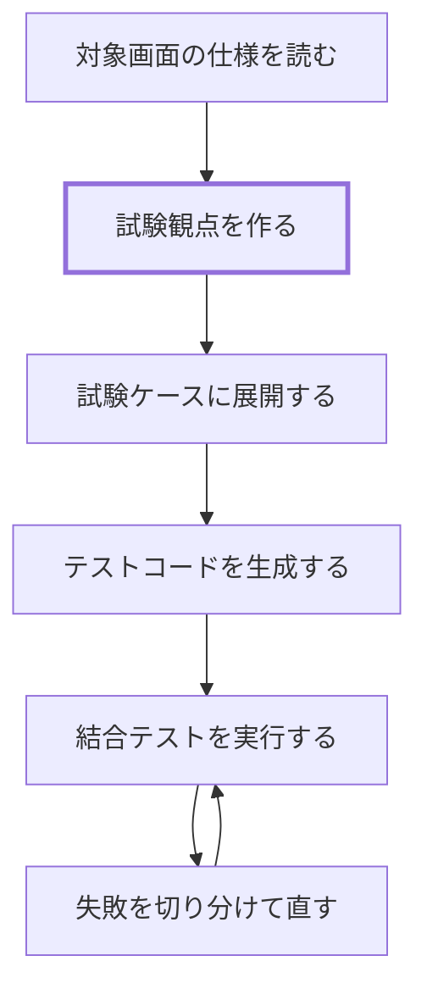

# Playwright 導入の進行状況

Playwright による結合テストを、予約申請画面（`/reservations/new`）を対象とする独立したチュートリアルとして導入する。導入の判断とその理由は [ADR-032](../reference/adr/ADR-032-integration-test-tutorial-adoption.md) に記録している。本ページは進行状況と未決事項、および工程ごとの導入計画を扱う。決まったことと決まっていないことの現況は、[次の節](#status)にまとめた。

:::note[学習者向けのページ]

学習者向けのページは[結合テストのワークフロー](../develop/integration-test/workflow.md)から辿れる。ただし学習カリキュラムからの導線はまだつないでいない。

:::

---

## 決まったことと決まっていないこと {#status}

2026-10-03 時点の現況である。ここより下の節（工程の変化、スケジュール、未決事項、導入計画）は検討の経緯として残しており、スケジュールは現在のものではない。現況と経緯が食い違う場合は、この節を正とする。

学習者が従う全体の流れは[結合テストのワークフロー](../develop/integration-test/workflow.md)にまとめた。

### 決まったこと {#status-decided}

| 決めた日 | 決めたこと | 記録している場所 |
|---|---|---|
| 2026-09-14 | 結合テストが通ることを必須課題の完了条件には加えない。先行実施の結果を見て再検討する | [未決事項 B](#open-quality) |
| 2026-09-14 | CI に載せるのは、運営者が用意する疎通確認テストだけにする | [未決事項 B](#open-quality) |
| 2026-09-17 | サインインは開発専用のロール別ログインを使う | [工程1](#plan-verify) |
| 2026-09-17 | 要素は役割とラベルで指定し、`data-testid` は入れない | [工程1](#plan-verify) |
| 2026-09-21 | 実際のバックエンドとデータベースを通し、予約の時間帯の割り当てと後片付けは機構が引き受ける | [工程1](#plan-verify) |
| 2026-09-23 | 主題は「Playwright を使った E2E テストを AI と協働して作る」とする。不具合を仕込んで見つけさせる演習はしない | 本節 |
| 2026-09-23 | Playwright 公式のテストエージェント（planner、generator、healer）は採用しない。planner は動いている画面から期待結果を作り、healer は期待値を実装に合わせて書き換えうるため | 本節 |
| 2026-09-23 | 試験観点は、全画面で共通に使えるスキル（`generate-test-perspectives`、新規作成のみ）で出力する。予約申請画面専用の旧スキルは削除した | [未決事項 4](#plan-verify)、[Claude Code 設定台帳](../reference/claude-code/agent-config.md) |
| 2026-09-23 | 成果物は作業ブランチにコミットしてよいが、main には決してマージしない | [ADR-032 の追記](../reference/adr/ADR-032-integration-test-tutorial-adoption.md#addendum-2026-09-23) |
| 2026-09-23 | 仕様確認事項の回答で保留した観点は、学習者が観点一覧へ手で移す。スキルを呼び直して反映はしない。2026-09-30 に変更した：学習者がダッシュボードで回答を選び、案内スキルが観点一覧へ移す | [試験観点を作る](../develop/integration-test/viewpoints.md#step4-1) |
| 2026-09-23 | 仕様理解メモは作らない。仕様書そのものが根拠のため | [試験観点を作る](../develop/integration-test/viewpoints.md#step1) |
| 2026-09-23 | 観点、試験ケース（計画）、テストコード、実行結果の4つを、それぞれ人がレビューする | [結合テストのワークフロー](../develop/integration-test/workflow.md) |
| 2026-09-26 | スキルの根拠は仕様書だけとする。実装コード、図のファイル、既存の画面の課題シートは読まない | スキル本体 |
| 2026-09-26 | スキルは Opus で実行する（学習者のセッションは Sonnet のまま）。2026-09-27 に確かめたところ、`model: opus` が効くのは利用者がスラッシュコマンドで直接呼んだスキルだけで、別のスキルの中から呼ばれた場合やスラッシュなしの依頼では切り替わらなかった。そのため入口の `/e2e-workflow` にも `model: opus` を付け、スラッシュ付きで呼ぶよう案内する | [Claude Code 設定台帳](../reference/claude-code/agent-config.md) |
| 2026-09-26 | 観点一覧に自動化の可否の列は設けない | スキル本体 |
| 2026-09-27 | 仕様どうしの食い違いは、AI が迷ったら挙げ、本当に食い違っているかは学習者が確認する | [試験観点を作る](../develop/integration-test/viewpoints.md#step3-2) |
| 2026-09-27 | 答え合わせ用の標準観点セットは使わない（削除した） | [未決事項 B](#open-quality) |
| 2026-09-27 | ワークフローの図は、学習者、AI、成果物の3つのレーンを持つスイムレーン（シーケンス図）で表し、拡大と全画面表示ができるようにする | [結合テストのワークフロー](../develop/integration-test/workflow.md#overview) |
| 2026-09-27 | ワークフローは、AI-DLC を簡略化した仕組み（画面ごとの状態ファイル、案内スキル `e2e-workflow`、ローカルのダッシュボード）で進める。確定と差し戻しはダッシュボードの操作だけで書く。観点一覧の保存先は `Docs/test/<画面>/perspectives.md` とする | [ADR-033](../reference/adr/ADR-033-e2e-workflow-mechanism.md) |
| 2026-09-27 | 試験観点を差し戻したら、AI が差し戻しの理由をもとに観点一覧を直す。一から作り直さず、既存の ID は振り直さない | [ADR-033](../reference/adr/ADR-033-e2e-workflow-mechanism.md) |
| 2026-09-30 | 学習者は、すべての観点の根拠を仕様書で確かめる。抜き取りにはしない。誤りがどの行に出るかが実行のたびに変わるため | [試験観点を作る](../develop/integration-test/viewpoints.md#step3-1) |
| 2026-09-30 | 観点一覧に優先度の列を設けない。載せた観点はすべてテストするため | スキル本体 |
| 2026-09-30 | 網羅の点検表（付録）は使わない（削除した） | [試験観点を作る](../develop/integration-test/viewpoints.md) |
| 2026-09-30 | 観点一覧の6章「レビュー記録」をやめる。指摘は差し戻しの理由に書き、問題のない行に印を付ける記録は作らない | [ADR-033](../reference/adr/ADR-033-e2e-workflow-mechanism.md) |
| 2026-09-30 | 仕様確認事項のうち回答が要るのは仕様の食い違いだけにする。仕様に書かれていない点は一覧に並べるだけで、観点にもせずテストもしない。仕様書を変えないチュートリアルでは、仮の回答に正解がないため。学習者が必要と考えた点は、期待結果を添えて差し戻す | [試験観点を作る](../develop/integration-test/viewpoints.md#step3-4) |
| 2026-09-30 | 仕様の食い違いへの回答はダッシュボードで選ぶ。記録の日時は日本時間で表示する | [ADR-033](../reference/adr/ADR-033-e2e-workflow-mechanism.md) |

### 提案中で確認待ちのこと {#status-proposed}

運営者の作業の中で案として書き、まだ判断していないもの。判断が済んだら「決まったこと」へ移す。

| 案 | 書いた場所 |
|---|---|
| AI と学習者の役割分担と、学習者のレビュー手順（すべての観点の根拠の確認、食い違いの確認、除外への賛否、壊れたら困ることとの照合） | [AI と学習者の役割分担](../develop/integration-test/viewpoints.md#roles) |
| 段階ごとに関門を置き、関門を通すのは学習者だけとする。AI は自分の出力を確定にしない（段階の数は、下の段階の統合の提案で4つから3つになる） | [関門の決まり](../develop/integration-test/workflow.md#gates) |
| 試験ケースの一覧が、従来のテスト仕様書に当たるという整理 | [段階ごとの役割分担](../develop/integration-test/workflow.md#stages) |
| 試験ケースの段階の進め方。新規作成のスキル（`generate-test-cases`）で `Docs/test/<画面>/cases.md` に展開し、学習者がすべてのケースを観点と突き合わせる。日時は割り当て枠からの相対、テストデータは条件だけで書く。展開のために選んだ値と試験ケースにできなかった観点は書き出して学習者が判断し、観点との対応に漏れがあれば確定できない。差し戻したら AI が直す | [ADR-033 の追記](../reference/adr/ADR-033-e2e-workflow-mechanism.md#addendum-2026-10-02)、[試験ケースに展開する](../develop/integration-test/cases.md) |
| テストコードの段階の進め方。新規作成のスキル（`generate-test-code`）が `frontend/tests/e2e/workflow/<画面>.spec.ts` と説明 `Docs/test/<画面>/code.md` を出力する。実装は要素の指定とデータの用意にだけ使い、期待結果は試験ケースからだけ取る。生成したテストは普段の `pnpm test:e2e` に含めない。ケースとの対応に漏れや重複があれば確定できない。前提の予約の利用目的は、テスト自身の利用目的と前方一致しないよう `existingPurposeFor` で作る。前提データを API で用意する補助関数（`helpers/setup-data.ts`）は運営者の機構として main に入れる | [ADR-033 の追記](../reference/adr/ADR-033-e2e-workflow-mechanism.md#addendum-2026-10-03)、[Playwright コードを生成する](../develop/integration-test/code-generation.md) |
| 学習者はテストコードを読まない。テストの確かめ方が期待結果に足りているかは、実行の証拠（見る場所で撮った画面と、テストが実際に使った値）を期待結果と並べて見て判断する。試験ケースの「確かめ方」の列は「見る場所」に改め、画面の名前と部分の名前だけを書く。操作の記録（トレース）と動画は、学習者が見て判断できないので残さない。証拠は `scripts/e2e-workflow/run.mjs` が Playwright の実行結果から機械的に集め、テストコードが実行のあとで変わったら確定できない。利用目的に実行ごとの ID を入れる | [テストを実行する](../develop/integration-test/execution.md#evidence)、[Playwright コードを生成する](../develop/integration-test/code-generation.md) |
| 結合テストのワークフローで生成したテストは、開発用とは別の専用のデータベース（`bookflow_e2e`）で動かし、テストごとに初期データだけの状態に戻す。普段の `pnpm test:e2e` は、これまでどおり時間帯の割り当てと後片付けで動かす | [Playwright の解説](../develop/playwright-guide.md#run)、[工程1の決定3](#plan-verify) |
| テストコードの段階と実行の段階を、1つの段階（テストコードと実行）にまとめる。AI がテストコードを作ったあと、環境を整えて流し（`env.mjs`、`run.mjs`）、フェイルしたケースに見立て（`triage.md`）を書いてから学習者に渡す。テストの誤りに見えても AI は直さず、学習者が証拠を見て差し戻したときに直して流し直す。学習者が実装の不具合だと判断したケースは、確定するときに指摘の欄に書いて残す | [ADR-033 の追記](../reference/adr/ADR-033-e2e-workflow-mechanism.md#addendum-2026-10-03-run)、[テストを実行する](../develop/integration-test/execution.md) |
| 結合テストの成果物（`Docs/test/`、`tests/e2e/workflow/`）を main に入れない決まりは、すべての結合テストのスキルに書く。CI では止めない | [結合テストのワークフロー](../develop/integration-test/workflow.md) |

### 決まっていないこと {#status-open}

| 決めること | 状況、判断に必要なもの |
|---|---|
| 観点の行ごとに指摘を付ける機能を作るか。観点一覧を Markdown から構造化データ（JSON など）に変えるか | いまは指摘を差し戻しの理由に文章で書く。この形で先行実施を行い、負担を見てから決める |
| 確定した段階を開き直す操作をダッシュボードに用意するか | 試験ケースのレビューで観点そのものの誤りに気づいた場合や、関門3 で試験ケースの誤りが分かった場合に要る。いまは差し戻しの理由に書くしかない |
| 学習者が実装の不具合だと判断したケースを、Issue にする手順 | いまは関門3 で確定するときに指摘の欄に書いて残すだけである |
| 仕様確認事項の模範回答を運営者が用意するか | チュートリアルでは仕様書を変えないため、学習者は仮の回答を書く |
| スキルの測り直し | 観点一覧の形式が決まってから行う。完了の基準を先に決め、各画面を2回ずつ実行する |
| スキルの description の最適化 | スキルの中身が固まってから行う |
| 既存の選択課題「既存機能の E2E テスト追加」の扱い | [未決事項 8](#open-quality) のまま |
| 実行と切り分けを AI に任せる設計を ADR-032 に反映するか | [テストを実行する](../develop/integration-test/execution.md)は ADR-032 と異なる設計を試している |
| 完了条件への昇格 | 先行実施の結果を見て再検討する |
| 先行実施の日程と所要時間の実測 | 日程は未定。レビュー手順の所要時間もここで確かめる。すべての観点の根拠を確かめるため、予約申請画面では1時間を超える可能性がある |
| Playwright MCP の評価 | [別軸](#mcp)として後日評価する |

---

## 工程の変化 {#process-change}

現在の必須課題は、課題の選択から実装、AI レビュー、マージまでを次の順で進む。検証にあたる工程は lint とユニットテスト、そして AI レビューの3つで、いずれも画面からの動作そのものは確かめていない。

```mermaid
flowchart LR
  A["課題を選ぶ"] --> B["計画に同意する"]
  B --> C["エージェントが実装する"]
  C --> D["lint と単体テスト"]
  D --> E["AI レビュー"]
  E --> F["マージ"]
  G["結合テストは工程として未定義"]
  C -.-> G
  style G stroke-dasharray: 5 5
```

導入するチュートリアルは、この流れには組み込まない。既にある予約申請画面を題材に、試験観点を作るところからテストを通すところまでを一続きで扱う。

```mermaid
flowchart TB
  A["対象画面の仕様を読む"] --> B["試験観点を作る"]
  B --> C["試験ケースに展開する"]
  C --> D["テストコードを生成する"]
  D --> E["結合テストを実行する"]
  E --> F["失敗を切り分けて直す"]
  F --> E
  style B stroke-width: 3px
```

太い枠が、学習者が判断を担う工程である。他の工程は AI に任せ、学習者は出てきたものを仕様に照らして確かめる側に回る。

---

## スケジュール {#schedule}

| 期間 | 内容 |
|---|---|
| 9/9〜9/11 | [技術検証](#plan-verify)（サインイン方式、要素の指定方法、実行可否） |
| 9/14〜9/18 | [チュートリアル本体の作成](#plan-build)。9/18 にマージ |
| 9/24〜9/25 | [先行実施](#plan-pilot)による内容の確認 |
| 9/28〜9/30 | [最終修正](#plan-release) |
| 10/1 | [正式導入](#plan-release) |

工程ごとにやること、成果物、次に進む条件は[導入計画](#plan)に置く。技術検証はチュートリアル本体に影響しないよう、別のブランチで行う。

---

## 未決事項 {#open-questions}

### A. 技術的な前提 {#open-technical}

| # | 決めること | 選択肢 |
|---|---|---|
| 1 | サインインの方式 | 開発専用のロール別ログインを正式な手順とするのか、別の方式を用意するのか |
| 2 | 要素の指定方法 | `data-testid` を実装に入れるのか、役割とラベルで指定するのか |
| 3 | バックエンドへの依存 | 実際の API とデータベースを通すのか、`BACKEND_URL` の位置にスタブサーバーを立てるのか |
| 4 | 試験観点を作る手段 | 独自の SKILL を使うのか、Playwright 公式のテストエージェントを使うのか、両方を併記するのか |

1 は、ローカル環境ではブラウザからのサインインが成立しない（cognito-local が http で動き、認証クライアントのリダイレクトが失敗する）ことによる。2 は、現在の実装に `data-testid` が 1 つも入っていないことによる。3 の選択肢からブラウザ側での差し替えが外れているのは、予約申請画面のデータ取得がサーバー側で行われるためである（[実環境の前提](#environment)を参照）。この4つは机上では決まらないため、[技術検証](#plan-verify)で実際に動かして確かめる。

### B. 品質を担保する仕組み {#open-quality}

| # | 決めること | 選択肢 |
|---|---|---|
| 5 | 完了条件との接続 | 結合テストが通ることを完了条件に加えるのか、加えないのか |
| 6 | 試験観点のレビュー観点 | 生成された試験観点が妥当かを、誰がどの基準で判断するのか |
| 7 | CI での実行 | 独立したチュートリアルの段階では CI に載せるのか、ローカル実行に留めるのか |
| 8 | 既存の選択課題の扱い | [既存機能の E2E テスト追加](../spec/enhancements/beginner/e2e-test-coverage.md)の内容を書き換えて流用するのか、そのまま残すのか |

5 は 2026-09-14 に決定した。**今は完了条件に加えない**。理由は2つある。[ADR-032](../reference/adr/ADR-032-integration-test-tutorial-adoption.md)は学習者が書いたテストをリポジトリに取り込まないと定めており、完了を機械的に検証する手段がないため、加えるなら自己申告かレビュー時の口頭確認という弱い運用にせざるを得ない。また、必須課題への組み込みは学習時間の再配分などコストが高く実現性が低いと ADR-032 自身が一度退けた選択でもある。[先行実施](#plan-pilot)（9/24）の結果を見てから、完了条件への昇格を再検討する。

6 は 2026-09-14 に決定した。成果物を生成する手順を固定するだけでは、生成されたものが正しいかどうかを保証できないことによる。試験観点が仕様を網羅しているか、期待結果が妥当かは、別の仕組みで確かめることになる。暫定版の物差し（振る舞いの書き方と、確認しないと決めた振る舞いの併記）を定め、運営者から提供された標準観点セットをこの物差しに合わせて修正したうえで、[試験観点を作るチュートリアル](../develop/integration-test/viewpoints.md)の付録として同梱した。通信の内部（HTTP ステータスコード）は、利用者に見える振る舞いですでに確認済みであるという理由を付けて「確認しないと決めた観点」に回している。承認ステップの生成有無は、当初この付録で対象範囲外としていたが、2026-09-17 に運営者提供の SKILL（未決事項4で採用）の完了条件を確認した結果、予約申請画面の処理結果として対象に含めるべき項目だと判明したため、確定した試験観点に戻した。2026-09-26 に、観点のたたき台を全画面共通のスキルが出力し、学習者が決まった手順でレビューする形に改めた。レビューの観点は、AI の特性（見落としと挙げすぎ、引用の取り違え、実行ごとのばらつき、業務上の重要度を判断できないこと）から決め、網羅の点検表とあわせて[試験観点を作るチュートリアル](../develop/integration-test/viewpoints.md#roles)に書いた。学習者は観点を一から作らず AI の出力をレビューするため、答え合わせ用の標準観点セットは付録から削除した。2026-09-30 に、網羅の点検表と優先度の案も削除し、根拠の確認を全件にした。

7 は 2026-09-14 に決定した。**独立したチュートリアルの段階でも、運営者が用意する疎通確認テスト（機構が動くことを確かめる最小の1本）を既存の `ci-frontend.yml` に追加する**。学習者が書くテストは前述のとおりリポジトリに残らないため、CI で実行できるのは疎通確認テストに限られる。追加する具体的なワークフローの変更は、[工程2](#plan-build)で疎通確認テストを用意した段階で行う。

B のうち 8 は未判断のまま残る。どの工程で判断するかは[導入計画](#plan)に置く。

---

## 導入計画 {#plan}

導入は4つの工程に分ける。各工程は前の工程で決まったことを前提にする。技術的な前提（未決事項 A）を先に確定させる順にしたのは、品質を担保する仕組み（未決事項 B）のうち完了条件との接続と CI での実行が、A の実測結果を判断材料にするためである。

### 工程1 技術検証 {#plan-verify}

未決事項 A の4項目を実測で確定させる。この工程の成果物はテストコードではなく、決定とその根拠である。決まった内容は未決事項の表に反映する。

以下の4項目は、いずれも実際に devcontainer 上でバックエンドとフロントエンドを起動し、Playwright を実行して確かめた結果である。

**1 サインインの方式**：2026-09-17 に確定した。開発専用ロール別ログインを正式な手順として採用する。専用の検証設定で、環境の切り分け、セッションの保存、保存したセッションの再利用の3工程（計7件）を実行し、サインイン画面のロール別ボタンを押した際の cookie 発行と画面遷移、保存した storageState の再利用、cookie の有効期限（1時間、テスト全体の実行時間に十分耐える）をすべて確認した（検証設定は、この決定のあとに削除した）。テスト対象を本番ビルドに切り替えると `NODE_ENV` が production になりこの経路が遮断される制約と、cognito-local のエンドポイントが devcontainer のネットワーク内でしか解決しない制約は、確認前の見立てのとおり残る。

**2 要素の指定方法**：2026-09-17 に確定した。役割とラベルによる指定を全面的に採用し、`data-testid` は入れない。予約申請フォームのリソース選択（shadcn/ui の Select であり、ネイティブの `<select>` ではない。[実環境の前提](#environment)を参照）を含め、`getByRole` と `getByLabel` による指定で疎通確認テストが連続実行でも安定して通ることを確認した。判断軸は「そのテストはバグで落ちるか、意図した変更で落ちるか」に置いた。役割とラベルによる指定は、要素を利用者に見える契約に結びつける。ラベルの文言が変われば落ちるが、それは利用者から見た振る舞いが変わったということなので落ちてよい。一方で DOM の構造を組み替えただけでは落ちない。`data-testid` は逆に、DOM の変更には強い代わりに、利用者に見える契約から切り離された印を追うことになるうえ、学習者が触る既存実装への差分も増える。

**3 バックエンドへの依存**：2026-09-17 に確定した。devcontainer の postgres、cognito-local、バックエンドをそのまま起動し、実データを通す。バックエンドの起動はテスト実行前に `./gradlew bootRun` で行う手順とし、Playwright の `webServer` はフロントエンドの起動だけを担う。`seed.sql` の投入は環境構築の手順に含め、テスト側では行わない。繰り返し実行しても同じ結果になる状態は、時間帯の割り当てと後片付けを機構側で引き受けることで確保した（2026-09-21 に方式を変更）。

当初は実行時刻から一意な未来日時を計算する方式を採ったが、これは2つの理由で退けた。テストの入力が時計に依存すると、落ちたときに同じ状況を再現できない。加えて、実行時刻の剰余からオフセットを作る実装は 8 分 20 秒周期で同じ日時を生成し、その間隔で走らせた2回の実行が衝突する。

現在の方式では、テストごとに決まった時間帯を配り（ワーカー番号とテスト名から決めるため、時計を読まず、並列実行中も重ならない）、テストが作った予約を終了時にキャンセルして枠を解放する。強制終了で後片付けが走らなかった場合に備えて、実行の冒頭でも取りこぼしを回収する。キャンセルを使うのは、重複判定の条件が `status IN ('PENDING', 'APPROVED')` であり、キャンセルすれば対象から外れるためである。同一リソースを奪い合う4本を並列実行しても衝突せず、3回連続実行しても予約が蓄積しないことを確認している。

2026-10-03 に、結合テストのワークフローで生成したテストに限って、この方式を改めることを提案した。上の「蓄積しない」は、重複判定の対象になる予約（承認待ちと承認済み）のことで、キャンセル済みの予約は消えずに残る。学習者がテストの撮った画面で判断するようになると、残った予約が画面に写り、マイ予約一覧が9ページになって「このテストの予約がないこと」を画面で確かめられなくなった。そこで、生成したテストは結合テスト専用のデータベース（`bookflow_e2e`）で動かし、テストごとに初期データだけの状態に戻す。開発用のデータベースは戻さないので、この決定の「`seed.sql` の投入はテスト側では行わない」は、開発用のデータベースについては変わらない。普段の `pnpm test:e2e` は、これまでどおり時間帯の割り当てと後片付けで動かす。

**4 試験観点を作る手段**：2026-09-17 に確定した。運営者（相沢さん）が用意した独自 SKILL（`generate-reservation-test-perspectives`）を採用する。設計書のファイルパスと出力先のみ本リポジトリ向けに調整し、判定ルール、分類、粒度は変更していない。Playwright 公式のテストエージェントとの比較検証は行っておらず、[Playwright MCP](#mcp) と同じ別軸として後日評価する。[Claude Code 設定台帳](../reference/claude-code/agent-config.md)のスキル表に行を追加した。2026-09-23 に、予約申請画面専用のこの SKILL を、全画面共通の `generate-test-perspectives` に置き換えた。新しい画面を作ったときに使えるようにするためで、仕様書だけを根拠にし、実装コードは読まない。旧 SKILL は削除した。

4項目とも実測の結果と決定が出そろい、この工程は完了した。未決事項 B のうち、完了条件との接続（5）と CI での実行（7）もこの結果を踏まえて判断済みである（[未決事項](#open-quality)を参照）。

### 工程2 チュートリアル本体の作成 {#plan-build}

工程1 の決定を、学習者が使える形にする。ADR-032 が定めた担い手の分離に従い、ここで作るのは学習者が成果物を作れるようにするための機構だけである。

リポジトリに入れるもの：

- 認証の fixture（工程1 で決めた方式を、テスト間で共有できる形にしたもの）
- 実行の前提を揃える手順（postgres と cognito-local とバックエンドの起動、`seed.sql` の投入）
- 予約の時間帯の割り当てと後片付けの機構（テストごとに決まった枠を配り、テストが作った予約をキャンセルして解放する）
- 要素の指定方法の規約（`data-testid` を入れると決めた箇所は、実装への差分が発生する）
- 試験観点の物差し（後述）
- よくある失敗と切り分け方
- 学習者向けのページ

リポジトリに入れないもの：

- 学習者が書いた試験観点、試験ケース、テストコード（ADR-032 の成果物の扱いに従う）
- 手本として置くテストコード。機構が動くことを確かめる最小の1本は入れるが、これは学習者が写すためのものではない

試験観点の物差しは、観点を作らせるときと、できた観点をレビューするときの両方で使う 1 枚にする。ADR-032 は、手順を固定する仕組みが成果物を生成するだけで正しさを保証しないと述べており、未決事項 6 はその審査側をどう用意するかを問うている。生成用と審査用を別々に作ると、両者がずれたときにどちらが正なのかが決まらない。物差しに書くのは次の2つである。

- **振る舞いの書き方**：実装内部の名前を説明に持ち込まない。体言止めにせず「何をしたら、どうなれば正しいのか」を言い切る。1 項目には 1 つの振る舞いだけを書く。読み手はコードベースを知らない学習者である
- **確認しないと決めた振る舞い**：確認する観点の一覧の後に、意図して外した観点を理由付きで併記させる。理由は語彙を決めておく（取るに足らない、上流のテストで担保済み、手動確認に隔離、など）

除外を併記させるのは、レビューを学習者が担えるようにするためである。観点の一覧に漏れがないかを判断するには仕様の全体を把握している必要があるが、意図して外した理由が妥当かどうかは一つずつ独立に判断できる。[ADR-028](../reference/adr/ADR-028-training-purpose.md) が挙げた「AI が出したものの誤りに気づき、自分で直せる」状態に、この形なら手が届く。

書き方の規範が要るのも同じ理由による。生成された観点が実装内部の言葉で書かれていると、学習者は読み流すしかなくなり、判断役という到達目標そのものが成立しない。

この形は、フューチャー技術ブログの記事「[AI がテストを書く中で、「あるべき仕様」を単体テストで担保するために工夫してみていること](https://future-architect.github.io/articles/20260615a/)」から採っている。同記事が対象にしているのは単体テストで E2E はスコープ外だが、あるべき振る舞いを決めるのは人間であり、生成を任せる範囲との線引きを 1 枚の規範で担保するという考え方は、ADR-032 の担い手の分離と同じ構造である。層ごとのテストの厚みの出し分けは、同記事が presentation と I/O を薄い側に置いているのに対して本チュートリアルはその層そのものを扱うため、流用していない。

この工程で決める派生の項目が2つあった。どちらも 2026-09-21 に決定している。

学習者向けのページは **`docs-next/docs/develop/` 配下に置く**。ディレクトリの分け方は「いつ読むか」を軸にしており、`learn/` は最初に読む必修の導入、`develop/` は実装中に引くものである。本チュートリアルは [ADR-032](../reference/adr/ADR-032-integration-test-tutorial-adoption.md) が必修フローに組み込まないと決めたものであり、テストを書いている最中に引く性質のため後者に当たる。4本のチュートリアルは[結合テストのチュートリアル](../develop/integration-test/viewpoints.md)として展開できるカテゴリにまとめ、Playwright 自体の使い方は[Playwright とは](../develop/playwright-guide.md)に分離した。

既存の `frontend/tests/e2e/example.spec.ts` は**削除し、機構の疎通確認テストに置き換えた**。このテストが期待する「BookFlow」という名前の見出しは、未認証と認証済みのどちらの状態にも存在せず、現在の実装では通らないためである。

この工程を終える条件は、上の機構が揃い、疎通確認のテストが `pnpm test:e2e` で通ることである。試験観点のレビュー観点（未決事項 6）の暫定版もこの工程で作る。

### 工程3 先行実施 {#plan-pilot}

運営者以外が手順どおりに通せるかを確かめる。見るのは、手順の抜け、環境差による失敗、そして所要時間である。ADR-032 は所要時間を本体ができた段階で見積もるとしているため、ここで実測する。

この工程を終える条件は、先行実施者が手順だけで完走できることである。詰まった箇所が手順の修正では解消できないと判断した場合は、工程2 に戻る。

### 工程4 最終修正と正式導入 {#plan-release}

先行実施で出た指摘を反映し、学習者への導線をつなぐ。やることは4つある。

- 手順とページの修正
- [学習カリキュラム](../learn/curriculum.md#path-map)と[運用ガイド](./operations-guide.md)への導線追加
- 既存の選択課題の扱い（未決事項 8）の判断
- 未決事項 B の判断を [ADR-032](../reference/adr/ADR-032-integration-test-tutorial-adoption.md) に追記

正式導入の条件は、学習者が参照するページから手順まで辿れて、未決事項の8項目すべてに決定が書かれた状態になることである。

---

## 導入に伴うコスト {#cost}

独立したチュートリアルとしたことで、必須課題の学習時間と完了条件には手を入れずに済む。それでも次の負担は残る。

**テストの保守**：画面の構造が変わると、教材として置く試験ケースとテストコードは壊れる。対象画面（予約申請画面）に手を入れる課題が実施されると、教材側の追従が必要になる。

**実行の不安定さ**：ブラウザを介するテストは、待ち時間の扱いによって同じコードでも成否が変わることがある。失敗したときに実装の問題なのかテストの問題なのかを切り分ける手間が、学習者と運営者の双方に生じる。

**CI の実行時間**：未決事項の 7 で CI に載せる判断をした場合に発生する。`ci-frontend.yml` は、報告されない check がブランチ保護と AI レビューの前提を満たせなくなる事情から、ジョブ自体をスキップしない設計になっている。結合テストをこの check に載せると、frontend に触れない PR も含めてすべての PR がブラウザテストの完了を待つ。載せるために要る作業も小さくない。postgres と cognito-local をサービスコンテナとして立て、バックエンドを起動し、ブラウザの実体を入れ、`seed.sql` を投入する必要がある。`playwright.config.ts` は CI での再試行を2回、並列度を1に設定しているため、失敗したときの所要時間はテスト本数に比例して伸びる。既存の check に載せず、独立したワークフローとして手動または夜間に回す形なら、この待ち時間は他の PR に波及しない。

後の2つは、ブラウザと実データを通すことに由来する構造的な差であり、運用の工夫で消えるものではない。結合テストは、ADR-032 が寿命の長さの根拠とした実装の内部に依存しない書き方と引き換えに、フィードバックの速さを手放している。

---

## 別軸としての Playwright MCP {#mcp}

ここまではテストコードとしての Playwright を扱った。これとは別に、Claude Code 自身にブラウザを操作させる使い方がある。エージェントが実装後に画面を開いて動作を確かめ、その結果を報告する形になる。

本研修の学習範囲は Claude Code と AI 駆動開発なので、この使い方も範囲に含まれる。ただし現時点では評価していない。テストコードとしての運用が定まってから、別途検討する。

---

## 実環境の前提 {#environment}

着手する際に前提となる、現在のリポジトリの状態を挙げる。

**テスト基盤**

- フロントエンドには `@playwright/test` と `playwright.config.ts` が既にあり、pnpm で管理している。新たに導入する作業は要らない
- `pnpm test` はユニットテスト（Vitest）を実行する。Playwright は `pnpm test:e2e` である
- `playwright.config.ts` の `webServer.command` は `pnpm dev` である。テスト実行時の `NODE_ENV` が development になることが、開発専用ロール別ログインを使える前提になっている
- `ci-frontend.yml` に Playwright を実行するステップはない
- 既存の `frontend/tests/e2e/example.spec.ts` は、コードを読む限り現在の実装では通らない。トップページを開くと未認証ならサインイン画面へ戻され、そこの「BookFlow」は見出し要素ではない。認証済みでもヘッダーのロゴはリンクであり、見出しは「ダッシュボード」である。このテストが期待する「BookFlow」という名前の見出しは、どちらの状態にも存在しない

**認証**

- ローカル環境ではブラウザからのサインインが成立しない（cognito-local が http で動き、認証クライアントのリダイレクトが失敗する）
- 開発専用ロール別ログインが呼ぶ cognito-local のエンドポイントは、既定値が devcontainer のネットワーク内でしか解決しないホスト名である
- 認証ガードのレイアウトは利用者情報の API（`/api/users/me`）を呼ぶ。バックエンドが起動していないと、cookie があっても全画面がサインイン画面へ戻る

**予約申請画面**

- リソース一覧の取得はサーバー側から行われる。ブラウザを経由しないため、Playwright のルーティング機能では差し替えられない
- リソース選択はネイティブの `<select>` ではない。ラベルからの取得では掴めず、選択肢を開いてから選ぶ手順になる
- 実装に `data-testid` は 1 つも入っていない
- 必須項目のラベルは末尾に半角スペースと `*` が付く。ラベルからの取得を完全一致で書くと外れる

**テストデータ**

- `seed.sql` は Flyway の対象外で手動投入する。予約は2件で、同一リソースの重複時間帯のデータは含まない

:::note[この節の確認状況]

上に挙げた内容は、いずれもコードを読んで確かめたものである。Playwright を実行して確かめたものではない。実行による確認は[技術検証](#plan-verify)で行う。

:::

---

## 次の作業 {#next-steps}

- [技術検証](#plan-verify)の4項目を実測し、決定を未決事項の表に反映する
- 既存の `example.spec.ts` が通らないことを実行で確かめ、扱いを決める
- 決定を踏まえて[チュートリアル本体](#plan-build)を作り、学習者向けのページを起こす
- 学習者向けのページができたら、運用ガイドの関連ドキュメント一覧に導線を追加する
- 未決事項 B の判断が定まった時点で、[ADR-032](../reference/adr/ADR-032-integration-test-tutorial-adoption.md) に追記する
- 本ページの図は Mermaid で描いている。内容が定まった段階で、他のフロー図と同じく draw.io に置き換える
- 用語集に結合テストの項目を追加するかを検討する
